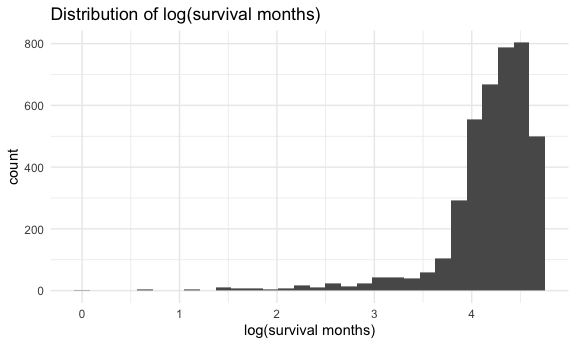

Data Exploration
================
Manye Dong
2023-11-28

## Predict the risk of death based on features 1-14

``` r
# include a descriptive table with summary statistics for all variables

# continuous data
conti_var = c("age", "tumor_size", "regional_node_examined","reginol_node_positive", "survival_months")
bc_data |>
  select(all_of(conti_var)) |>
  summary() |>
  knitr::kable()
```

|     | age           | tumor_size     | regional_node_examined | reginol_node_positive | survival_months |
|:----|:--------------|:---------------|:-----------------------|:----------------------|:----------------|
|     | Min. :30.00   | Min. : 1.00    | Min. : 1.00            | Min. : 1.000          | Min. : 1.0      |
|     | 1st Qu.:47.00 | 1st Qu.: 16.00 | 1st Qu.: 9.00          | 1st Qu.: 1.000        | 1st Qu.: 56.0   |
|     | Median :54.00 | Median : 25.00 | Median :14.00          | Median : 2.000        | Median : 73.0   |
|     | Mean :53.97   | Mean : 30.47   | Mean :14.36            | Mean : 4.158          | Mean : 71.3     |
|     | 3rd Qu.:61.00 | 3rd Qu.: 38.00 | 3rd Qu.:19.00          | 3rd Qu.: 5.000        | 3rd Qu.: 90.0   |
|     | Max. :69.00   | Max. :140.00   | Max. :61.00            | Max. :46.000          | Max. :107.0     |

``` r
# discrete data count number of distinct variables


discre_var <- c("race", "marital_status", "t_stage", "n_stage", "x6th_stage", "differentiate", "grade", "a_stage", "estrogen_status", "progesterone_status", "status")

# Function to create a summary table for each variable
summary_table = function(variable) {
  counts = table(bc_data[[variable]])
  summary_df = data.frame(
    Variable = rep(variable, length(counts)),
    Value = paste(variable, names(counts), sep = "_"),
    Count = as.vector(counts)
  )
  return(summary_df)
}

summary_tables = lapply(discre_var, summary_table)
combined_summary = do.call(rbind, summary_tables) |>
  knitr::kable()
print(combined_summary)
```

    ## 
    ## 
    ## |Variable            |Value                                   | Count|
    ## |:-------------------|:---------------------------------------|-----:|
    ## |race                |race_Black                              |   291|
    ## |race                |race_Other                              |   320|
    ## |race                |race_White                              |  3413|
    ## |marital_status      |marital_status_Divorced                 |   486|
    ## |marital_status      |marital_status_Married                  |  2643|
    ## |marital_status      |marital_status_Separated                |    45|
    ## |marital_status      |marital_status_Single                   |   615|
    ## |marital_status      |marital_status_Widowed                  |   235|
    ## |t_stage             |t_stage_T1                              |  1603|
    ## |t_stage             |t_stage_T2                              |  1786|
    ## |t_stage             |t_stage_T3                              |   533|
    ## |t_stage             |t_stage_T4                              |   102|
    ## |n_stage             |n_stage_N1                              |  2732|
    ## |n_stage             |n_stage_N2                              |   820|
    ## |n_stage             |n_stage_N3                              |   472|
    ## |x6th_stage          |x6th_stage_IIA                          |  1305|
    ## |x6th_stage          |x6th_stage_IIB                          |  1130|
    ## |x6th_stage          |x6th_stage_IIIA                         |  1050|
    ## |x6th_stage          |x6th_stage_IIIB                         |    67|
    ## |x6th_stage          |x6th_stage_IIIC                         |   472|
    ## |differentiate       |differentiate_Moderately differentiated |  2351|
    ## |differentiate       |differentiate_Poorly differentiated     |  1111|
    ## |differentiate       |differentiate_Undifferentiated          |    19|
    ## |differentiate       |differentiate_Well differentiated       |   543|
    ## |grade               |grade_ anaplastic; Grade IV             |    19|
    ## |grade               |grade_1                                 |   543|
    ## |grade               |grade_2                                 |  2351|
    ## |grade               |grade_3                                 |  1111|
    ## |a_stage             |a_stage_Distant                         |    92|
    ## |a_stage             |a_stage_Regional                        |  3932|
    ## |estrogen_status     |estrogen_status_Negative                |   269|
    ## |estrogen_status     |estrogen_status_Positive                |  3755|
    ## |progesterone_status |progesterone_status_Negative            |   698|
    ## |progesterone_status |progesterone_status_Positive            |  3326|
    ## |status              |status_Alive                            |  3408|
    ## |status              |status_Dead                             |   616|

``` r
# explore the distribution of the outcome and consider potential transformations if necessary
# Since the purpose is to predict the risk of death based on features 1-14, we are going to fit a model with variables 1-14 as predictors (x) and the survival months as the y value. 
# look at the original distribution of survival months
hist(bc_data$survival_months, main = "Distribution of survival months", xlab = "Survival Month")
```


``` r
#try different transformation 
log_survival = log(bc_data$survival_months)
hist(log_survival, main = "Distribution of log_transformed survival months", xlab = "log-transformed survival months")
```


``` r
sqrt_survival = sqrt(bc_data$survival_months)
hist(sqrt_survival, main = "Distribution of sqrt(survival months)", xlab = "sqrt(survival months)")
```


``` r
sq_survival = (bc_data$survival_months^2)
hist(sq_survival, main = "Distribution of square(survival months)", xlab = "square(survival months)")
```


``` r
bc_data = bc_data |>
  mutate(log_survival = log(survival_months))

bc_data |>
  ggplot(aes(x = log_survival)) +
  geom_histogram() +
  labs(title = "Distribution of log(survival months)", x = "log(survival months)")
```

    ## `stat_bin()` using `bins = 30`. Pick better value with `binwidth`.



``` r
# examine the marginal distributions and pariwise relationships between variables 
# explore several candidate models, and explain why you select your model
model_all = lm(survival_months ~ age+reginol_node_positive+ regional_node_examined+factor(estrogen_status)+factor(progesterone_status)+tumor_size+factor(a_stage) +factor(grade)+factor(differentiate)+factor(x6th_stage)+factor(n_stage)+factor(t_stage)+factor(marital_status)+factor(race), data = bc_data)

summary(model_all)
```

    ## 
    ## Call:
    ## lm(formula = survival_months ~ age + reginol_node_positive + 
    ##     regional_node_examined + factor(estrogen_status) + factor(progesterone_status) + 
    ##     tumor_size + factor(a_stage) + factor(grade) + factor(differentiate) + 
    ##     factor(x6th_stage) + factor(n_stage) + factor(t_stage) + 
    ##     factor(marital_status) + factor(race), data = bc_data)
    ## 
    ## Residuals:
    ##     Min      1Q  Median      3Q     Max 
    ## -74.685 -15.591   1.087  18.126  56.245 
    ## 
    ## Coefficients: (4 not defined because of singularities)
    ##                                            Estimate Std. Error t value Pr(>|t|)
    ## (Intercept)                                56.02926    6.63672   8.442  < 2e-16
    ## age                                        -0.04220    0.04138  -1.020  0.30787
    ## reginol_node_positive                      -0.31396    0.14259  -2.202  0.02774
    ## regional_node_examined                      0.10692    0.04828   2.214  0.02686
    ## factor(estrogen_status)Positive             8.61299    1.68605   5.108  3.4e-07
    ## factor(progesterone_status)Positive         1.60271    1.10116   1.455  0.14562
    ## tumor_size                                 -0.05649    0.03434  -1.645  0.10002
    ## factor(a_stage)Regional                     4.36505    2.67211   1.634  0.10243
    ## factor(grade)1                              2.93128    5.29131   0.554  0.57962
    ## factor(grade)2                              2.95238    5.21782   0.566  0.57154
    ## factor(grade)3                              1.96293    5.22945   0.375  0.70741
    ## factor(differentiate)Poorly differentiated       NA         NA      NA       NA
    ## factor(differentiate)Undifferentiated            NA         NA      NA       NA
    ## factor(differentiate)Well differentiated         NA         NA      NA       NA
    ## factor(x6th_stage)IIB                       0.53765    1.82506   0.295  0.76832
    ## factor(x6th_stage)IIIA                     -0.65701    2.36107  -0.278  0.78082
    ## factor(x6th_stage)IIIB                      3.32794    5.15941   0.645  0.51895
    ## factor(x6th_stage)IIIC                     -3.37649    2.67197  -1.264  0.20642
    ## factor(n_stage)N2                          -0.58607    1.98650  -0.295  0.76799
    ## factor(n_stage)N3                                NA         NA      NA       NA
    ## factor(t_stage)T2                          -1.61447    1.69125  -0.955  0.33984
    ## factor(t_stage)T3                           0.73762    2.76338   0.267  0.78954
    ## factor(t_stage)T4                          -2.25092    4.48353  -0.502  0.61567
    ## factor(marital_status)Married               0.71309    1.11566   0.639  0.52276
    ## factor(marital_status)Separated            -6.24605    3.52093  -1.774  0.07614
    ## factor(marital_status)Single               -0.03560    1.37859  -0.026  0.97940
    ## factor(marital_status)Widowed              -0.78933    1.80857  -0.436  0.66254
    ## factor(race)Other                           5.58194    1.84998   3.017  0.00257
    ## factor(race)White                           3.67154    1.40193   2.619  0.00885
    ##                                               
    ## (Intercept)                                ***
    ## age                                           
    ## reginol_node_positive                      *  
    ## regional_node_examined                     *  
    ## factor(estrogen_status)Positive            ***
    ## factor(progesterone_status)Positive           
    ## tumor_size                                    
    ## factor(a_stage)Regional                       
    ## factor(grade)1                                
    ## factor(grade)2                                
    ## factor(grade)3                                
    ## factor(differentiate)Poorly differentiated    
    ## factor(differentiate)Undifferentiated         
    ## factor(differentiate)Well differentiated      
    ## factor(x6th_stage)IIB                         
    ## factor(x6th_stage)IIIA                        
    ## factor(x6th_stage)IIIB                        
    ## factor(x6th_stage)IIIC                        
    ## factor(n_stage)N2                             
    ## factor(n_stage)N3                             
    ## factor(t_stage)T2                             
    ## factor(t_stage)T3                             
    ## factor(t_stage)T4                             
    ## factor(marital_status)Married                 
    ## factor(marital_status)Separated            .  
    ## factor(marital_status)Single                  
    ## factor(marital_status)Widowed                 
    ## factor(race)Other                          ** 
    ## factor(race)White                          ** 
    ## ---
    ## Signif. codes:  0 '***' 0.001 '**' 0.01 '*' 0.05 '.' 0.1 ' ' 1
    ## 
    ## Residual standard error: 22.47 on 3999 degrees of freedom
    ## Multiple R-squared:  0.04476,    Adjusted R-squared:  0.03903 
    ## F-statistic: 7.808 on 24 and 3999 DF,  p-value: < 2.2e-16

``` r
# see if there are any unusual observations and consider them as potential outliers/influential points

# detect non normality of outliers, using qq plot
plot(model_all, which = 2)
```


``` r
# suggest possible models
```
