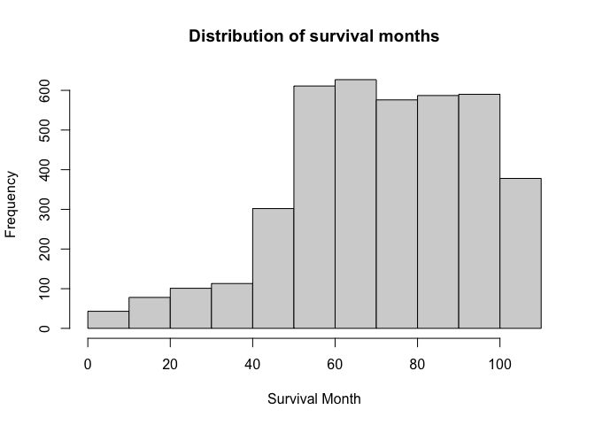

Data Exploration
================
Manye Dong
2023-11-28

## Goal: Predict the risk of death based on features 1-14

``` r
# import data and data cleaning
bc_data = read.csv("./Project_2_data.csv") |>
  janitor::clean_names() |> 
  na.omit()
```

### Data summary

``` r
# include a descriptive table with summary statistics for all variables

# continuous data
conti_var = c("age", "tumor_size", "regional_node_examined","reginol_node_positive", "survival_months")
bc_data |>
  select(all_of(conti_var)) |>
  summary() |>
  knitr::kable()
```

|     | age           | tumor_size     | regional_node_examined | reginol_node_positive | survival_months |
|:----|:--------------|:---------------|:-----------------------|:----------------------|:----------------|
|     | Min. :30.00   | Min. : 1.00    | Min. : 1.00            | Min. : 1.000          | Min. : 1.0      |
|     | 1st Qu.:47.00 | 1st Qu.: 16.00 | 1st Qu.: 9.00          | 1st Qu.: 1.000        | 1st Qu.: 56.0   |
|     | Median :54.00 | Median : 25.00 | Median :14.00          | Median : 2.000        | Median : 73.0   |
|     | Mean :53.97   | Mean : 30.47   | Mean :14.36            | Mean : 4.158          | Mean : 71.3     |
|     | 3rd Qu.:61.00 | 3rd Qu.: 38.00 | 3rd Qu.:19.00          | 3rd Qu.: 5.000        | 3rd Qu.: 90.0   |
|     | Max. :69.00   | Max. :140.00   | Max. :61.00            | Max. :46.000          | Max. :107.0     |

``` r
# discrete data count number of distinct variables


discre_var <- c("race", "marital_status", "t_stage", "n_stage", "x6th_stage", "differentiate", "grade", "a_stage", "estrogen_status", "progesterone_status", "status")

# Function to create a summary table for each variable
summary_table = function(variable) {
  counts = table(bc_data[[variable]])
  summary_df = data.frame(
    Variable = rep(variable, length(counts)),
    Value = paste(variable, names(counts), sep = "_"),
    Count = as.vector(counts)
  )
  return(summary_df)
}

summary_tables = lapply(discre_var, summary_table)
combined_summary = do.call(rbind, summary_tables) |>
  knitr::kable()
print(combined_summary)
```

    ## 
    ## 
    ## |Variable            |Value                                   | Count|
    ## |:-------------------|:---------------------------------------|-----:|
    ## |race                |race_Black                              |   291|
    ## |race                |race_Other                              |   320|
    ## |race                |race_White                              |  3413|
    ## |marital_status      |marital_status_Divorced                 |   486|
    ## |marital_status      |marital_status_Married                  |  2643|
    ## |marital_status      |marital_status_Separated                |    45|
    ## |marital_status      |marital_status_Single                   |   615|
    ## |marital_status      |marital_status_Widowed                  |   235|
    ## |t_stage             |t_stage_T1                              |  1603|
    ## |t_stage             |t_stage_T2                              |  1786|
    ## |t_stage             |t_stage_T3                              |   533|
    ## |t_stage             |t_stage_T4                              |   102|
    ## |n_stage             |n_stage_N1                              |  2732|
    ## |n_stage             |n_stage_N2                              |   820|
    ## |n_stage             |n_stage_N3                              |   472|
    ## |x6th_stage          |x6th_stage_IIA                          |  1305|
    ## |x6th_stage          |x6th_stage_IIB                          |  1130|
    ## |x6th_stage          |x6th_stage_IIIA                         |  1050|
    ## |x6th_stage          |x6th_stage_IIIB                         |    67|
    ## |x6th_stage          |x6th_stage_IIIC                         |   472|
    ## |differentiate       |differentiate_Moderately differentiated |  2351|
    ## |differentiate       |differentiate_Poorly differentiated     |  1111|
    ## |differentiate       |differentiate_Undifferentiated          |    19|
    ## |differentiate       |differentiate_Well differentiated       |   543|
    ## |grade               |grade_ anaplastic; Grade IV             |    19|
    ## |grade               |grade_1                                 |   543|
    ## |grade               |grade_2                                 |  2351|
    ## |grade               |grade_3                                 |  1111|
    ## |a_stage             |a_stage_Distant                         |    92|
    ## |a_stage             |a_stage_Regional                        |  3932|
    ## |estrogen_status     |estrogen_status_Negative                |   269|
    ## |estrogen_status     |estrogen_status_Positive                |  3755|
    ## |progesterone_status |progesterone_status_Negative            |   698|
    ## |progesterone_status |progesterone_status_Positive            |  3326|
    ## |status              |status_Alive                            |  3408|
    ## |status              |status_Dead                             |   616|

### Outliers

``` r
Q1 <- quantile(bc_data$survival_months, 0.25)
Q3 <- quantile(bc_data$survival_months, 0.75)
IQR <- Q3 - Q1

lower_bound <- Q1 - 1.5 * IQR
upper_bound <- Q3 + 1.5 * IQR

outliers <- bc_data |> filter((survival_months < lower_bound) | (survival_months > upper_bound))

bc_data <- anti_join(bc_data, outliers, by = c(colnames(bc_data)))
```

### Survial Months distribution

``` r
# explore the distribution of the outcome and consider potential transformations if necessary
# look at the original distribution of survival months
hist(bc_data$survival_months, main = "Distribution of survival months", xlab = "Survival Month")
```

<!-- -->

``` r
#try different transformation 
log_survival = log(bc_data$survival_months)
hist(log_survival, main = "Distribution of log_transformed survival months", xlab = "log-transformed survival months")
```

<!-- -->

``` r
sqrt_survival = sqrt(bc_data$survival_months)
hist(sqrt_survival, main = "Distribution of sqrt(survival months)", xlab = "sqrt(survival months)")
```

<!-- -->

``` r
sq_survival = (bc_data$survival_months^2)
hist(sq_survival, main = "Distribution of square(survival months)", xlab = "square(survival months)")
```

<!-- -->

``` r
iv_survival = (1/bc_data$survival_months)
hist(iv_survival, main = "Distribution of inverse(survival months)", xlab = "inverse(survival months)", xlim = c(0,0.1),breaks=100)
```

<!-- -->

### Convert categorical data to factor

``` r
bc_data = 
  bc_data |>
  mutate(
    race = factor(race, labels = c("1", "2", "3"), levels = c("Black", "White", "Other")),
    marital_status = factor(marital_status, labels = c("1", "2", "3","4","5"),levels = c("Divorced", "Married", "Separated", "Single ", "Widowed")),
    t_stage = factor(t_stage, labels = c("1", "2", "3","4"),levels = c("T1", "T2", "T3", "T4")),
    n_stage = factor(n_stage, labels = c("1","2","3"),levels = c("N1","N2", "N3")),
    x6th_stage = factor(x6th_stage, labels = c("1", "2", "3","4","5"),levels = c("IIA","IIB","IIIA","IIIB","IIIC")),
    differentiate = factor(differentiate, labels = c("1", "2", "3","4"),levels = c("Moderately differentiated","Poorly differentiated","Undifferentiated","Well differentiated")),
    grade = factor(grade, labels = c("1", "2", "3","4"),levels = c("1","2","3"," anaplastic; Grade IV")),
    a_stage = factor(a_stage, labels = c("1","2"),levels = c("Distant","Regional")),
    estrogen_status = factor(estrogen_status, labels = c("0","1"),levels = c("Negative","Positive")),
    progesterone_status = factor(progesterone_status, labels = c("0","1"),levels = c("Negative","Positive")),
    status = factor(status, labels = c("0","1"),levels = c("Dead","Alive"))
    ) |> 
  rename(regional_node_positive = reginol_node_positive) 
```

## Look at data interaction and collinearity

``` r
# Pairwise interaction and Correlation plot
bc_data |> 
  select(-status, -survival_months) |> 
  pairs()
```

<!-- -->

``` r
cor_matrix <- 
  bc_data |> 
  select(-status, -survival_months) |> 
  mutate(across(where(is.factor), as.numeric)) |> 
  cor()

print(cor_matrix, digits = 3)
```

    ##                             age     race marital_status  t_stage  n_stage
    ## age                     1.00000 -0.02710        0.05004 -0.06793  0.00294
    ## race                   -0.02710  1.00000       -0.10185  0.00607 -0.01821
    ## marital_status          0.05004 -0.10185        1.00000  0.00924  0.01236
    ## t_stage                -0.06793  0.00607        0.00924  1.00000  0.27706
    ## n_stage                 0.00294 -0.01821        0.01236  0.27706  1.00000
    ## x6th_stage             -0.01874 -0.00622        0.00157  0.60716  0.88162
    ## differentiate           0.01612 -0.00258        0.03154 -0.03176 -0.03573
    ## grade                  -0.10058 -0.04452        0.00379  0.13098  0.16258
    ## a_stage                 0.02062  0.00713        0.00490 -0.22149 -0.26162
    ## tumor_size             -0.07725  0.00356        0.00720  0.80903  0.27815
    ## estrogen_status         0.05942  0.02037       -0.01803 -0.06112 -0.10280
    ## progesterone_status    -0.02119  0.01699       -0.01315 -0.05913 -0.09534
    ## regional_node_examined -0.03165  0.00907       -0.00301  0.11439  0.32761
    ## regional_node_positive  0.01275 -0.00709        0.00448  0.24279  0.83789
    ##                        x6th_stage differentiate    grade  a_stage tumor_size
    ## age                      -0.01874       0.01612 -0.10058  0.02062   -0.07725
    ## race                     -0.00622      -0.00258 -0.04452  0.00713    0.00356
    ## marital_status            0.00157       0.03154  0.00379  0.00490    0.00720
    ## t_stage                   0.60716      -0.03176  0.13098 -0.22149    0.80903
    ## n_stage                   0.88162      -0.03573  0.16258 -0.26162    0.27815
    ## x6th_stage                1.00000      -0.04205  0.18696 -0.29293    0.51426
    ## differentiate            -0.04205       1.00000 -0.33112 -0.00863   -0.02885
    ## grade                     0.18696      -0.33112  1.00000 -0.03951    0.11896
    ## a_stage                  -0.29293      -0.00863 -0.03951  1.00000   -0.12405
    ## tumor_size                0.51426      -0.02885  0.11896 -0.12405    1.00000
    ## estrogen_status          -0.10628      -0.02123 -0.21148  0.06540   -0.05968
    ## progesterone_status      -0.10288       0.00870 -0.18091  0.02658   -0.07136
    ## regional_node_examined    0.31689      -0.05733  0.08505 -0.06913    0.10403
    ## regional_node_positive    0.77364      -0.02859  0.13460 -0.23361    0.24179
    ##                        estrogen_status progesterone_status
    ## age                             0.0594             -0.0212
    ## race                            0.0204              0.0170
    ## marital_status                 -0.0180             -0.0131
    ## t_stage                        -0.0611             -0.0591
    ## n_stage                        -0.1028             -0.0953
    ## x6th_stage                     -0.1063             -0.1029
    ## differentiate                  -0.0212              0.0087
    ## grade                          -0.2115             -0.1809
    ## a_stage                         0.0654              0.0266
    ## tumor_size                     -0.0597             -0.0714
    ## estrogen_status                 1.0000              0.5145
    ## progesterone_status             0.5145              1.0000
    ## regional_node_examined         -0.0449             -0.0187
    ## regional_node_positive         -0.0865             -0.0795
    ##                        regional_node_examined regional_node_positive
    ## age                                  -0.03165                0.01275
    ## race                                  0.00907               -0.00709
    ## marital_status                       -0.00301                0.00448
    ## t_stage                               0.11439                0.24279
    ## n_stage                               0.32761                0.83789
    ## x6th_stage                            0.31689                0.77364
    ## differentiate                        -0.05733               -0.02859
    ## grade                                 0.08505                0.13460
    ## a_stage                              -0.06913               -0.23361
    ## tumor_size                            0.10403                0.24179
    ## estrogen_status                      -0.04488               -0.08650
    ## progesterone_status                  -0.01867               -0.07951
    ## regional_node_examined                1.00000                0.41106
    ## regional_node_positive                0.41106                1.00000

``` r
corrplot(cor_matrix, type = "upper", diag = FALSE, tl.cex = 0.5, tl.srt = 45)
```

<!-- -->

``` r
# boxplots for each variable
par(mfrow = c(2,3))

boxplot(bc_data$survival_months, main = "survival_months")
boxplot(bc_data$age, main = "age")
boxplot(bc_data$race, main = "race")
boxplot(bc_data$marital_status, main = "marital_status")
boxplot(bc_data$t_stage, main = "t_stage")
boxplot(bc_data$n_stage, main = "n_stage")
```

<!-- -->

``` r
par(mfrow = c(2,4))
boxplot(bc_data$x6th_stage, main = "x6th_stage")
boxplot(bc_data$differentiate, main = "differentiate")
boxplot(bc_data$a_stage, main = "a_stage")
boxplot(bc_data$tumor_size, main = "tumor_size")
boxplot(bc_data$estrogen_status, main = "estrogen_status")
boxplot(bc_data$progesterone_status, main = "progesterone_status")
boxplot(bc_data$regional_node_examined, main = "regional_node_examined")
boxplot(bc_data$regional_node_positive, main = "regional_node_positive")
```

<!-- -->

## Model and MLR selections

### MLR with all predictors

Create dummies:

``` r
# Create a copy of the original data (optional step)
bc_data_dummy <- bc_data

# Specify the names of factor variables
factor_vars <- c("race", "marital_status", "t_stage", "n_stage", "x6th_stage", 
                 "differentiate", "grade", "a_stage", "estrogen_status", 
                 "progesterone_status", "status")

# Loop through each factor variable and create dummy variables
for (var in factor_vars) {
  # Convert the factor variable into dummy variables
  dummy_cols <- model.matrix(~ 0 + as.factor(bc_data[[var]]))
  
  # Modify column names to remove unwanted parts
  colnames(dummy_cols) <- gsub(paste0(var, "_bc_data\\[\\[", var, "\\]\\]"), "", colnames(dummy_cols))
  
  # Assign dummy variables to the dataframe
  colnames(dummy_cols) <- paste(var, colnames(dummy_cols), sep = "_")
  bc_data_dummy <- cbind(bc_data_dummy, dummy_cols)
}

# Remove original factor columns if desired
bc_data_dummy <- bc_data_dummy[, !names(bc_data_dummy) %in% factor_vars] |> janitor::clean_names()

head(bc_data_dummy)
```

    ##   age tumor_size regional_node_examined regional_node_positive survival_months
    ## 1  68          4                     24                      1              60
    ## 2  50         35                     14                      5              62
    ## 3  58         63                     14                      7              75
    ## 4  58         18                      2                      1              84
    ## 5  47         41                      3                      1              50
    ## 6  51         20                     18                      2              89
    ##   race_as_factor_bc_data_var_1 race_as_factor_bc_data_var_2
    ## 1                            0                            1
    ## 2                            0                            1
    ## 3                            0                            1
    ## 4                            0                            1
    ## 5                            0                            1
    ## 6                            0                            1
    ##   race_as_factor_bc_data_var_3 marital_status_as_factor_bc_data_var_1
    ## 1                            0                                      0
    ## 2                            0                                      0
    ## 3                            0                                      1
    ## 4                            0                                      0
    ## 5                            0                                      0
    ## 6                            0                                      0
    ##   marital_status_as_factor_bc_data_var_2 marital_status_as_factor_bc_data_var_3
    ## 1                                      1                                      0
    ## 2                                      1                                      0
    ## 3                                      0                                      0
    ## 4                                      1                                      0
    ## 5                                      1                                      0
    ## 6                                      0                                      0
    ##   marital_status_as_factor_bc_data_var_4 marital_status_as_factor_bc_data_var_5
    ## 1                                      0                                      0
    ## 2                                      0                                      0
    ## 3                                      0                                      0
    ## 4                                      0                                      0
    ## 5                                      0                                      0
    ## 6                                      1                                      0
    ##   t_stage_as_factor_bc_data_var_1 t_stage_as_factor_bc_data_var_2
    ## 1                               1                               0
    ## 2                               0                               1
    ## 3                               0                               0
    ## 4                               1                               0
    ## 5                               0                               1
    ## 6                               1                               0
    ##   t_stage_as_factor_bc_data_var_3 t_stage_as_factor_bc_data_var_4
    ## 1                               0                               0
    ## 2                               0                               0
    ## 3                               1                               0
    ## 4                               0                               0
    ## 5                               0                               0
    ## 6                               0                               0
    ##   n_stage_as_factor_bc_data_var_1 n_stage_as_factor_bc_data_var_2
    ## 1                               1                               0
    ## 2                               0                               1
    ## 3                               0                               0
    ## 4                               1                               0
    ## 5                               1                               0
    ## 6                               1                               0
    ##   n_stage_as_factor_bc_data_var_3 x6th_stage_as_factor_bc_data_var_1
    ## 1                               0                                  1
    ## 2                               0                                  0
    ## 3                               1                                  0
    ## 4                               0                                  1
    ## 5                               0                                  0
    ## 6                               0                                  1
    ##   x6th_stage_as_factor_bc_data_var_2 x6th_stage_as_factor_bc_data_var_3
    ## 1                                  0                                  0
    ## 2                                  0                                  1
    ## 3                                  0                                  0
    ## 4                                  0                                  0
    ## 5                                  1                                  0
    ## 6                                  0                                  0
    ##   x6th_stage_as_factor_bc_data_var_4 x6th_stage_as_factor_bc_data_var_5
    ## 1                                  0                                  0
    ## 2                                  0                                  0
    ## 3                                  0                                  1
    ## 4                                  0                                  0
    ## 5                                  0                                  0
    ## 6                                  0                                  0
    ##   differentiate_as_factor_bc_data_var_1 differentiate_as_factor_bc_data_var_2
    ## 1                                     0                                     1
    ## 2                                     1                                     0
    ## 3                                     1                                     0
    ## 4                                     0                                     1
    ## 5                                     0                                     1
    ## 6                                     1                                     0
    ##   differentiate_as_factor_bc_data_var_3 differentiate_as_factor_bc_data_var_4
    ## 1                                     0                                     0
    ## 2                                     0                                     0
    ## 3                                     0                                     0
    ## 4                                     0                                     0
    ## 5                                     0                                     0
    ## 6                                     0                                     0
    ##   grade_as_factor_bc_data_var_1 grade_as_factor_bc_data_var_2
    ## 1                             0                             0
    ## 2                             0                             1
    ## 3                             0                             1
    ## 4                             0                             0
    ## 5                             0                             0
    ## 6                             0                             1
    ##   grade_as_factor_bc_data_var_3 grade_as_factor_bc_data_var_4
    ## 1                             1                             0
    ## 2                             0                             0
    ## 3                             0                             0
    ## 4                             1                             0
    ## 5                             1                             0
    ## 6                             0                             0
    ##   a_stage_as_factor_bc_data_var_1 a_stage_as_factor_bc_data_var_2
    ## 1                               0                               1
    ## 2                               0                               1
    ## 3                               0                               1
    ## 4                               0                               1
    ## 5                               0                               1
    ## 6                               0                               1
    ##   estrogen_status_as_factor_bc_data_var_0
    ## 1                                       0
    ## 2                                       0
    ## 3                                       0
    ## 4                                       0
    ## 5                                       0
    ## 6                                       0
    ##   estrogen_status_as_factor_bc_data_var_1
    ## 1                                       1
    ## 2                                       1
    ## 3                                       1
    ## 4                                       1
    ## 5                                       1
    ## 6                                       1
    ##   progesterone_status_as_factor_bc_data_var_0
    ## 1                                           0
    ## 2                                           0
    ## 3                                           0
    ## 4                                           0
    ## 5                                           0
    ## 6                                           0
    ##   progesterone_status_as_factor_bc_data_var_1 status_as_factor_bc_data_var_0
    ## 1                                           1                              0
    ## 2                                           1                              0
    ## 3                                           1                              0
    ## 4                                           1                              0
    ## 5                                           1                              0
    ## 6                                           1                              0
    ##   status_as_factor_bc_data_var_1
    ## 1                              1
    ## 2                              1
    ## 3                              1
    ## 4                              1
    ## 5                              1
    ## 6                              1

``` r
mult.fit = lm(survival_months ~ ., data = bc_data_dummy)

#logit_fit=glm(status ~ .-survival_months,family="binomial",data=bc_data)
#summary(logit_fit)


summary(mult.fit)
```

    ## 
    ## Call:
    ## lm(formula = survival_months ~ ., data = bc_data_dummy)
    ## 
    ## Residuals:
    ##     Min      1Q  Median      3Q     Max 
    ## -69.992 -15.128   0.098  16.032  56.613 
    ## 
    ## Coefficients: (15 not defined because of singularities)
    ##                                               Estimate Std. Error t value
    ## (Intercept)                                  77.180024   5.292491  14.583
    ## age                                           0.040374   0.036737   1.099
    ## tumor_size                                   -0.051989   0.030404  -1.710
    ## regional_node_examined                       -0.001346   0.042900  -0.031
    ## regional_node_positive                        0.022143   0.126845   0.175
    ## race_as_factor_bc_data_var_1                 -2.546319   1.643544  -1.549
    ## race_as_factor_bc_data_var_2                 -0.987926   1.173270  -0.842
    ## race_as_factor_bc_data_var_3                        NA         NA      NA
    ## marital_status_as_factor_bc_data_var_1        0.548340   1.604840   0.342
    ## marital_status_as_factor_bc_data_var_2        0.489042   1.393440   0.351
    ## marital_status_as_factor_bc_data_var_3       -1.497469   3.300200  -0.454
    ## marital_status_as_factor_bc_data_var_4        0.139726   1.573657   0.089
    ## marital_status_as_factor_bc_data_var_5              NA         NA      NA
    ## t_stage_as_factor_bc_data_var_1              -3.717544   3.969937  -0.936
    ## t_stage_as_factor_bc_data_var_2              -3.617628   3.701685  -0.977
    ## t_stage_as_factor_bc_data_var_3              -0.518356   3.724496  -0.139
    ## t_stage_as_factor_bc_data_var_4                     NA         NA      NA
    ## n_stage_as_factor_bc_data_var_1               2.030794   4.516244   0.450
    ## n_stage_as_factor_bc_data_var_2               3.901942   4.400173   0.887
    ## n_stage_as_factor_bc_data_var_3                     NA         NA      NA
    ## x6th_stage_as_factor_bc_data_var_1           -0.788278   4.564133  -0.173
    ## x6th_stage_as_factor_bc_data_var_2           -0.985161   4.466927  -0.221
    ## x6th_stage_as_factor_bc_data_var_3           -3.206911   4.354306  -0.736
    ## x6th_stage_as_factor_bc_data_var_4                  NA         NA      NA
    ## x6th_stage_as_factor_bc_data_var_5                  NA         NA      NA
    ## differentiate_as_factor_bc_data_var_1         1.491896   0.954990   1.562
    ## differentiate_as_factor_bc_data_var_2         1.777293   1.086156   1.636
    ## differentiate_as_factor_bc_data_var_3         4.887995   4.684956   1.043
    ## differentiate_as_factor_bc_data_var_4               NA         NA      NA
    ## grade_as_factor_bc_data_var_1                       NA         NA      NA
    ## grade_as_factor_bc_data_var_2                       NA         NA      NA
    ## grade_as_factor_bc_data_var_3                       NA         NA      NA
    ## grade_as_factor_bc_data_var_4                       NA         NA      NA
    ## a_stage_as_factor_bc_data_var_1              -4.570519   2.363160  -1.934
    ## a_stage_as_factor_bc_data_var_2                     NA         NA      NA
    ## estrogen_status_as_factor_bc_data_var_0      -4.774359   1.498117  -3.187
    ## estrogen_status_as_factor_bc_data_var_1             NA         NA      NA
    ## progesterone_status_as_factor_bc_data_var_0   0.647275   0.979282   0.661
    ## progesterone_status_as_factor_bc_data_var_1         NA         NA      NA
    ## status_as_factor_bc_data_var_0              -28.806548   0.945322 -30.473
    ## status_as_factor_bc_data_var_1                      NA         NA      NA
    ##                                             Pr(>|t|)    
    ## (Intercept)                                  < 2e-16 ***
    ## age                                          0.27183    
    ## tumor_size                                   0.08735 .  
    ## regional_node_examined                       0.97497    
    ## regional_node_positive                       0.86143    
    ## race_as_factor_bc_data_var_1                 0.12139    
    ## race_as_factor_bc_data_var_2                 0.39982    
    ## race_as_factor_bc_data_var_3                      NA    
    ## marital_status_as_factor_bc_data_var_1       0.73261    
    ## marital_status_as_factor_bc_data_var_2       0.72564    
    ## marital_status_as_factor_bc_data_var_3       0.65003    
    ## marital_status_as_factor_bc_data_var_4       0.92925    
    ## marital_status_as_factor_bc_data_var_5            NA    
    ## t_stage_as_factor_bc_data_var_1              0.34911    
    ## t_stage_as_factor_bc_data_var_2              0.32848    
    ## t_stage_as_factor_bc_data_var_3              0.88932    
    ## t_stage_as_factor_bc_data_var_4                   NA    
    ## n_stage_as_factor_bc_data_var_1              0.65298    
    ## n_stage_as_factor_bc_data_var_2              0.37526    
    ## n_stage_as_factor_bc_data_var_3                   NA    
    ## x6th_stage_as_factor_bc_data_var_1           0.86289    
    ## x6th_stage_as_factor_bc_data_var_2           0.82546    
    ## x6th_stage_as_factor_bc_data_var_3           0.46147    
    ## x6th_stage_as_factor_bc_data_var_4                NA    
    ## x6th_stage_as_factor_bc_data_var_5                NA    
    ## differentiate_as_factor_bc_data_var_1        0.11832    
    ## differentiate_as_factor_bc_data_var_2        0.10185    
    ## differentiate_as_factor_bc_data_var_3        0.29685    
    ## differentiate_as_factor_bc_data_var_4             NA    
    ## grade_as_factor_bc_data_var_1                     NA    
    ## grade_as_factor_bc_data_var_2                     NA    
    ## grade_as_factor_bc_data_var_3                     NA    
    ## grade_as_factor_bc_data_var_4                     NA    
    ## a_stage_as_factor_bc_data_var_1              0.05318 .  
    ## a_stage_as_factor_bc_data_var_2                   NA    
    ## estrogen_status_as_factor_bc_data_var_0      0.00145 ** 
    ## estrogen_status_as_factor_bc_data_var_1           NA    
    ## progesterone_status_as_factor_bc_data_var_0  0.50867    
    ## progesterone_status_as_factor_bc_data_var_1       NA    
    ## status_as_factor_bc_data_var_0               < 2e-16 ***
    ## status_as_factor_bc_data_var_1                    NA    
    ## ---
    ## Signif. codes:  0 '***' 0.001 '**' 0.01 '*' 0.05 '.' 0.1 ' ' 1
    ## 
    ## Residual standard error: 19.86 on 3980 degrees of freedom
    ## Multiple R-squared:  0.2263, Adjusted R-squared:  0.2215 
    ## F-statistic: 46.57 on 25 and 3980 DF,  p-value: < 2.2e-16

``` r
# QQ plot showing datafit 
plot(mult.fit)
```

<!-- --><!-- --><!-- --><!-- -->

``` r
# residual vs. leverage plot
plot(mult.fit, which = 4)
```

<!-- -->
Looks like doesn’t need a transformation on the outcome survival months.

Use box-cox transformation to double-check if we need to make
transformations.

``` r
# boxcox(mult.fit)
```

Since lambda approaches 1 and its 95% CI lies close to 1, it suggests
that we do not need to make any transformation.

Based on Cook’s distance, we will investigate the three influential
points:

``` r
view_influential = bc_data[c(278, 1553, 1584), ]
view_influential
```

    ##      age race marital_status t_stage n_stage x6th_stage differentiate grade
    ## 278   52    1              4       3       3          5             3     4
    ## 1553  58    2              4       1       2          3             3     4
    ## 1584  50    2              2       2       1          2             1     2
    ##      a_stage tumor_size estrogen_status progesterone_status
    ## 278        2        100               1                   1
    ## 1553       2         19               0                   0
    ## 1584       2         25               1                   1
    ##      regional_node_examined regional_node_positive survival_months status
    ## 278                      23                     17              16      0
    ## 1553                     47                      7               9      0
    ## 1584                     39                      3              71      1

After investigation, it looks like these three points are not negatively
impacting the results. So, we will not remove them. They have a reason
to be there.

### MLR reducing multicollinearity using correlation matrix

First, find the highly correlated pairs:

``` r
new_df = bc_data |> mutate(across(where(is.factor), as.numeric))
```

``` r
cor_matrix = cor(new_df[, c(colnames(new_df))])

# Find the pairs where correlation is greater than or equal to 0.7 but less than 1
high_cor_pairs = which(cor_matrix >= 0.7 & cor_matrix < 1, arr.ind = TRUE)

# Extract the variable names for these pairs
high_cor_var_pairs = data.frame(
  Var1 = rownames(cor_matrix)[high_cor_pairs[, 1]],
  Var2 = colnames(cor_matrix)[high_cor_pairs[, 2]],
  Correlation = cor_matrix[high_cor_pairs]
)

high_cor_var_pairs |> 
  knitr::kable(digits=4)
```

| Var1                   | Var2                   | Correlation |
|:-----------------------|:-----------------------|------------:|
| tumor_size             | t_stage                |      0.8090 |
| x6th_stage             | n_stage                |      0.8816 |
| regional_node_positive | n_stage                |      0.8379 |
| n_stage                | x6th_stage             |      0.8816 |
| regional_node_positive | x6th_stage             |      0.7736 |
| t_stage                | tumor_size             |      0.8090 |
| n_stage                | regional_node_positive |      0.8379 |
| x6th_stage             | regional_node_positive |      0.7736 |

Remove the one with lower correlation with outcome in every pair:

``` r
cor_tumor = cor_matrix["survival_months", "tumor_size"]
cor_tstage = cor_matrix["survival_months", "t_stage"]

c(cor_tumor, cor_tstage)
```

    ## [1] -0.08873521 -0.08673585

Keep tumor_size.

``` r
cor_tumor = cor_matrix["survival_months", "x6th_stage"]
cor_nstage = cor_matrix["survival_months", "n_stage"]
cor_regional = cor_matrix["survival_months", "regional_node_positive"]

c(cor_tumor, cor_nstage, cor_regional)
```

    ## [1] -0.1438298 -0.1372208 -0.1350219

Keep tumor_size, delete the other two.

Fit the reduced model:

``` r
reduced_df = bc_data_dummy |> select(-t_stage_as_factor_bc_data_var_1, -t_stage_as_factor_bc_data_var_2, -t_stage_as_factor_bc_data_var_3, -t_stage_as_factor_bc_data_var_4, -n_stage_as_factor_bc_data_var_1, -n_stage_as_factor_bc_data_var_2, -n_stage_as_factor_bc_data_var_3, -x6th_stage_as_factor_bc_data_var_1, -x6th_stage_as_factor_bc_data_var_2, -x6th_stage_as_factor_bc_data_var_3, -x6th_stage_as_factor_bc_data_var_4, -x6th_stage_as_factor_bc_data_var_5)
```

``` r
reduced_model = lm(survival_months ~ ., data = reduced_df) 

summary(reduced_model) 
```

    ## 
    ## Call:
    ## lm(formula = survival_months ~ ., data = reduced_df)
    ## 
    ## Residuals:
    ##     Min      1Q  Median      3Q     Max 
    ## -70.364 -15.117   0.119  16.073  55.601 
    ## 
    ## Coefficients: (11 not defined because of singularities)
    ##                                               Estimate Std. Error t value
    ## (Intercept)                                  74.034319   2.979908  24.844
    ## age                                           0.039838   0.036678   1.086
    ## tumor_size                                   -0.023423   0.015504  -1.511
    ## regional_node_examined                       -0.001638   0.042780  -0.038
    ## regional_node_positive                       -0.021290   0.072907  -0.292
    ## race_as_factor_bc_data_var_1                 -2.445316   1.640892  -1.490
    ## race_as_factor_bc_data_var_2                 -0.882341   1.171560  -0.753
    ## race_as_factor_bc_data_var_3                        NA         NA      NA
    ## marital_status_as_factor_bc_data_var_1        0.600815   1.603587   0.375
    ## marital_status_as_factor_bc_data_var_2        0.557853   1.392545   0.401
    ## marital_status_as_factor_bc_data_var_3       -1.656587   3.295270  -0.503
    ## marital_status_as_factor_bc_data_var_4        0.251571   1.571793   0.160
    ## marital_status_as_factor_bc_data_var_5              NA         NA      NA
    ## differentiate_as_factor_bc_data_var_1         1.438294   0.952960   1.509
    ## differentiate_as_factor_bc_data_var_2         1.655436   1.080239   1.532
    ## differentiate_as_factor_bc_data_var_3         4.996548   4.670001   1.070
    ## differentiate_as_factor_bc_data_var_4               NA         NA      NA
    ## grade_as_factor_bc_data_var_1                       NA         NA      NA
    ## grade_as_factor_bc_data_var_2                       NA         NA      NA
    ## grade_as_factor_bc_data_var_3                       NA         NA      NA
    ## grade_as_factor_bc_data_var_4                       NA         NA      NA
    ## a_stage_as_factor_bc_data_var_1              -3.186618   2.167131  -1.470
    ## a_stage_as_factor_bc_data_var_2                     NA         NA      NA
    ## estrogen_status_as_factor_bc_data_var_0      -4.670712   1.496363  -3.121
    ## estrogen_status_as_factor_bc_data_var_1             NA         NA      NA
    ## progesterone_status_as_factor_bc_data_var_0   0.575600   0.978345   0.588
    ## progesterone_status_as_factor_bc_data_var_1         NA         NA      NA
    ## status_as_factor_bc_data_var_0              -28.714016   0.941956 -30.483
    ## status_as_factor_bc_data_var_1                      NA         NA      NA
    ##                                             Pr(>|t|)    
    ## (Intercept)                                  < 2e-16 ***
    ## age                                          0.27747    
    ## tumor_size                                   0.13092    
    ## regional_node_examined                       0.96946    
    ## regional_node_positive                       0.77029    
    ## race_as_factor_bc_data_var_1                 0.13624    
    ## race_as_factor_bc_data_var_2                 0.45141    
    ## race_as_factor_bc_data_var_3                      NA    
    ## marital_status_as_factor_bc_data_var_1       0.70793    
    ## marital_status_as_factor_bc_data_var_2       0.68874    
    ## marital_status_as_factor_bc_data_var_3       0.61519    
    ## marital_status_as_factor_bc_data_var_4       0.87285    
    ## marital_status_as_factor_bc_data_var_5            NA    
    ## differentiate_as_factor_bc_data_var_1        0.13130    
    ## differentiate_as_factor_bc_data_var_2        0.12549    
    ## differentiate_as_factor_bc_data_var_3        0.28472    
    ## differentiate_as_factor_bc_data_var_4             NA    
    ## grade_as_factor_bc_data_var_1                     NA    
    ## grade_as_factor_bc_data_var_2                     NA    
    ## grade_as_factor_bc_data_var_3                     NA    
    ## grade_as_factor_bc_data_var_4                     NA    
    ## a_stage_as_factor_bc_data_var_1              0.14152    
    ## a_stage_as_factor_bc_data_var_2                   NA    
    ## estrogen_status_as_factor_bc_data_var_0      0.00181 ** 
    ## estrogen_status_as_factor_bc_data_var_1           NA    
    ## progesterone_status_as_factor_bc_data_var_0  0.55634    
    ## progesterone_status_as_factor_bc_data_var_1       NA    
    ## status_as_factor_bc_data_var_0               < 2e-16 ***
    ## status_as_factor_bc_data_var_1                    NA    
    ## ---
    ## Signif. codes:  0 '***' 0.001 '**' 0.01 '*' 0.05 '.' 0.1 ' ' 1
    ## 
    ## Residual standard error: 19.86 on 3988 degrees of freedom
    ## Multiple R-squared:  0.225,  Adjusted R-squared:  0.2217 
    ## F-statistic: 68.09 on 17 and 3988 DF,  p-value: < 2.2e-16

``` r
# |> broom::tidy() |> knitr::kable(digits=3)
```

Estrogen_status1 seems to be the most influential factor .

``` r
plot(reduced_model)
```

<!-- --><!-- --><!-- --><!-- -->

Normality fit looks better at the left tail.

### Stepwise

Forward

``` r
intercept_only = lm(survival_months ~ 1, data = bc_data_dummy)
step(intercept_only, direction = "forward", scope = formula(mult.fit), trace = FALSE)
```

    ## 
    ## Call:
    ## lm(formula = survival_months ~ status_as_factor_bc_data_var_1 + 
    ##     estrogen_status_as_factor_bc_data_var_1 + a_stage_as_factor_bc_data_var_1 + 
    ##     x6th_stage_as_factor_bc_data_var_4 + tumor_size + differentiate_as_factor_bc_data_var_4 + 
    ##     race_as_factor_bc_data_var_1, data = bc_data_dummy)
    ## 
    ## Coefficients:
    ##                             (Intercept)  
    ##                                44.45422  
    ##          status_as_factor_bc_data_var_1  
    ##                                28.67674  
    ## estrogen_status_as_factor_bc_data_var_1  
    ##                                 4.28267  
    ##         a_stage_as_factor_bc_data_var_1  
    ##                                -4.56280  
    ##      x6th_stage_as_factor_bc_data_var_4  
    ##                                 4.75315  
    ##                              tumor_size  
    ##                                -0.02783  
    ##   differentiate_as_factor_bc_data_var_4  
    ##                                -1.50022  
    ##            race_as_factor_bc_data_var_1  
    ##                                -1.79008

``` r
#step_forward = MASS::stepAIC(mult.fit, direction = "forward", trace = FALSE) |>
  #broom::tidy()

#knitr::kable(step_forward, digits = 3)
```

``` r
forward_pred = lm(survival_months ~ a_stage_as_factor_bc_data_var_1 + estrogen_status_as_factor_bc_data_var_1 + status_as_factor_bc_data_var_1 + x6th_stage_as_factor_bc_data_var_4 + tumor_size + differentiate_as_factor_bc_data_var_4 +  race_as_factor_bc_data_var_1, 
                  data = bc_data_dummy)

summary(forward_pred)
```

    ## 
    ## Call:
    ## lm(formula = survival_months ~ a_stage_as_factor_bc_data_var_1 + 
    ##     estrogen_status_as_factor_bc_data_var_1 + status_as_factor_bc_data_var_1 + 
    ##     x6th_stage_as_factor_bc_data_var_4 + tumor_size + differentiate_as_factor_bc_data_var_4 + 
    ##     race_as_factor_bc_data_var_1, data = bc_data_dummy)
    ## 
    ## Residuals:
    ##     Min      1Q  Median      3Q     Max 
    ## -71.245 -15.181   0.107  16.070  55.436 
    ## 
    ## Coefficients:
    ##                                         Estimate Std. Error t value Pr(>|t|)
    ## (Intercept)                             44.45422    1.46660  30.311  < 2e-16
    ## a_stage_as_factor_bc_data_var_1         -4.56280    2.20361  -2.071 0.038460
    ## estrogen_status_as_factor_bc_data_var_1  4.28267    1.28133   3.342 0.000838
    ## status_as_factor_bc_data_var_1          28.67674    0.90605  31.650  < 2e-16
    ## x6th_stage_as_factor_bc_data_var_4       4.75315    2.57413   1.847 0.064892
    ## tumor_size                              -0.02783    0.01520  -1.831 0.067164
    ## differentiate_as_factor_bc_data_var_4   -1.50022    0.92326  -1.625 0.104262
    ## race_as_factor_bc_data_var_1            -1.79008    1.21589  -1.472 0.141035
    ##                                            
    ## (Intercept)                             ***
    ## a_stage_as_factor_bc_data_var_1         *  
    ## estrogen_status_as_factor_bc_data_var_1 ***
    ## status_as_factor_bc_data_var_1          ***
    ## x6th_stage_as_factor_bc_data_var_4      .  
    ## tumor_size                              .  
    ## differentiate_as_factor_bc_data_var_4      
    ## race_as_factor_bc_data_var_1               
    ## ---
    ## Signif. codes:  0 '***' 0.001 '**' 0.01 '*' 0.05 '.' 0.1 ' ' 1
    ## 
    ## Residual standard error: 19.84 on 3998 degrees of freedom
    ## Multiple R-squared:  0.2249, Adjusted R-squared:  0.2236 
    ## F-statistic: 165.8 on 7 and 3998 DF,  p-value: < 2.2e-16

Backward

``` r
step(mult.fit, direction = 'backward', trace = FALSE)
```

    ## 
    ## Call:
    ## lm(formula = survival_months ~ tumor_size + race_as_factor_bc_data_var_1 + 
    ##     t_stage_as_factor_bc_data_var_1 + t_stage_as_factor_bc_data_var_2 + 
    ##     n_stage_as_factor_bc_data_var_2 + x6th_stage_as_factor_bc_data_var_3 + 
    ##     a_stage_as_factor_bc_data_var_1 + estrogen_status_as_factor_bc_data_var_0 + 
    ##     status_as_factor_bc_data_var_0, data = bc_data_dummy)
    ## 
    ## Coefficients:
    ##                             (Intercept)  
    ##                                81.21453  
    ##                              tumor_size  
    ##                                -0.05631  
    ##            race_as_factor_bc_data_var_1  
    ##                                -1.77403  
    ##         t_stage_as_factor_bc_data_var_1  
    ##                                -3.46466  
    ##         t_stage_as_factor_bc_data_var_2  
    ##                                -3.42648  
    ##         n_stage_as_factor_bc_data_var_2  
    ##                                 2.23931  
    ##      x6th_stage_as_factor_bc_data_var_3  
    ##                                -2.35503  
    ##         a_stage_as_factor_bc_data_var_1  
    ##                                -4.80914  
    ## estrogen_status_as_factor_bc_data_var_0  
    ##                                -4.12002  
    ##          status_as_factor_bc_data_var_0  
    ##                               -28.71037

``` r
backward_pred = lm(survival_months ~ t_stage_as_factor_bc_data_var_1 + t_stage_as_factor_bc_data_var_2 + n_stage_as_factor_bc_data_var_2 + a_stage_as_factor_bc_data_var_1 + estrogen_status_as_factor_bc_data_var_0 + status_as_factor_bc_data_var_0 + x6th_stage_as_factor_bc_data_var_3 + tumor_size + race_as_factor_bc_data_var_1, 
                  data = bc_data_dummy)

summary(backward_pred)
```

    ## 
    ## Call:
    ## lm(formula = survival_months ~ t_stage_as_factor_bc_data_var_1 + 
    ##     t_stage_as_factor_bc_data_var_2 + n_stage_as_factor_bc_data_var_2 + 
    ##     a_stage_as_factor_bc_data_var_1 + estrogen_status_as_factor_bc_data_var_0 + 
    ##     status_as_factor_bc_data_var_0 + x6th_stage_as_factor_bc_data_var_3 + 
    ##     tumor_size + race_as_factor_bc_data_var_1, data = bc_data_dummy)
    ## 
    ## Residuals:
    ##     Min      1Q  Median      3Q     Max 
    ## -72.187 -15.310   0.046  16.081  55.844 
    ## 
    ## Coefficients:
    ##                                          Estimate Std. Error t value Pr(>|t|)
    ## (Intercept)                              81.21453    2.27563  35.689  < 2e-16
    ## t_stage_as_factor_bc_data_var_1          -3.46466    1.95535  -1.772  0.07649
    ## t_stage_as_factor_bc_data_var_2          -3.42648    1.54699  -2.215  0.02682
    ## n_stage_as_factor_bc_data_var_2           2.23931    1.47528   1.518  0.12912
    ## a_stage_as_factor_bc_data_var_1          -4.80914    2.21200  -2.174  0.02975
    ## estrogen_status_as_factor_bc_data_var_0  -4.12002    1.27907  -3.221  0.00129
    ## status_as_factor_bc_data_var_0          -28.71037    0.90959 -31.564  < 2e-16
    ## x6th_stage_as_factor_bc_data_var_3       -2.35503    1.47769  -1.594  0.11108
    ## tumor_size                               -0.05631    0.02948  -1.910  0.05620
    ## race_as_factor_bc_data_var_1             -1.77403    1.21690  -1.458  0.14496
    ##                                            
    ## (Intercept)                             ***
    ## t_stage_as_factor_bc_data_var_1         .  
    ## t_stage_as_factor_bc_data_var_2         *  
    ## n_stage_as_factor_bc_data_var_2            
    ## a_stage_as_factor_bc_data_var_1         *  
    ## estrogen_status_as_factor_bc_data_var_0 ** 
    ## status_as_factor_bc_data_var_0          ***
    ## x6th_stage_as_factor_bc_data_var_3         
    ## tumor_size                              .  
    ## race_as_factor_bc_data_var_1               
    ## ---
    ## Signif. codes:  0 '***' 0.001 '**' 0.01 '*' 0.05 '.' 0.1 ' ' 1
    ## 
    ## Residual standard error: 19.84 on 3996 degrees of freedom
    ## Multiple R-squared:  0.2249, Adjusted R-squared:  0.2232 
    ## F-statistic: 128.9 on 9 and 3996 DF,  p-value: < 2.2e-16

Both Directions

``` r
step(mult.fit, direction = 'both', trace = FALSE)
```

    ## 
    ## Call:
    ## lm(formula = survival_months ~ tumor_size + race_as_factor_bc_data_var_1 + 
    ##     t_stage_as_factor_bc_data_var_1 + t_stage_as_factor_bc_data_var_2 + 
    ##     n_stage_as_factor_bc_data_var_2 + x6th_stage_as_factor_bc_data_var_3 + 
    ##     a_stage_as_factor_bc_data_var_1 + estrogen_status_as_factor_bc_data_var_0 + 
    ##     status_as_factor_bc_data_var_0 + differentiate_as_factor_bc_data_var_4, 
    ##     data = bc_data_dummy)
    ## 
    ## Coefficients:
    ##                             (Intercept)  
    ##                                81.48828  
    ##                              tumor_size  
    ##                                -0.05714  
    ##            race_as_factor_bc_data_var_1  
    ##                                -1.79838  
    ##         t_stage_as_factor_bc_data_var_1  
    ##                                -3.43219  
    ##         t_stage_as_factor_bc_data_var_2  
    ##                                -3.45923  
    ##         n_stage_as_factor_bc_data_var_2  
    ##                                 2.19394  
    ##      x6th_stage_as_factor_bc_data_var_3  
    ##                                -2.37434  
    ##         a_stage_as_factor_bc_data_var_1  
    ##                                -4.80172  
    ## estrogen_status_as_factor_bc_data_var_0  
    ##                                -4.25832  
    ##          status_as_factor_bc_data_var_0  
    ##                               -28.80115  
    ##   differentiate_as_factor_bc_data_var_4  
    ##                                -1.53394

``` r
both_pred = lm(survival_months ~ t_stage_as_factor_bc_data_var_1 + t_stage_as_factor_bc_data_var_2 + n_stage_as_factor_bc_data_var_2 + a_stage_as_factor_bc_data_var_1 + estrogen_status_as_factor_bc_data_var_0 + status_as_factor_bc_data_var_0 + x6th_stage_as_factor_bc_data_var_3 + tumor_size + race_as_factor_bc_data_var_1+differentiate_as_factor_bc_data_var_4, 
                  data = bc_data_dummy)

summary(both_pred)
```

    ## 
    ## Call:
    ## lm(formula = survival_months ~ t_stage_as_factor_bc_data_var_1 + 
    ##     t_stage_as_factor_bc_data_var_2 + n_stage_as_factor_bc_data_var_2 + 
    ##     a_stage_as_factor_bc_data_var_1 + estrogen_status_as_factor_bc_data_var_0 + 
    ##     status_as_factor_bc_data_var_0 + x6th_stage_as_factor_bc_data_var_3 + 
    ##     tumor_size + race_as_factor_bc_data_var_1 + differentiate_as_factor_bc_data_var_4, 
    ##     data = bc_data_dummy)
    ## 
    ## Residuals:
    ##     Min      1Q  Median      3Q     Max 
    ## -70.951 -15.228   0.039  16.079  55.859 
    ## 
    ## Coefficients:
    ##                                          Estimate Std. Error t value Pr(>|t|)
    ## (Intercept)                              81.48828    2.28112  35.723  < 2e-16
    ## t_stage_as_factor_bc_data_var_1          -3.43219    1.95502  -1.756 0.079238
    ## t_stage_as_factor_bc_data_var_2          -3.45923    1.54678  -2.236 0.025380
    ## n_stage_as_factor_bc_data_var_2           2.19394    1.47522   1.487 0.137042
    ## a_stage_as_factor_bc_data_var_1          -4.80172    2.21152  -2.171 0.029972
    ## estrogen_status_as_factor_bc_data_var_0  -4.25832    1.28151  -3.323 0.000899
    ## status_as_factor_bc_data_var_0          -28.80115    0.91104 -31.614  < 2e-16
    ## x6th_stage_as_factor_bc_data_var_3       -2.37434    1.47742  -1.607 0.108113
    ## tumor_size                               -0.05714    0.02948  -1.939 0.052628
    ## race_as_factor_bc_data_var_1             -1.79838    1.21672  -1.478 0.139472
    ## differentiate_as_factor_bc_data_var_4    -1.53394    0.92575  -1.657 0.097602
    ##                                            
    ## (Intercept)                             ***
    ## t_stage_as_factor_bc_data_var_1         .  
    ## t_stage_as_factor_bc_data_var_2         *  
    ## n_stage_as_factor_bc_data_var_2            
    ## a_stage_as_factor_bc_data_var_1         *  
    ## estrogen_status_as_factor_bc_data_var_0 ***
    ## status_as_factor_bc_data_var_0          ***
    ## x6th_stage_as_factor_bc_data_var_3         
    ## tumor_size                              .  
    ## race_as_factor_bc_data_var_1               
    ## differentiate_as_factor_bc_data_var_4   .  
    ## ---
    ## Signif. codes:  0 '***' 0.001 '**' 0.01 '*' 0.05 '.' 0.1 ' ' 1
    ## 
    ## Residual standard error: 19.84 on 3995 degrees of freedom
    ## Multiple R-squared:  0.2255, Adjusted R-squared:  0.2235 
    ## F-statistic: 116.3 on 10 and 3995 DF,  p-value: < 2.2e-16

### LASSO

``` r
# supply sequence of lambda values for the lasso cross validation for lambda
lambda_seq <- 10^seq(-3, 0, by = .1)
set.seed(2023)

# save matrix of predictors to pass to the lasso function
mat = makeX(bc_data[1:14])

response_dat.state =
  bc_data %>% 
  select(survival_months) %>% 
  as.matrix()

cv_lasso_fit <- glmnet::cv.glmnet(x = mat,
                                    y = response_dat.state,
                                    lambda = lambda_seq,
                                    nfolds = 10)
cv_lasso_fit
```

    ## 
    ## Call:  glmnet::cv.glmnet(x = mat, y = response_dat.state, lambda = lambda_seq,      nfolds = 10) 
    ## 
    ## Measure: Mean-Squared Error 
    ## 
    ##     Lambda Index Measure    SE Nonzero
    ## min 0.2512     7   489.1 12.83      21
    ## 1se 1.0000     1   491.9 13.30      10

min lambda is 0.25

``` r
lasso_fit = glmnet::glmnet(x = mat,
                           y = response_dat.state,
                           lambda = cv_lasso_fit$lambda.min)
coef(lasso_fit)
```

    ## 39 x 1 sparse Matrix of class "dgCMatrix"
    ##                                   s0
    ## (Intercept)             7.316194e+01
    ## age                    -3.987188e-03
    ## race1                  -2.832633e+00
    ## race2                   .           
    ## race3                   1.274236e+00
    ## marital_status1         .           
    ## marital_status2         5.383468e-01
    ## marital_status3        -3.186934e+00
    ## marital_status4         .           
    ## marital_status5         .           
    ## t_stage1                8.210388e-01
    ## t_stage2               -1.926698e-02
    ## t_stage3                .           
    ## t_stage4                .           
    ## n_stage1                7.618059e-01
    ## n_stage2                .           
    ## n_stage3               -2.369430e+00
    ## x6th_stage1             2.218546e-01
    ## x6th_stage2             .           
    ## x6th_stage3             .           
    ## x6th_stage4             .           
    ## x6th_stage5             .           
    ## differentiate1          2.657832e-01
    ## differentiate2         -5.742593e-01
    ## differentiate3          .           
    ## differentiate4          .           
    ## grade1                  .           
    ## grade2                  7.163250e-04
    ## grade3                  .           
    ## grade4                  .           
    ## a_stage1               -3.292971e+00
    ## a_stage2                3.206509e-14
    ## tumor_size             -2.979397e-02
    ## estrogen_status0       -8.437197e+00
    ## estrogen_status1        .           
    ## progesterone_status0   -1.282546e+00
    ## progesterone_status1    1.056815e-12
    ## regional_node_examined  5.166213e-02
    ## regional_node_positive -2.784534e-01

Fit LASSO:

``` r
pred_lasso = lm(survival_months ~ age+race_as_factor_bc_data_var_1+race_as_factor_bc_data_var_3+marital_status_as_factor_bc_data_var_2+marital_status_as_factor_bc_data_var_3+t_stage_as_factor_bc_data_var_1+t_stage_as_factor_bc_data_var_2+n_stage_as_factor_bc_data_var_1+n_stage_as_factor_bc_data_var_3+x6th_stage_as_factor_bc_data_var_1+differentiate_as_factor_bc_data_var_1+differentiate_as_factor_bc_data_var_2+grade_as_factor_bc_data_var_2+a_stage_as_factor_bc_data_var_1+a_stage_as_factor_bc_data_var_2+tumor_size+estrogen_status_as_factor_bc_data_var_0+progesterone_status_as_factor_bc_data_var_0+progesterone_status_as_factor_bc_data_var_1+status_as_factor_bc_data_var_0+status_as_factor_bc_data_var_1, data = bc_data_dummy)

summary(pred_lasso)
```

    ## 
    ## Call:
    ## lm(formula = survival_months ~ age + race_as_factor_bc_data_var_1 + 
    ##     race_as_factor_bc_data_var_3 + marital_status_as_factor_bc_data_var_2 + 
    ##     marital_status_as_factor_bc_data_var_3 + t_stage_as_factor_bc_data_var_1 + 
    ##     t_stage_as_factor_bc_data_var_2 + n_stage_as_factor_bc_data_var_1 + 
    ##     n_stage_as_factor_bc_data_var_3 + x6th_stage_as_factor_bc_data_var_1 + 
    ##     differentiate_as_factor_bc_data_var_1 + differentiate_as_factor_bc_data_var_2 + 
    ##     grade_as_factor_bc_data_var_2 + a_stage_as_factor_bc_data_var_1 + 
    ##     a_stage_as_factor_bc_data_var_2 + tumor_size + estrogen_status_as_factor_bc_data_var_0 + 
    ##     progesterone_status_as_factor_bc_data_var_0 + progesterone_status_as_factor_bc_data_var_1 + 
    ##     status_as_factor_bc_data_var_0 + status_as_factor_bc_data_var_1, 
    ##     data = bc_data_dummy)
    ## 
    ## Residuals:
    ##     Min      1Q  Median      3Q     Max 
    ## -70.310 -15.180   0.001  16.028  56.099 
    ## 
    ## Coefficients: (4 not defined because of singularities)
    ##                                              Estimate Std. Error t value
    ## (Intercept)                                  77.03999    3.20976  24.002
    ## age                                           0.03837    0.03573   1.074
    ## race_as_factor_bc_data_var_1                 -1.52905    1.23919  -1.234
    ## race_as_factor_bc_data_var_3                  0.91179    1.17136   0.778
    ## marital_status_as_factor_bc_data_var_2        0.19705    0.67953   0.290
    ## marital_status_as_factor_bc_data_var_3       -1.79124    3.05579  -0.586
    ## t_stage_as_factor_bc_data_var_1              -3.11382    2.20014  -1.415
    ## t_stage_as_factor_bc_data_var_2              -2.56936    1.44013  -1.784
    ## n_stage_as_factor_bc_data_var_1              -0.34539    0.95092  -0.363
    ## n_stage_as_factor_bc_data_var_3              -0.64763    1.20343  -0.538
    ## x6th_stage_as_factor_bc_data_var_1            0.76543    1.53075   0.500
    ## differentiate_as_factor_bc_data_var_1         1.32389    0.93857   1.411
    ## differentiate_as_factor_bc_data_var_2         1.58473    1.06786   1.484
    ## grade_as_factor_bc_data_var_2                      NA         NA      NA
    ## a_stage_as_factor_bc_data_var_1              -3.61002    2.22301  -1.624
    ## a_stage_as_factor_bc_data_var_2                    NA         NA      NA
    ## tumor_size                                   -0.05714    0.02969  -1.924
    ## estrogen_status_as_factor_bc_data_var_0      -4.60077    1.49275  -3.082
    ## progesterone_status_as_factor_bc_data_var_0   0.57978    0.97779   0.593
    ## progesterone_status_as_factor_bc_data_var_1        NA         NA      NA
    ## status_as_factor_bc_data_var_0              -28.65756    0.93661 -30.597
    ## status_as_factor_bc_data_var_1                     NA         NA      NA
    ##                                             Pr(>|t|)    
    ## (Intercept)                                  < 2e-16 ***
    ## age                                          0.28305    
    ## race_as_factor_bc_data_var_1                 0.21731    
    ## race_as_factor_bc_data_var_3                 0.43638    
    ## marital_status_as_factor_bc_data_var_2       0.77185    
    ## marital_status_as_factor_bc_data_var_3       0.55779    
    ## t_stage_as_factor_bc_data_var_1              0.15706    
    ## t_stage_as_factor_bc_data_var_2              0.07448 .  
    ## n_stage_as_factor_bc_data_var_1              0.71646    
    ## n_stage_as_factor_bc_data_var_3              0.59050    
    ## x6th_stage_as_factor_bc_data_var_1           0.61708    
    ## differentiate_as_factor_bc_data_var_1        0.15846    
    ## differentiate_as_factor_bc_data_var_2        0.13788    
    ## grade_as_factor_bc_data_var_2                     NA    
    ## a_stage_as_factor_bc_data_var_1              0.10447    
    ## a_stage_as_factor_bc_data_var_2                   NA    
    ## tumor_size                                   0.05438 .  
    ## estrogen_status_as_factor_bc_data_var_0      0.00207 ** 
    ## progesterone_status_as_factor_bc_data_var_0  0.55325    
    ## progesterone_status_as_factor_bc_data_var_1       NA    
    ## status_as_factor_bc_data_var_0               < 2e-16 ***
    ## status_as_factor_bc_data_var_1                    NA    
    ## ---
    ## Signif. codes:  0 '***' 0.001 '**' 0.01 '*' 0.05 '.' 0.1 ' ' 1
    ## 
    ## Residual standard error: 19.86 on 3988 degrees of freedom
    ## Multiple R-squared:  0.2255, Adjusted R-squared:  0.2222 
    ## F-statistic: 68.29 on 17 and 3988 DF,  p-value: < 2.2e-16

## Model Validation & Performance Evaluation

First, we will conduct a train-test split on bc_data:

``` r
# train test split used for training and testing
# Set seed for reproducibility
set.seed(123)

# Split data into training and testing sets (80% train, 20% test)
train_indices <- sample(seq_len(nrow(bc_data)), 0.8 * nrow(bc_data))  # 80% train indices
train_data <- bc_data[train_indices, ]  # Training data
test_data <- bc_data[-train_indices, ]  # Testing data

# Separate predictor variables (train_x, test_x) and target variable (train_y, test_y)
train_x <- train_data[, -which(names(train_data) == "survival_months")]
train_y <- train_data$survival_months

test_x <- test_data[, -which(names(test_data) == "survival_months")]
test_y <- test_data$survival_months
```

### Test MLR w/ all predictors

``` r
# Fit the MLR model on the training data
mult.fit <- lm(survival_months ~ ., data = train_data)

# Predict on the test data
predicted_test <- predict(mult.fit, newdata = test_data)

# Calculate evaluation metrics (e.g., Mean Squared Error, R-squared)
rmse <- sqrt(mean((predicted_test - test_data$survival_months)^2))
rsquared <- summary(mult.fit)$r.squared

rsquared
```

    ## [1] 0.2330054

``` r
mlr_summary <- summary(mult.fit)
adjusted_r_squared_mlr <- mlr_summary$adj.r.squared
adjusted_r_squared_mlr
```

    ## [1] 0.2269717

We will also cross-validate MLR to double-check:

``` r
# Define the number of folds for cross-validation
num_folds <- 5  # You can adjust the number of folds as needed

# Define the control parameters for cross-validation
ctrl <- trainControl(method = "cv", number = num_folds)

# Train the MLR model with k-fold cross-validation
mult.fit_cv <- train(survival_months ~ ., data = bc_data, method = "lm", trControl = ctrl)

# Get cross-validated performance metrics
cv_results <- mult.fit_cv$results
print(cv_results)
```

    ##   intercept     RMSE  Rsquared     MAE    RMSESD RsquaredSD     MAESD
    ## 1      TRUE 19.94613 0.2154283 16.5184 0.3696032 0.01164553 0.1953258

The RMSE and R-squared appear similar.

### Test MLR with reduced multicollinearity

``` r
# Fit the MLR model on the training data
reduced_train = train_data |> select(-t_stage, n_stage, x6th_stage)
reduced_test = test_data |> select(-t_stage, n_stage, x6th_stage)
  
reduced_fit <- lm(survival_months ~ ., data = reduced_train)

# Predict on the test data
predicted_test <- predict(reduced_fit, newdata = reduced_test)

# Calculate evaluation metrics (e.g., Mean Squared Error, R-squared)
rmse <- sqrt(mean((predicted_test - reduced_test$survival_months)^2))
rsquared <- summary(reduced_fit)$r.squared

rsquared
```

    ## [1] 0.232238

``` r
mlr_summary_reduced <- summary(reduced_model)
adjusted_r_squared_mlr_reduced <- mlr_summary_reduced$adj.r.squared
adjusted_r_squared_mlr_reduced
```

    ## [1] 0.2216511

We will also cross-validate MLR to double-check:

``` r
# Define the number of folds for cross-validation
num_folds <- 5  # You can adjust the number of folds as needed

# Define the control parameters for cross-validation
ctrl <- trainControl(method = "cv", number = num_folds)

# Train the MLR model with k-fold cross-validation
reduced_fit_cv <- train(survival_months ~ ., data = reduced_df, method = "lm", trControl = ctrl)

# Get cross-validated performance metrics
cv_results_reduced <- reduced_fit_cv$results
print(cv_results_reduced)
```

    ##   intercept    RMSE  Rsquared      MAE    RMSESD RsquaredSD     MAESD
    ## 1      TRUE 19.9594 0.2159712 16.52566 0.3346709 0.03943883 0.2933473

The RMSE and R-squared appear similar to that before cross-validation.

### Test Stepwise Regression Model

``` r
# Create a named vector of coefficients
coefficients <- c(
  `(Intercept)` = 39.290750,
  a_stage = 3.426435, 
  estrogen_status = 3.744369, 
  status = 29.713666
)

# Extract the predictor names from the coefficients
selected_predictors <- names(coefficients)[-1]  # Exclude '(Intercept)'

# Construct the formula for the model
selected_formula <- reformulate(selected_predictors, response = "survival_months")

# Fit the MLR model using the selected predictors and coefficients
selected_model <- lm(selected_formula, data = train_data)  # Replace 'your_data' with your dataset

# View the summary of the model
summary(selected_model)
```

    ## 
    ## Call:
    ## lm(formula = selected_formula, data = train_data)
    ## 
    ## Residuals:
    ##     Min      1Q  Median      3Q     Max 
    ## -71.515 -15.515   0.485  16.485  56.413 
    ## 
    ## Coefficients:
    ##                  Estimate Std. Error t value Pr(>|t|)    
    ## (Intercept)        38.727      2.623  14.767  < 2e-16 ***
    ## a_stage2            3.861      2.373   1.627 0.103927    
    ## estrogen_status1    4.790      1.416   3.383 0.000726 ***
    ## status1            29.137      1.004  29.025  < 2e-16 ***
    ## ---
    ## Signif. codes:  0 '***' 0.001 '**' 0.01 '*' 0.05 '.' 0.1 ' ' 1
    ## 
    ## Residual standard error: 20.05 on 3200 degrees of freedom
    ## Multiple R-squared:  0.2294, Adjusted R-squared:  0.2286 
    ## F-statistic: 317.5 on 3 and 3200 DF,  p-value: < 2.2e-16

``` r
# Predict on the test data
predicted_test <- predict(selected_model, newdata = test_data)

# Calculate evaluation metrics: RMSE, R-squared, and adjusted R-squared
actual_values <- test_data$survival_months  # Actual values from test data

# RMSE
rmse <- sqrt(mean((predicted_test - test_y)^2))

# R-squared
rsquared <- summary(selected_model)$r.squared

# Adjusted R-squared
num_predictors <- length(coef(selected_model)) - 1  # Number of predictors (excluding intercept)
n <- length(test_y)  # Total number of samples
adjusted_r_squared <- 1 - ((1 - rsquared) * (n - 1) / (n - num_predictors - 1))

cat("RMSE:", rmse, "\n")
```

    ## RMSE: 19.06999

``` r
cat("R-squared:", rsquared, "\n")
```

    ## R-squared: 0.2293712

``` r
cat("Adjusted R-squared:", adjusted_r_squared, "\n")
```

    ## Adjusted R-squared: 0.2264741

### Test LASSO

``` r
# Train LASSO model using the best lambda obtained from cross-validation
lasso_model <- glmnet(train_x, train_y, alpha = 1, lambda = 8)
```

``` r
# Predict using the validation data
predicted_val <- predict(lasso_model, newx = as.matrix(test_x))

# Calculate evaluation metrics (e.g., Mean Squared Error and R-squared)
rmse <- sqrt(mean((predicted_val - test_y)^2))
rsquared <- 1 - (sum((test_y - predicted_val)^2) / sum((test_y - mean(test_y))^2))

rmse
```

    ## [1] 21.6487

``` r
# Calculate the residual sum of squares (RSS)
rss <- sum((predicted_val - test_y)^2)

# Get the number of predictors used in the LASSO model
num_predictors <- sum(coef(lasso_model) != 0) - 1  # Exclude intercept (-1)

# Get the total number of samples
n <- length(test_y)

# Calculate adjusted R-squared for LASSO model
r_squared <- 1 - (rss / ((n - num_predictors - 1) * var(test_y)))
adjusted_r_squared_lasso <- 1 - ((1 - r_squared) * (n - 1) / (n - num_predictors - 1))
```

``` r
adjusted_r_squared_lasso
```

    ## [1] -0.0431408

## The model we selected…

xxxx The reasons behind: The crude, all-in-one MLR performs better than
linear regression with LASSO regularization in terms of adjusted
R-squared. all-predictor one compared with the reduced-predictor one?

## Additional: Logistic Regression

``` r
# Fit logistic regression model
logistic_model <- glm(status ~ ., data = bc_data, family = "binomial")

# Summary of the logistic regression model
summary(logistic_model)
```

    ## 
    ## Call:
    ## glm(formula = status ~ ., family = "binomial", data = bc_data)
    ## 
    ## Coefficients: (4 not defined because of singularities)
    ##                         Estimate Std. Error z value Pr(>|z|)    
    ## (Intercept)            -1.235181   0.595384  -2.075 0.038024 *  
    ## age                    -0.027559   0.006541  -4.213 2.52e-05 ***
    ## race2                   0.446184   0.191402   2.331 0.019746 *  
    ## race3                   0.802021   0.289947   2.766 0.005673 ** 
    ## marital_status2         0.139183   0.168233   0.827 0.408054    
    ## marital_status3        -0.697379   0.484014  -1.441 0.149635    
    ## marital_status4         0.086582   0.208441   0.415 0.677866    
    ## marital_status5        -0.064943   0.262848  -0.247 0.804851    
    ## t_stage2               -0.256951   0.230561  -1.114 0.265081    
    ## t_stage3               -0.722445   0.373958  -1.932 0.053373 .  
    ## t_stage4               -1.349809   0.573542  -2.353 0.018600 *  
    ## n_stage2               -0.709268   0.280586  -2.528 0.011478 *  
    ## n_stage3               -0.665586   0.352349  -1.889 0.058892 .  
    ## x6th_stage2            -0.226037   0.269016  -0.840 0.400776    
    ## x6th_stage3             0.223002   0.343211   0.650 0.515853    
    ## x6th_stage4            -0.022565   0.665945  -0.034 0.972970    
    ## x6th_stage5                   NA         NA      NA       NA    
    ## differentiate2         -0.418227   0.123468  -3.387 0.000706 ***
    ## differentiate3         -1.708037   0.800223  -2.134 0.032806 *  
    ## differentiate4          0.617809   0.208358   2.965 0.003026 ** 
    ## grade2                        NA         NA      NA       NA    
    ## grade3                        NA         NA      NA       NA    
    ## grade4                        NA         NA      NA       NA    
    ## a_stage2               -0.214702   0.327314  -0.656 0.511856    
    ## tumor_size              0.002832   0.004744   0.597 0.550488    
    ## estrogen_status1        0.372523   0.229289   1.625 0.104230    
    ## progesterone_status1    0.504229   0.153494   3.285 0.001020 ** 
    ## regional_node_examined  0.031695   0.008091   3.918 8.94e-05 ***
    ## regional_node_positive -0.076363   0.018016  -4.239 2.25e-05 ***
    ## survival_months         0.062550   0.002852  21.934  < 2e-16 ***
    ## ---
    ## Signif. codes:  0 '***' 0.001 '**' 0.01 '*' 0.05 '.' 0.1 ' ' 1
    ## 
    ## (Dispersion parameter for binomial family taken to be 1)
    ## 
    ##     Null deviance: 3394.0  on 4005  degrees of freedom
    ## Residual deviance: 2210.9  on 3980  degrees of freedom
    ## AIC: 2262.9
    ## 
    ## Number of Fisher Scoring iterations: 6

``` r
# Predict on the training set
predicted <- predict(logistic_model, type = "response")

# Display the predicted values
head(predicted)
```

    ##         1         2         3         4         5         6 
    ## 0.8973973 0.8732727 0.8409712 0.9640071 0.7461318 0.9900037

Evaluate model performance on training set:

``` r
library(caret)
library(pROC)
```

    ## Type 'citation("pROC")' for a citation.

    ## 
    ## Attaching package: 'pROC'

    ## The following objects are masked from 'package:stats':
    ## 
    ##     cov, smooth, var

``` r
# Create the confusion matrix
conf_matrix <- confusionMatrix(as.factor(round(predicted)), as.factor(bc_data$status))

# Print the confusion matrix
print(conf_matrix)
```

    ## Confusion Matrix and Statistics
    ## 
    ##           Reference
    ## Prediction    0    1
    ##          0  268   73
    ##          1  335 3330
    ##                                           
    ##                Accuracy : 0.8982          
    ##                  95% CI : (0.8884, 0.9074)
    ##     No Information Rate : 0.8495          
    ##     P-Value [Acc > NIR] : < 2.2e-16       
    ##                                           
    ##                   Kappa : 0.5151          
    ##                                           
    ##  Mcnemar's Test P-Value : < 2.2e-16       
    ##                                           
    ##             Sensitivity : 0.44444         
    ##             Specificity : 0.97855         
    ##          Pos Pred Value : 0.78592         
    ##          Neg Pred Value : 0.90859         
    ##              Prevalence : 0.15052         
    ##          Detection Rate : 0.06690         
    ##    Detection Prevalence : 0.08512         
    ##       Balanced Accuracy : 0.71150         
    ##                                           
    ##        'Positive' Class : 0               
    ## 

``` r
# ROC curve and AUC
roc_curve <- roc(bc_data$status, predicted)
```

    ## Setting levels: control = 0, case = 1

    ## Setting direction: controls < cases

``` r
plot(roc_curve)
```

<!-- -->
This is a very good classification!

Use train-test split on logistic regression model to validate the model:

``` r
# train test split used for training and testing
# Set seed for reproducibility
set.seed(123)

# Split data into training and testing sets (80% train, 20% test)
train_indices <- sample(seq_len(nrow(bc_data)), 0.8 * nrow(bc_data))  # 80% train indices
train_data <- bc_data[train_indices, ]  # Training data
test_data <- bc_data[-train_indices, ]  # Testing data

# Separate predictor variables (train_x, test_x) and target variable (train_y, test_y)
train_x <- train_data[, -which(names(train_data) == "status")]
train_y <- train_data$status

test_x <- test_data[, -which(names(test_data) == "status")]
test_y <- test_data$status
```

``` r
# Fit logistic regression model using train data
logistic_validate <- glm(status ~ ., data = train_data, family = "binomial")

# Predict on test data
test_predictions <- predict(logistic_validate, newdata = test_data, type = "response")
```

``` r
# Create the confusion matrix
conf_matrix <- confusionMatrix(as.factor(round(test_predictions)), as.factor(test_data$status))

# Print the confusion matrix
print(conf_matrix)
```

    ## Confusion Matrix and Statistics
    ## 
    ##           Reference
    ## Prediction   0   1
    ##          0  38  14
    ##          1  69 681
    ##                                           
    ##                Accuracy : 0.8965          
    ##                  95% CI : (0.8733, 0.9167)
    ##     No Information Rate : 0.8666          
    ##     P-Value [Acc > NIR] : 0.006019        
    ##                                           
    ##                   Kappa : 0.4281          
    ##                                           
    ##  Mcnemar's Test P-Value : 3.08e-09        
    ##                                           
    ##             Sensitivity : 0.35514         
    ##             Specificity : 0.97986         
    ##          Pos Pred Value : 0.73077         
    ##          Neg Pred Value : 0.90800         
    ##              Prevalence : 0.13342         
    ##          Detection Rate : 0.04738         
    ##    Detection Prevalence : 0.06484         
    ##       Balanced Accuracy : 0.66750         
    ##                                           
    ##        'Positive' Class : 0               
    ## 

## Additional: Compare performance for White vs Black groups

And can you improve the prediction performance gap btw these two groups
for your model?
