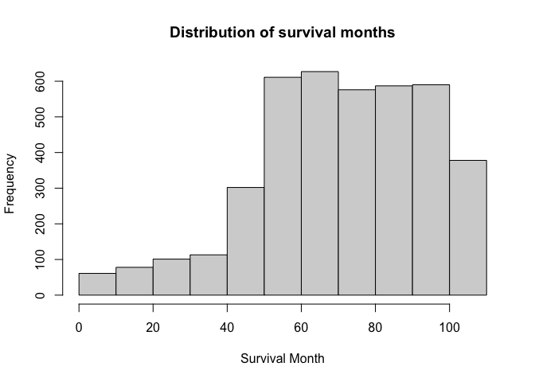

Data Exploration
================
Manye Dong
2023-11-28

## Goal: Predict the risk of death based on features 1-14

``` r
# import data and data cleaning
bc_data = read.csv("./Project_2_data.csv") |>
  janitor::clean_names() |> 
  na.omit() 
```

## Data summary

``` r
# include a descriptive table with summary statistics for all variables

# continuous data
conti_var = c("age", "tumor_size", "regional_node_examined","reginol_node_positive", "survival_months")
bc_data |>
  select(all_of(conti_var)) |>
  summary() |>
  knitr::kable()
```

|     | age           | tumor_size     | regional_node_examined | reginol_node_positive | survival_months |
|:----|:--------------|:---------------|:-----------------------|:----------------------|:----------------|
|     | Min. :30.00   | Min. : 1.00    | Min. : 1.00            | Min. : 1.000          | Min. : 1.0      |
|     | 1st Qu.:47.00 | 1st Qu.: 16.00 | 1st Qu.: 9.00          | 1st Qu.: 1.000        | 1st Qu.: 56.0   |
|     | Median :54.00 | Median : 25.00 | Median :14.00          | Median : 2.000        | Median : 73.0   |
|     | Mean :53.97   | Mean : 30.47   | Mean :14.36            | Mean : 4.158          | Mean : 71.3     |
|     | 3rd Qu.:61.00 | 3rd Qu.: 38.00 | 3rd Qu.:19.00          | 3rd Qu.: 5.000        | 3rd Qu.: 90.0   |
|     | Max. :69.00   | Max. :140.00   | Max. :61.00            | Max. :46.000          | Max. :107.0     |

``` r
# discrete data count number of distinct variables


discre_var <- c("race", "marital_status", "t_stage", "n_stage", "x6th_stage", "differentiate", "grade", "a_stage", "estrogen_status", "progesterone_status", "status")

# Function to create a summary table for each variable
summary_table = function(variable) {
  counts = table(bc_data[[variable]])
  summary_df = data.frame(
    Variable = rep(variable, length(counts)),
    Value = paste(variable, names(counts), sep = "_"),
    Count = as.vector(counts)
  )
  return(summary_df)
}

summary_tables = lapply(discre_var, summary_table)
combined_summary = do.call(rbind, summary_tables) |>
  knitr::kable()
print(combined_summary)
```

    ## 
    ## 
    ## |Variable            |Value                                   | Count|
    ## |:-------------------|:---------------------------------------|-----:|
    ## |race                |race_Black                              |   291|
    ## |race                |race_Other                              |   320|
    ## |race                |race_White                              |  3413|
    ## |marital_status      |marital_status_Divorced                 |   486|
    ## |marital_status      |marital_status_Married                  |  2643|
    ## |marital_status      |marital_status_Separated                |    45|
    ## |marital_status      |marital_status_Single                   |   615|
    ## |marital_status      |marital_status_Widowed                  |   235|
    ## |t_stage             |t_stage_T1                              |  1603|
    ## |t_stage             |t_stage_T2                              |  1786|
    ## |t_stage             |t_stage_T3                              |   533|
    ## |t_stage             |t_stage_T4                              |   102|
    ## |n_stage             |n_stage_N1                              |  2732|
    ## |n_stage             |n_stage_N2                              |   820|
    ## |n_stage             |n_stage_N3                              |   472|
    ## |x6th_stage          |x6th_stage_IIA                          |  1305|
    ## |x6th_stage          |x6th_stage_IIB                          |  1130|
    ## |x6th_stage          |x6th_stage_IIIA                         |  1050|
    ## |x6th_stage          |x6th_stage_IIIB                         |    67|
    ## |x6th_stage          |x6th_stage_IIIC                         |   472|
    ## |differentiate       |differentiate_Moderately differentiated |  2351|
    ## |differentiate       |differentiate_Poorly differentiated     |  1111|
    ## |differentiate       |differentiate_Undifferentiated          |    19|
    ## |differentiate       |differentiate_Well differentiated       |   543|
    ## |grade               |grade_ anaplastic; Grade IV             |    19|
    ## |grade               |grade_1                                 |   543|
    ## |grade               |grade_2                                 |  2351|
    ## |grade               |grade_3                                 |  1111|
    ## |a_stage             |a_stage_Distant                         |    92|
    ## |a_stage             |a_stage_Regional                        |  3932|
    ## |estrogen_status     |estrogen_status_Negative                |   269|
    ## |estrogen_status     |estrogen_status_Positive                |  3755|
    ## |progesterone_status |progesterone_status_Negative            |   698|
    ## |progesterone_status |progesterone_status_Positive            |  3326|
    ## |status              |status_Alive                            |  3408|
    ## |status              |status_Dead                             |   616|

## Survial Months distribution

``` r
# explore the distribution of the outcome and consider potential transformations if necessary
# look at the original distribution of survival months
hist(bc_data$survival_months, main = "Distribution of survival months", xlab = "Survival Month")
```

<!-- -->

``` r
#try different transformation 
log_survival = log(bc_data$survival_months)
hist(log_survival, main = "Distribution of log_transformed survival months", xlab = "log-transformed survival months")
```

<!-- -->

``` r
sqrt_survival = sqrt(bc_data$survival_months)
hist(sqrt_survival, main = "Distribution of sqrt(survival months)", xlab = "sqrt(survival months)")
```

<!-- -->

``` r
sq_survival = (bc_data$survival_months^2)
hist(sq_survival, main = "Distribution of square(survival months)", xlab = "square(survival months)")
```

<!-- -->

``` r
iv_survival = (1/bc_data$survival_months)
hist(iv_survival, main = "Distribution of inverse(survival months)", xlab = "inverse(survival months)", xlim = c(0,0.1),breaks=100)
```

<!-- -->

## Convert categorical data to factor

``` r
bc_data = 
  bc_data |>
  mutate(
    race = factor(race, labels = c("1", "2", "3"), levels = c("Black","White","Other")),
    marital_status = factor(marital_status, labels = c("1", "2", "3","4","5"),levels = c("Divorced", "Married", "Separated", "Single ", "Widowed")),
    t_stage = factor(t_stage, labels = c("1", "2", "3","4"),levels = c("T1", "T2", "T3", "T4")),
    n_stage = factor(n_stage, labels = c("1","2","3"),levels = c("N1","N2", "N3")),
    x6th_stage = factor(x6th_stage, labels = c("1", "2", "3","4","5"),levels = c("IIA","IIB","IIIA","IIIB","IIIC")),
    differentiate = factor(differentiate, labels = c("1", "2", "3","4"),levels = c("Moderately differentiated","Poorly differentiated","Undifferentiated","Well differentiated")),
    grade = factor(grade, labels = c("1", "2", "3","4"),levels = c("1","2","3"," anaplastic; Grade IV")),
    a_stage = factor(a_stage, labels = c("1","2"),levels = c("Distant","Regional")),
    estrogen_status = factor(estrogen_status, labels = c("0","1"),levels = c("Negative","Positive")),
    progesterone_status = factor(progesterone_status, labels = c("0","1"),levels = c("Negative","Positive")),
    status = factor(status, labels = c("0","1"),levels = c("Dead","Alive"))
    ) |> 
  rename(regional_node_positive = reginol_node_positive) 
```

## Look at data interaction and collinearity

``` r
# Pairwise interaction and Correlation plot
bc_data |> 
  select(-status, -survival_months) |> 
  pairs()
```

<!-- -->

``` r
cor_matrix <- 
  bc_data |> 
  select(-status, -survival_months) |> 
  mutate(across(where(is.factor), as.numeric)) |> 
  cor()

print(cor_matrix, digits = 3)
```

    ##                             age     race marital_status  t_stage  n_stage
    ## age                     1.00000 -0.02905        0.05083 -0.06691  0.00288
    ## race                   -0.02905  1.00000       -0.10482  0.00687 -0.01813
    ## marital_status          0.05083 -0.10482        1.00000  0.00932  0.01317
    ## t_stage                -0.06691  0.00687        0.00932  1.00000  0.27701
    ## n_stage                 0.00288 -0.01813        0.01317  0.27701  1.00000
    ## x6th_stage             -0.01874 -0.00621        0.00299  0.60671  0.88188
    ## differentiate           0.01570 -0.00315        0.03164 -0.03135 -0.03625
    ## grade                  -0.09929 -0.04535        0.00440  0.13147  0.16250
    ## a_stage                 0.02086  0.00710        0.00494 -0.22112 -0.26057
    ## tumor_size             -0.07721  0.00463        0.00741  0.80918  0.27790
    ## estrogen_status         0.05979  0.02027       -0.01790 -0.06095 -0.10199
    ## progesterone_status    -0.02127  0.01858       -0.01349 -0.05763 -0.09372
    ## regional_node_examined -0.03335  0.00997       -0.00429  0.11410  0.32828
    ## regional_node_positive  0.01259 -0.00769        0.00585  0.24307  0.83807
    ##                        x6th_stage differentiate   grade  a_stage tumor_size
    ## age                      -0.01874       0.01570 -0.0993  0.02086   -0.07721
    ## race                     -0.00621      -0.00315 -0.0453  0.00710    0.00463
    ## marital_status            0.00299       0.03164  0.0044  0.00494    0.00741
    ## t_stage                   0.60671      -0.03135  0.1315 -0.22112    0.80918
    ## n_stage                   0.88188      -0.03625  0.1625 -0.26057    0.27790
    ## x6th_stage                1.00000      -0.04229  0.1869 -0.29196    0.51397
    ## differentiate            -0.04229       1.00000 -0.3297 -0.00898   -0.02839
    ## grade                     0.18694      -0.32967  1.0000 -0.03946    0.11937
    ## a_stage                  -0.29196      -0.00898 -0.0395  1.00000   -0.12388
    ## tumor_size                0.51397      -0.02839  0.1194 -0.12388    1.00000
    ## estrogen_status          -0.10561      -0.02183 -0.2113  0.06557   -0.05958
    ## progesterone_status      -0.10125       0.00896 -0.1799  0.02653   -0.06988
    ## regional_node_examined    0.31722      -0.05725  0.0844 -0.06901    0.10435
    ## regional_node_positive    0.77396      -0.02834  0.1353 -0.23285    0.24232
    ##                        estrogen_status progesterone_status
    ## age                             0.0598            -0.02127
    ## race                            0.0203             0.01858
    ## marital_status                 -0.0179            -0.01349
    ## t_stage                        -0.0610            -0.05763
    ## n_stage                        -0.1020            -0.09372
    ## x6th_stage                     -0.1056            -0.10125
    ## differentiate                  -0.0218             0.00896
    ## grade                          -0.2113            -0.17986
    ## a_stage                         0.0656             0.02653
    ## tumor_size                     -0.0596            -0.06988
    ## estrogen_status                 1.0000             0.51331
    ## progesterone_status             0.5133             1.00000
    ## regional_node_examined         -0.0448            -0.01805
    ## regional_node_positive         -0.0860            -0.07807
    ##                        regional_node_examined regional_node_positive
    ## age                                  -0.03335                0.01259
    ## race                                  0.00997               -0.00769
    ## marital_status                       -0.00429                0.00585
    ## t_stage                               0.11410                0.24307
    ## n_stage                               0.32828                0.83807
    ## x6th_stage                            0.31722                0.77396
    ## differentiate                        -0.05725               -0.02834
    ## grade                                 0.08442                0.13532
    ## a_stage                              -0.06901               -0.23285
    ## tumor_size                            0.10435                0.24232
    ## estrogen_status                      -0.04484               -0.08599
    ## progesterone_status                  -0.01805               -0.07807
    ## regional_node_examined                1.00000                0.41158
    ## regional_node_positive                0.41158                1.00000

``` r
corrplot(cor_matrix, type = "upper", diag = FALSE, tl.cex = 0.5, tl.srt = 45)
```

<!-- -->

``` r
# boxplots for each variable
par(mfrow = c(2,3))

boxplot(bc_data$survival_months, main = "survival_months")
boxplot(bc_data$age, main = "age")
boxplot(bc_data$race, main = "race")
boxplot(bc_data$marital_status, main = "marital_status")
boxplot(bc_data$t_stage, main = "t_stage")
boxplot(bc_data$n_stage, main = "n_stage")
```

<!-- -->

``` r
par(mfrow = c(2,4))
boxplot(bc_data$x6th_stage, main = "x6th_stage")
boxplot(bc_data$differentiate, main = "differentiate")
boxplot(bc_data$a_stage, main = "a_stage")
boxplot(bc_data$tumor_size, main = "tumor_size")
boxplot(bc_data$estrogen_status, main = "estrogen_status")
boxplot(bc_data$progesterone_status, main = "progesterone_status")
boxplot(bc_data$regional_node_examined, main = "regional_node_examined")
boxplot(bc_data$regional_node_positive, main = "regional_node_positive")
```

<!-- -->

## Model and MLR selections

``` r
mult.fit = 
  lm(survival_months ~ ., data = bc_data)

logit_fit=glm(status ~ .-survival_months,family="binomial",data=bc_data)
summary(logit_fit)
```

    ## 
    ## Call:
    ## glm(formula = status ~ . - survival_months, family = "binomial", 
    ##     data = bc_data)
    ## 
    ## Coefficients: (4 not defined because of singularities)
    ##                          Estimate Std. Error z value Pr(>|z|)    
    ## (Intercept)             1.7760652  0.4874359   3.644 0.000269 ***
    ## age                    -0.0241699  0.0056199  -4.301 1.70e-05 ***
    ## race2                   0.5097774  0.1618144   3.150 0.001631 ** 
    ## race3                   0.9235406  0.2486035   3.715 0.000203 ***
    ## marital_status2         0.2102748  0.1417668   1.483 0.138010    
    ## marital_status3        -0.6717802  0.3874652  -1.734 0.082957 .  
    ## marital_status4         0.0677682  0.1750670   0.387 0.698683    
    ## marital_status5        -0.0234528  0.2210320  -0.106 0.915498    
    ## t_stage2               -0.2821932  0.1953845  -1.444 0.148656    
    ## t_stage3               -0.5359069  0.3137751  -1.708 0.087649 .  
    ## t_stage4               -0.9542320  0.4500716  -2.120 0.033991 *  
    ## n_stage2               -0.6208066  0.2391834  -2.596 0.009445 ** 
    ## n_stage3               -0.6910134  0.3007413  -2.298 0.021579 *  
    ## x6th_stage2            -0.2143223  0.2318280  -0.924 0.355232    
    ## x6th_stage3             0.0871350  0.2950089   0.295 0.767716    
    ## x6th_stage4            -0.0887019  0.5289101  -0.168 0.866814    
    ## x6th_stage5                    NA         NA      NA       NA    
    ## differentiate2         -0.3884281  0.1049279  -3.702 0.000214 ***
    ## differentiate3         -1.3615636  0.5324917  -2.557 0.010559 *  
    ## differentiate4          0.5367572  0.1840814   2.916 0.003547 ** 
    ## grade2                         NA         NA      NA       NA    
    ## grade3                         NA         NA      NA       NA    
    ## grade4                         NA         NA      NA       NA    
    ## a_stage2                0.0401504  0.2662370   0.151 0.880128    
    ## tumor_size             -0.0002492  0.0039726  -0.063 0.949990    
    ## estrogen_status1        0.7418514  0.1778875   4.170 3.04e-05 ***
    ## progesterone_status1    0.5860593  0.1276841   4.590 4.43e-06 ***
    ## regional_node_examined  0.0358800  0.0071869   4.992 5.96e-07 ***
    ## regional_node_positive -0.0790803  0.0153636  -5.147 2.64e-07 ***
    ## ---
    ## Signif. codes:  0 '***' 0.001 '**' 0.01 '*' 0.05 '.' 0.1 ' ' 1
    ## 
    ## (Dispersion parameter for binomial family taken to be 1)
    ## 
    ##     Null deviance: 3444.7  on 4023  degrees of freedom
    ## Residual deviance: 2952.0  on 3999  degrees of freedom
    ## AIC: 3002
    ## 
    ## Number of Fisher Scoring iterations: 5

``` r
summary(mult.fit)
```

    ## 
    ## Call:
    ## lm(formula = survival_months ~ ., data = bc_data)
    ## 
    ## Residuals:
    ##     Min      1Q  Median      3Q     Max 
    ## -73.905 -15.151   0.226  16.184  57.401 
    ## 
    ## Coefficients: (4 not defined because of singularities)
    ##                          Estimate Std. Error t value Pr(>|t|)    
    ## (Intercept)            36.4584902  3.8193833   9.546  < 2e-16 ***
    ## age                     0.0364364  0.0371704   0.980  0.32702    
    ## race2                   1.5911926  1.2583387   1.265  0.20612    
    ## race3                   2.2807094  1.6615278   1.373  0.16994    
    ## marital_status2        -0.0403054  1.0002832  -0.040  0.96786    
    ## marital_status3        -3.3037925  3.1572889  -1.046  0.29544    
    ## marital_status4        -0.3193347  1.2356947  -0.258  0.79609    
    ## marital_status5        -0.5737841  1.6210719  -0.354  0.72339    
    ## t_stage2               -0.3848148  1.5164113  -0.254  0.79969    
    ## t_stage3                3.1833386  2.4781073   1.285  0.19901    
    ## t_stage4                3.9450351  4.0235624   0.980  0.32691    
    ## n_stage2                1.8578638  1.7822545   1.042  0.29728    
    ## n_stage3               -1.4015767  2.3957759  -0.585  0.55857    
    ## x6th_stage2             0.3640443  1.6358546   0.223  0.82390    
    ## x6th_stage3            -2.4028024  2.1170181  -1.135  0.25645    
    ## x6th_stage4             0.6484431  4.6252820   0.140  0.88851    
    ## x6th_stage5                    NA         NA      NA       NA    
    ## differentiate2          0.5516415  0.7648521   0.721  0.47080    
    ## differentiate3          3.9487549  4.6820387   0.843  0.39906    
    ## differentiate4         -1.1882734  0.9677626  -1.228  0.21957    
    ## grade2                         NA         NA      NA       NA    
    ## grade3                         NA         NA      NA       NA    
    ## grade4                         NA         NA      NA       NA    
    ## a_stage2                4.2167409  2.3950735   1.761  0.07838 .  
    ## tumor_size             -0.0514424  0.0307797  -1.671  0.09474 .  
    ## estrogen_status1        4.4127809  1.5171945   2.909  0.00365 ** 
    ## progesterone_status1   -0.7240860  0.9897913  -0.732  0.46448    
    ## regional_node_examined  0.0007842  0.0434113   0.018  0.98559    
    ## regional_node_positive  0.0441596  0.1283212   0.344  0.73076    
    ## status1                29.7066602  0.9491205  31.299  < 2e-16 ***
    ## ---
    ## Signif. codes:  0 '***' 0.001 '**' 0.01 '*' 0.05 '.' 0.1 ' ' 1
    ## 
    ## Residual standard error: 20.14 on 3998 degrees of freedom
    ## Multiple R-squared:  0.2328, Adjusted R-squared:  0.228 
    ## F-statistic: 48.52 on 25 and 3998 DF,  p-value: < 2.2e-16

``` r
# QQ plot showing datafit 
plot(mult.fit, which = 2)
```

<!-- -->

``` r
# residual vs. leverage plot
plot(mult.fit, which = 4)
```

<!-- -->

``` r
# backward regression 
step_backward = step(mult.fit, direction='backward')
```

    ## Start:  AIC=24191.73
    ## survival_months ~ age + race + marital_status + t_stage + n_stage + 
    ##     x6th_stage + differentiate + grade + a_stage + tumor_size + 
    ##     estrogen_status + progesterone_status + regional_node_examined + 
    ##     regional_node_positive + status
    ## 
    ## 
    ## Step:  AIC=24191.73
    ## survival_months ~ age + race + marital_status + t_stage + n_stage + 
    ##     x6th_stage + differentiate + a_stage + tumor_size + estrogen_status + 
    ##     progesterone_status + regional_node_examined + regional_node_positive + 
    ##     status
    ## 
    ##                          Df Sum of Sq     RSS   AIC
    ## - marital_status          4       539 1622216 24185
    ## - x6th_stage              3       938 1622615 24188
    ## - differentiate           3      1291 1622968 24189
    ## - regional_node_examined  1         0 1621677 24190
    ## - race                    2       837 1622513 24190
    ## - t_stage                 3      1656 1623333 24190
    ## - regional_node_positive  1        48 1621725 24190
    ## - progesterone_status     1       217 1621894 24190
    ## - age                     1       390 1622067 24191
    ## - n_stage                 1       441 1622118 24191
    ## <none>                                1621677 24192
    ## - tumor_size              1      1133 1622810 24192
    ## - a_stage                 1      1257 1622934 24193
    ## - estrogen_status         1      3431 1625108 24198
    ## - status                  1    397362 2019039 25072
    ## 
    ## Step:  AIC=24185.07
    ## survival_months ~ age + race + t_stage + n_stage + x6th_stage + 
    ##     differentiate + a_stage + tumor_size + estrogen_status + 
    ##     progesterone_status + regional_node_examined + regional_node_positive + 
    ##     status
    ## 
    ##                          Df Sum of Sq     RSS   AIC
    ## - x6th_stage              3       971 1623187 24182
    ## - differentiate           3      1324 1623540 24182
    ## - regional_node_examined  1         0 1622216 24183
    ## - regional_node_positive  1        38 1622254 24183
    ## - t_stage                 3      1679 1623895 24183
    ## - race                    2       983 1623199 24184
    ## - progesterone_status     1       198 1622414 24184
    ## - age                     1       401 1622616 24184
    ## - n_stage                 1       453 1622669 24184
    ## <none>                                1622216 24185
    ## - tumor_size              1      1142 1623358 24186
    ## - a_stage                 1      1289 1623505 24186
    ## - estrogen_status         1      3461 1625676 24192
    ## - status                  1    399518 2021734 25069
    ## 
    ## Step:  AIC=24181.48
    ## survival_months ~ age + race + t_stage + n_stage + differentiate + 
    ##     a_stage + tumor_size + estrogen_status + progesterone_status + 
    ##     regional_node_examined + regional_node_positive + status
    ## 
    ##                          Df Sum of Sq     RSS   AIC
    ## - n_stage                 2       126 1623313 24178
    ## - differentiate           3      1228 1624415 24178
    ## - regional_node_examined  1         0 1623187 24180
    ## - regional_node_positive  1        30 1623217 24180
    ## - race                    2       924 1624111 24180
    ## - progesterone_status     1       183 1623370 24180
    ## - age                     1       350 1623537 24180
    ## - t_stage                 3      2343 1625530 24181
    ## <none>                                1623187 24182
    ## - tumor_size              1      1016 1624203 24182
    ## - a_stage                 1      1244 1624431 24183
    ## - estrogen_status         1      3386 1626573 24188
    ## - status                  1    399071 2022258 25064
    ## 
    ## Step:  AIC=24177.79
    ## survival_months ~ age + race + t_stage + differentiate + a_stage + 
    ##     tumor_size + estrogen_status + progesterone_status + regional_node_examined + 
    ##     regional_node_positive + status
    ## 
    ##                          Df Sum of Sq     RSS   AIC
    ## - differentiate           3      1192 1624506 24175
    ## - regional_node_examined  1         1 1623314 24176
    ## - regional_node_positive  1        40 1623354 24176
    ## - race                    2       945 1624259 24176
    ## - progesterone_status     1       177 1623490 24176
    ## - age                     1       347 1623660 24177
    ## - t_stage                 3      2378 1625691 24178
    ## <none>                                1623313 24178
    ## - tumor_size              1      1042 1624355 24178
    ## - a_stage                 1      1441 1624754 24179
    ## - estrogen_status         1      3397 1626711 24184
    ## - status                  1    400445 2023759 25063
    ## 
    ## Step:  AIC=24174.75
    ## survival_months ~ age + race + t_stage + a_stage + tumor_size + 
    ##     estrogen_status + progesterone_status + regional_node_examined + 
    ##     regional_node_positive + status
    ## 
    ##                          Df Sum of Sq     RSS   AIC
    ## - regional_node_examined  1         6 1624511 24173
    ## - regional_node_positive  1        24 1624529 24173
    ## - race                    2       866 1625372 24173
    ## - progesterone_status     1       233 1624739 24173
    ## - age                     1       254 1624760 24173
    ## - t_stage                 3      2382 1626888 24175
    ## <none>                                1624506 24175
    ## - tumor_size              1      1000 1625505 24175
    ## - a_stage                 1      1513 1626019 24176
    ## - estrogen_status         1      3099 1627605 24180
    ## - status                  1    400311 2024817 25059
    ## 
    ## Step:  AIC=24172.76
    ## survival_months ~ age + race + t_stage + a_stage + tumor_size + 
    ##     estrogen_status + progesterone_status + regional_node_positive + 
    ##     status
    ## 
    ##                          Df Sum of Sq     RSS   AIC
    ## - regional_node_positive  1        18 1624529 24171
    ## - race                    2       867 1625379 24171
    ## - progesterone_status     1       232 1624743 24171
    ## - age                     1       252 1624764 24171
    ## - t_stage                 3      2379 1626891 24173
    ## <none>                                1624511 24173
    ## - tumor_size              1      1003 1625515 24173
    ## - a_stage                 1      1518 1626030 24174
    ## - estrogen_status         1      3094 1627606 24178
    ## - status                  1    403062 2027574 25063
    ## 
    ## Step:  AIC=24170.8
    ## survival_months ~ age + race + t_stage + a_stage + tumor_size + 
    ##     estrogen_status + progesterone_status + status
    ## 
    ##                       Df Sum of Sq     RSS   AIC
    ## - race                 2       866 1625395 24169
    ## - progesterone_status  1       231 1624760 24169
    ## - age                  1       249 1624779 24169
    ## - t_stage              3      2393 1626923 24171
    ## <none>                             1624529 24171
    ## - tumor_size           1      1036 1625565 24171
    ## - a_stage              1      1639 1626169 24173
    ## - estrogen_status      1      3104 1627633 24176
    ## - status               1    422474 2047003 25099
    ## 
    ## Step:  AIC=24168.95
    ## survival_months ~ age + t_stage + a_stage + tumor_size + estrogen_status + 
    ##     progesterone_status + status
    ## 
    ##                       Df Sum of Sq     RSS   AIC
    ## - progesterone_status  1       227 1625622 24168
    ## - age                  1       265 1625660 24168
    ## - t_stage              3      2381 1627776 24169
    ## <none>                             1625395 24169
    ## - tumor_size           1      1056 1626451 24170
    ## - a_stage              1      1632 1627027 24171
    ## - estrogen_status      1      3169 1628564 24175
    ## - status               1    428139 2053534 25108
    ## 
    ## Step:  AIC=24167.51
    ## survival_months ~ age + t_stage + a_stage + tumor_size + estrogen_status + 
    ##     status
    ## 
    ##                   Df Sum of Sq     RSS   AIC
    ## - age              1       295 1625917 24166
    ## - t_stage          3      2349 1627971 24167
    ## <none>                         1625622 24168
    ## - tumor_size       1      1032 1626655 24168
    ## - a_stage          1      1644 1627266 24170
    ## - estrogen_status  1      3167 1628789 24173
    ## - status           1    429866 2055488 25110
    ## 
    ## Step:  AIC=24166.24
    ## survival_months ~ t_stage + a_stage + tumor_size + estrogen_status + 
    ##     status
    ## 
    ##                   Df Sum of Sq     RSS   AIC
    ## - t_stage          3      2376 1628293 24166
    ## <none>                         1625917 24166
    ## - tumor_size       1      1063 1626980 24167
    ## - a_stage          1      1672 1627589 24168
    ## - estrogen_status  1      3316 1629234 24172
    ## - status           1    430775 2056692 25110
    ## 
    ## Step:  AIC=24166.12
    ## survival_months ~ a_stage + tumor_size + estrogen_status + status
    ## 
    ##                   Df Sum of Sq     RSS   AIC
    ## - tumor_size       1       792 1629085 24166
    ## <none>                         1628293 24166
    ## - a_stage          1       840 1629132 24166
    ## - estrogen_status  1      3289 1631582 24172
    ## - status           1    431297 2059590 25110
    ## 
    ## Step:  AIC=24166.07
    ## survival_months ~ a_stage + estrogen_status + status
    ## 
    ##                   Df Sum of Sq     RSS   AIC
    ## <none>                         1629085 24166
    ## - a_stage          1      1043 1630128 24167
    ## - estrogen_status  1      3391 1632476 24172
    ## - status           1    441605 2070690 25129

``` r
# Criteria based procedures. both direction: choose the model with the smallest AIC value
step_both = MASS::stepAIC(mult.fit, direction = "both", trace = FALSE) |>
  broom::tidy()

knitr::kable(step_both, digits = 3)
```

| term             | estimate | std.error | statistic | p.value |
|:-----------------|---------:|----------:|----------:|--------:|
| (Intercept)      |   39.291 |     2.376 |    16.537 |   0.000 |
| a_stage2         |    3.426 |     2.136 |     1.604 |   0.109 |
| estrogen_status1 |    3.744 |     1.294 |     2.893 |   0.004 |
| status1          |   29.714 |     0.900 |    33.011 |   0.000 |

``` r
# fit a LASSO with lambda = 1
# smaller lambda, tends to give large model (more predictors)
mat=makeX(bc_data[1:14])
fit_LASSO = cv.glmnet(mat, bc_data$survival_months)
plot(fit_LASSO)
```

<!-- -->

``` r
best_model = glmnet(mat, bc_data$survival_months,lambda=fit_LASSO$lambda.min)
coef(best_model)
```

    ## 39 x 1 sparse Matrix of class "dgCMatrix"
    ##                                   s0
    ## (Intercept)             7.389688e+01
    ## age                    -2.336744e-02
    ## race1                  -3.135409e+00
    ## race2                   .           
    ## race3                   1.283391e+00
    ## marital_status1         .           
    ## marital_status2         6.230925e-01
    ## marital_status3        -4.849360e+00
    ## marital_status4         .           
    ## marital_status5        -2.380726e-01
    ## t_stage1                7.665824e-01
    ## t_stage2               -4.628485e-01
    ## t_stage3                .           
    ## t_stage4                .           
    ## n_stage1                1.286869e+00
    ## n_stage2                .           
    ## n_stage3               -2.376220e+00
    ## x6th_stage1             .           
    ## x6th_stage2             .           
    ## x6th_stage3             .           
    ## x6th_stage4             .           
    ## x6th_stage5            -6.647384e-14
    ## differentiate1          .           
    ## differentiate2         -7.099347e-01
    ## differentiate3         -5.741060e-01
    ## differentiate4          .           
    ## grade1                  .           
    ## grade2                  .           
    ## grade3                 -4.500262e-06
    ## grade4                 -1.248387e-06
    ## a_stage1               -3.230680e+00
    ## a_stage2                .           
    ## tumor_size             -3.350628e-02
    ## estrogen_status0       -8.204483e+00
    ## estrogen_status1        .           
    ## progesterone_status0   -1.418250e+00
    ## progesterone_status1    .           
    ## regional_node_examined  6.992062e-02
    ## regional_node_positive -2.801364e-01

``` r
coef(fit_LASSO)
```

    ## 39 x 1 sparse Matrix of class "dgCMatrix"
    ##                                 s1
    ## (Intercept)            71.54135781
    ## age                     .         
    ## race1                   .         
    ## race2                   .         
    ## race3                   .         
    ## marital_status1         .         
    ## marital_status2         .         
    ## marital_status3         .         
    ## marital_status4         .         
    ## marital_status5         .         
    ## t_stage1                .         
    ## t_stage2                .         
    ## t_stage3                .         
    ## t_stage4                .         
    ## n_stage1                .         
    ## n_stage2                .         
    ## n_stage3                .         
    ## x6th_stage1             .         
    ## x6th_stage2             .         
    ## x6th_stage3             .         
    ## x6th_stage4             .         
    ## x6th_stage5             .         
    ## differentiate1          .         
    ## differentiate2          .         
    ## differentiate3          .         
    ## differentiate4          .         
    ## grade1                  .         
    ## grade2                  .         
    ## grade3                  .         
    ## grade4                  .         
    ## a_stage1                .         
    ## a_stage2                .         
    ## tumor_size              .         
    ## estrogen_status0       -0.39144718
    ## estrogen_status1        .         
    ## progesterone_status0    .         
    ## progesterone_status1    .         
    ## regional_node_examined  .         
    ## regional_node_positive -0.05224268

``` r
fit_LASSO_logit = cv.glmnet(mat, bc_data$status,family="binomial")
plot(fit_LASSO_logit)
```

<!-- -->

``` r
# cross validation to choose the value of lambda
# lambda_seq = 10^seq(-3,0, by =0.1)
# set.seed(123)
# cv_object = cv.glmnet(as.matrix(bc_data[1:14]), y = bc_data$survival_months, lambda = lambda_seq, nfold = 5)
# cv_object
```

## The model we selected

## MLR Validation
