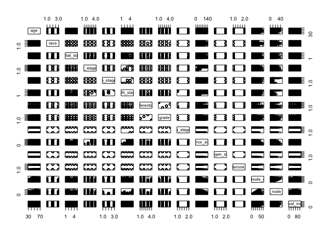

Data Exploration
================
Manye Dong
2023-11-28

## Predict the risk of death based on features 1-14

``` r
# import data and data cleaning
bc_data = read.csv("./Project_2_data.csv") |>
  janitor::clean_names() |> 
  na.omit() |> 
  mutate(
    race = factor(race, labels = c("1", "2", "3"), levels = c("Black","White","Other")),
    marital_status = factor(marital_status, labels = c("1", "2", "3","4","5"),levels = c("Divorced", "Married", "Separated", "Single ", "Widowed")),
    t_stage = factor(t_stage, labels = c("1", "2", "3","4"),levels = c("T1", "T2", "T3", "T4")),
    n_stage = factor(n_stage, labels = c("1","2","3"),levels = c("N1","N2", "N3")),
    x6th_stage = factor(x6th_stage, labels = c("1", "2", "3","4","5"),levels = c("IIA","IIB","IIIA","IIIB","IIIC")),
    differentiate = factor(differentiate, labels = c("1", "2", "3","4"),levels = c("Moderately differentiated","Poorly differentiated","Undifferentiated","Well differentiated")),
    grade = factor(grade, labels = c("1", "2", "3","4"),levels = c("1","2","3"," anaplastic; Grade IV")),
    a_stage = factor(a_stage, labels = c("1","2"),levels = c("Distant","Regional")),
    estrogen_status = factor(estrogen_status, labels = c("0","1"),levels = c("Negative","Positive")),
    progesterone_status = factor(progesterone_status, labels = c("0","1"),levels = c("Negative","Positive"))
    )
```

``` r
# Pairwise interaction and Correlation plot

bc_data |> 
  select(-status) |> 
  mutate(across(where(is.factor), as.numeric)) |> 
  cor() |> 
  (\(x) corrplot(x, type = "upper", diag = FALSE))()
```

<!-- -->

``` r
cor_matrix <- bc_data |> 
  select(-status) |> 
  mutate(across(where(is.factor), as.numeric)) |> 
  cor()

corrplot(cor_matrix, type = "upper", diag = FALSE, tl.cex = 0.5, tl.srt = 45)
```

<!-- -->

``` r
# include a descriptive table with summary statistics for all variables

# continuous data
conti_var = c("age", "tumor_size", "regional_node_examined","reginol_node_positive", "survival_months")
bc_data |>
  select(all_of(conti_var)) |>
  summary() |>
  knitr::kable()
```

|     | age           | tumor_size     | regional_node_examined | reginol_node_positive | survival_months |
|:----|:--------------|:---------------|:-----------------------|:----------------------|:----------------|
|     | Min. :30.00   | Min. : 1.00    | Min. : 1.00            | Min. : 1.000          | Min. : 1.0      |
|     | 1st Qu.:47.00 | 1st Qu.: 16.00 | 1st Qu.: 9.00          | 1st Qu.: 1.000        | 1st Qu.: 56.0   |
|     | Median :54.00 | Median : 25.00 | Median :14.00          | Median : 2.000        | Median : 73.0   |
|     | Mean :53.97   | Mean : 30.47   | Mean :14.36            | Mean : 4.158          | Mean : 71.3     |
|     | 3rd Qu.:61.00 | 3rd Qu.: 38.00 | 3rd Qu.:19.00          | 3rd Qu.: 5.000        | 3rd Qu.: 90.0   |
|     | Max. :69.00   | Max. :140.00   | Max. :61.00            | Max. :46.000          | Max. :107.0     |

``` r
# discrete data count number of distinct variables


discre_var <- c("race", "marital_status", "t_stage", "n_stage", "x6th_stage", "differentiate", "grade", "a_stage", "estrogen_status", "progesterone_status", "status")

# Function to create a summary table for each variable
summary_table = function(variable) {
  counts = table(bc_data[[variable]])
  summary_df = data.frame(
    Variable = rep(variable, length(counts)),
    Value = paste(variable, names(counts), sep = "_"),
    Count = as.vector(counts)
  )
  return(summary_df)
}

summary_tables = lapply(discre_var, summary_table)
combined_summary = do.call(rbind, summary_tables) |>
  knitr::kable()
print(combined_summary)
```

    ## 
    ## 
    ## |Variable            |Value                 | Count|
    ## |:-------------------|:---------------------|-----:|
    ## |race                |race_1                |   291|
    ## |race                |race_2                |  3413|
    ## |race                |race_3                |   320|
    ## |marital_status      |marital_status_1      |   486|
    ## |marital_status      |marital_status_2      |  2643|
    ## |marital_status      |marital_status_3      |    45|
    ## |marital_status      |marital_status_4      |   615|
    ## |marital_status      |marital_status_5      |   235|
    ## |t_stage             |t_stage_1             |  1603|
    ## |t_stage             |t_stage_2             |  1786|
    ## |t_stage             |t_stage_3             |   533|
    ## |t_stage             |t_stage_4             |   102|
    ## |n_stage             |n_stage_1             |  2732|
    ## |n_stage             |n_stage_2             |   820|
    ## |n_stage             |n_stage_3             |   472|
    ## |x6th_stage          |x6th_stage_1          |  1305|
    ## |x6th_stage          |x6th_stage_2          |  1130|
    ## |x6th_stage          |x6th_stage_3          |  1050|
    ## |x6th_stage          |x6th_stage_4          |    67|
    ## |x6th_stage          |x6th_stage_5          |   472|
    ## |differentiate       |differentiate_1       |  2351|
    ## |differentiate       |differentiate_2       |  1111|
    ## |differentiate       |differentiate_3       |    19|
    ## |differentiate       |differentiate_4       |   543|
    ## |grade               |grade_1               |   543|
    ## |grade               |grade_2               |  2351|
    ## |grade               |grade_3               |  1111|
    ## |grade               |grade_4               |    19|
    ## |a_stage             |a_stage_1             |    92|
    ## |a_stage             |a_stage_2             |  3932|
    ## |estrogen_status     |estrogen_status_0     |   269|
    ## |estrogen_status     |estrogen_status_1     |  3755|
    ## |progesterone_status |progesterone_status_0 |   698|
    ## |progesterone_status |progesterone_status_1 |  3326|
    ## |status              |status_Alive          |  3408|
    ## |status              |status_Dead           |   616|

``` r
# explore the distribution of the outcome and consider potential transformations if necessary
# Since the purpose is to predict the risk of death based on features 1-14, we are going to fit a model with variables 1-14 as predictors (x) and the survival months as the y value. 
# look at the original distribution of survival months
hist(bc_data$survival_months, main = "Distribution of survival months", xlab = "Survival Month")
```

<!-- -->

``` r
#try different transformation 
log_survival = log(bc_data$survival_months)
hist(log_survival, main = "Distribution of log_transformed survival months", xlab = "log-transformed survival months")
```

<!-- -->

``` r
sqrt_survival = sqrt(bc_data$survival_months)
hist(sqrt_survival, main = "Distribution of sqrt(survival months)", xlab = "sqrt(survival months)")
```

<!-- -->

``` r
sq_survival = (bc_data$survival_months^2)
hist(sq_survival, main = "Distribution of square(survival months)", xlab = "square(survival months)")
```

<!-- -->

``` r
bc_data = bc_data |>
  mutate(log_survival = log(survival_months))

bc_data |>
  ggplot(aes(x = log_survival)) +
  geom_histogram() +
  labs(title = "Distribution of log(survival months)", x = "log(survival months)")
```

    ## `stat_bin()` using `bins = 30`. Pick better value with `binwidth`.

<!-- -->

``` r
# examine the marginal distributions and pariwise relationships between variables (e.g., to check to see whether any nonlinearities are immediately obvious)
# explore several candidate models, and explain why you select your model
model_all = lm(survival_months ~ age+reginol_node_positive+ regional_node_examined+factor(estrogen_status)+factor(progesterone_status)+tumor_size+factor(a_stage) +factor(grade)+factor(differentiate)+factor(x6th_stage)+factor(n_stage)+factor(t_stage)+factor(marital_status)+factor(race), data = bc_data)

summary(model_all)
```

``` r
# see if there are any unusual observations and consider them as potential outliers/influential points

# detect non normality of outliers, using qq plot
plot(model_all, which = 2)
```

``` r
# suggest possible models
```
