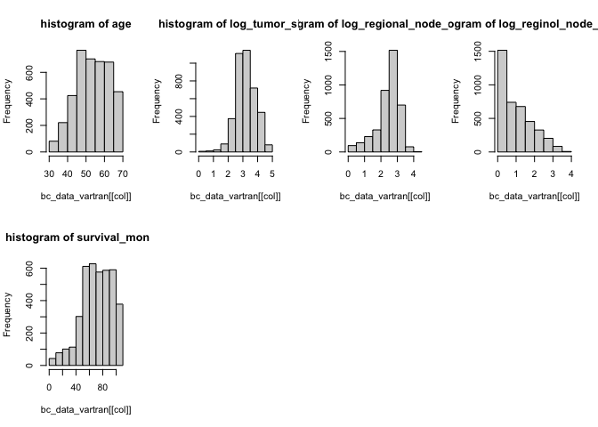
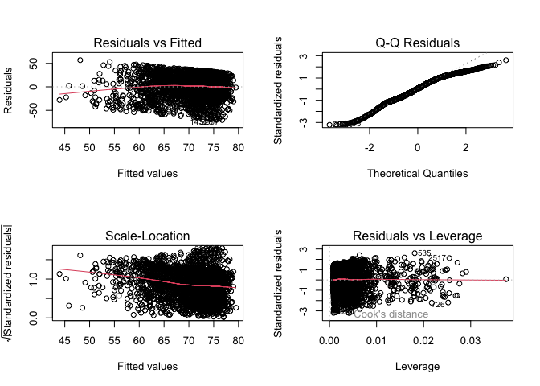

Data Exploration
================
Manye Dong
2023-11-28

## Goal: Predict the risk of death based on features 1-14

``` r
# import data and data cleaning
bc_data = read.csv("./Project_2_data.csv") |>
  janitor::clean_names() |> 
  na.omit()
```

### Data summary

``` r
# include a descriptive table with summary statistics for all variables

# continuous data
conti_var = c("age", "tumor_size", "regional_node_examined","reginol_node_positive", "survival_months")
bc_data |>
  select(all_of(conti_var)) |>
  summary() |>
  knitr::kable()
```

|     | age           | tumor_size     | regional_node_examined | reginol_node_positive | survival_months |
|:----|:--------------|:---------------|:-----------------------|:----------------------|:----------------|
|     | Min. :30.00   | Min. : 1.00    | Min. : 1.00            | Min. : 1.000          | Min. : 1.0      |
|     | 1st Qu.:47.00 | 1st Qu.: 16.00 | 1st Qu.: 9.00          | 1st Qu.: 1.000        | 1st Qu.: 56.0   |
|     | Median :54.00 | Median : 25.00 | Median :14.00          | Median : 2.000        | Median : 73.0   |
|     | Mean :53.97   | Mean : 30.47   | Mean :14.36            | Mean : 4.158          | Mean : 71.3     |
|     | 3rd Qu.:61.00 | 3rd Qu.: 38.00 | 3rd Qu.:19.00          | 3rd Qu.: 5.000        | 3rd Qu.: 90.0   |
|     | Max. :69.00   | Max. :140.00   | Max. :61.00            | Max. :46.000          | Max. :107.0     |

``` r
# discrete data count number of distinct variables


discre_var <- c("race", "marital_status", "t_stage", "n_stage", "x6th_stage", "differentiate", "grade", "a_stage", "estrogen_status", "progesterone_status", "status")

# Function to create a summary table for each variable
summary_table = function(variable) {
  counts = table(bc_data[[variable]])
  summary_df = data.frame(
    Variable = rep(variable, length(counts)),
    Value = paste(variable, names(counts), sep = "_"),
    Count = as.vector(counts)
  )
  return(summary_df)
}

summary_tables = lapply(discre_var, summary_table)
combined_summary = do.call(rbind, summary_tables) |>
  knitr::kable()
print(combined_summary)
```

    ## 
    ## 
    ## |Variable            |Value                                   | Count|
    ## |:-------------------|:---------------------------------------|-----:|
    ## |race                |race_Black                              |   291|
    ## |race                |race_Other                              |   320|
    ## |race                |race_White                              |  3413|
    ## |marital_status      |marital_status_Divorced                 |   486|
    ## |marital_status      |marital_status_Married                  |  2643|
    ## |marital_status      |marital_status_Separated                |    45|
    ## |marital_status      |marital_status_Single                   |   615|
    ## |marital_status      |marital_status_Widowed                  |   235|
    ## |t_stage             |t_stage_T1                              |  1603|
    ## |t_stage             |t_stage_T2                              |  1786|
    ## |t_stage             |t_stage_T3                              |   533|
    ## |t_stage             |t_stage_T4                              |   102|
    ## |n_stage             |n_stage_N1                              |  2732|
    ## |n_stage             |n_stage_N2                              |   820|
    ## |n_stage             |n_stage_N3                              |   472|
    ## |x6th_stage          |x6th_stage_IIA                          |  1305|
    ## |x6th_stage          |x6th_stage_IIB                          |  1130|
    ## |x6th_stage          |x6th_stage_IIIA                         |  1050|
    ## |x6th_stage          |x6th_stage_IIIB                         |    67|
    ## |x6th_stage          |x6th_stage_IIIC                         |   472|
    ## |differentiate       |differentiate_Moderately differentiated |  2351|
    ## |differentiate       |differentiate_Poorly differentiated     |  1111|
    ## |differentiate       |differentiate_Undifferentiated          |    19|
    ## |differentiate       |differentiate_Well differentiated       |   543|
    ## |grade               |grade_ anaplastic; Grade IV             |    19|
    ## |grade               |grade_1                                 |   543|
    ## |grade               |grade_2                                 |  2351|
    ## |grade               |grade_3                                 |  1111|
    ## |a_stage             |a_stage_Distant                         |    92|
    ## |a_stage             |a_stage_Regional                        |  3932|
    ## |estrogen_status     |estrogen_status_Negative                |   269|
    ## |estrogen_status     |estrogen_status_Positive                |  3755|
    ## |progesterone_status |progesterone_status_Negative            |   698|
    ## |progesterone_status |progesterone_status_Positive            |  3326|
    ## |status              |status_Alive                            |  3408|
    ## |status              |status_Dead                             |   616|

### Outliers

``` r
Q1 <- quantile(bc_data$survival_months, 0.25)
Q3 <- quantile(bc_data$survival_months, 0.75)
IQR <- Q3 - Q1

lower_bound <- Q1 - 1.5 * IQR
upper_bound <- Q3 + 1.5 * IQR

outliers <- bc_data |> filter((survival_months < lower_bound) | (survival_months > upper_bound))

bc_data <- anti_join(bc_data, outliers, by = c(colnames(bc_data)))
```

``` r
colnames(bc_data)
```

    ##  [1] "age"                    "race"                   "marital_status"        
    ##  [4] "t_stage"                "n_stage"                "x6th_stage"            
    ##  [7] "differentiate"          "grade"                  "a_stage"               
    ## [10] "tumor_size"             "estrogen_status"        "progesterone_status"   
    ## [13] "regional_node_examined" "reginol_node_positive"  "survival_months"       
    ## [16] "status"

### Survial Months distribution

``` r
# explore the distribution of the outcome and consider potential transformations if necessary
# look at the original distribution of survival months
hist(bc_data$survival_months, main = "Distribution of survival months", xlab = "Survival Month")
```

<!-- -->

``` r
#try different transformation 
log_survival = log(bc_data$survival_months)
hist(log_survival, main = "Distribution of log_transformed survival months", xlab = "log-transformed survival months")
```

<!-- -->

``` r
sqrt_survival = sqrt(bc_data$survival_months)
hist(sqrt_survival, main = "Distribution of sqrt(survival months)", xlab = "sqrt(survival months)")
```

<!-- -->

``` r
sq_survival = (bc_data$survival_months^2)
hist(sq_survival, main = "Distribution of square(survival months)", xlab = "square(survival months)")
```

<!-- -->

``` r
iv_survival = (1/bc_data$survival_months)
hist(iv_survival, main = "Distribution of inverse(survival months)", xlab = "inverse(survival months)", xlim = c(0,0.1),breaks=100)
```

<!-- -->
\### Numerical Variables distribution

``` r
par(mfrow = c(2,4))
for(col in conti_var) {
  hist(bc_data[[col]], main = paste("histogram of", col))
}
```

<!-- -->

``` r
bc_data_vartran = bc_data |>
  mutate(log_reginol_node_positive =log(reginol_node_positive), 
         log_regional_node_examined= log(regional_node_examined), 
         log_tumor_size = log(tumor_size)) |>
  select(- reginol_node_positive, -tumor_size, -regional_node_examined)

log_var = c("age", "log_tumor_size", "log_regional_node_examined","log_reginol_node_positive", "survival_months")
par(mfrow = c(2,4))
for(col in log_var) {
  hist(bc_data_vartran[[col]], main = paste("histogram of", col))
}
```

<!-- -->

### Convert categorical data to factor

``` r
bc_data = 
  bc_data |>
  mutate(
    race = factor(race, labels = c("1", "2", "3"), levels = c("Black", "White", "Other")),
    marital_status = factor(marital_status, labels = c("1", "2", "3","4","5"),levels = c("Divorced", "Married", "Separated", "Single ", "Widowed")),
    t_stage = factor(t_stage, labels = c("1", "2", "3","4"),levels = c("T1", "T2", "T3", "T4")),
    n_stage = factor(n_stage, labels = c("1","2","3"),levels = c("N1","N2", "N3")),
    x6th_stage = factor(x6th_stage, labels = c("1", "2", "3","4","5"),levels = c("IIA","IIB","IIIA","IIIB","IIIC")),
    differentiate = factor(differentiate, labels = c("1", "2", "3","4"),levels = c("Moderately differentiated","Poorly differentiated","Undifferentiated","Well differentiated")),
    grade = factor(grade, labels = c("1", "2", "3","4"),levels = c("1","2","3"," anaplastic; Grade IV")),
    a_stage = factor(a_stage, labels = c("1","2"),levels = c("Distant","Regional")),
    estrogen_status = factor(estrogen_status, labels = c("0","1"),levels = c("Negative","Positive")),
    progesterone_status = factor(progesterone_status, labels = c("0","1"),levels = c("Negative","Positive")),
    status = factor(status, labels = c("0","1"),levels = c("Dead","Alive"))
    ) |> 
  rename(regional_node_positive = reginol_node_positive) 
```

## Look at data interaction and collinearity

``` r
# Pairwise interaction and Correlation plot
bc_data |> 
  select(-status, -survival_months) |> 
  pairs()
```

<!-- -->

``` r
cor_matrix <- 
  bc_data |> 
  select(-status, -survival_months) |> 
  mutate(across(where(is.factor), as.numeric)) |> 
  cor()

print(cor_matrix, digits = 3)
```

    ##                             age     race marital_status  t_stage  n_stage
    ## age                     1.00000 -0.02710        0.05004 -0.06793  0.00294
    ## race                   -0.02710  1.00000       -0.10185  0.00607 -0.01821
    ## marital_status          0.05004 -0.10185        1.00000  0.00924  0.01236
    ## t_stage                -0.06793  0.00607        0.00924  1.00000  0.27706
    ## n_stage                 0.00294 -0.01821        0.01236  0.27706  1.00000
    ## x6th_stage             -0.01874 -0.00622        0.00157  0.60716  0.88162
    ## differentiate           0.01612 -0.00258        0.03154 -0.03176 -0.03573
    ## grade                  -0.10058 -0.04452        0.00379  0.13098  0.16258
    ## a_stage                 0.02062  0.00713        0.00490 -0.22149 -0.26162
    ## tumor_size             -0.07725  0.00356        0.00720  0.80903  0.27815
    ## estrogen_status         0.05942  0.02037       -0.01803 -0.06112 -0.10280
    ## progesterone_status    -0.02119  0.01699       -0.01315 -0.05913 -0.09534
    ## regional_node_examined -0.03165  0.00907       -0.00301  0.11439  0.32761
    ## regional_node_positive  0.01275 -0.00709        0.00448  0.24279  0.83789
    ##                        x6th_stage differentiate    grade  a_stage tumor_size
    ## age                      -0.01874       0.01612 -0.10058  0.02062   -0.07725
    ## race                     -0.00622      -0.00258 -0.04452  0.00713    0.00356
    ## marital_status            0.00157       0.03154  0.00379  0.00490    0.00720
    ## t_stage                   0.60716      -0.03176  0.13098 -0.22149    0.80903
    ## n_stage                   0.88162      -0.03573  0.16258 -0.26162    0.27815
    ## x6th_stage                1.00000      -0.04205  0.18696 -0.29293    0.51426
    ## differentiate            -0.04205       1.00000 -0.33112 -0.00863   -0.02885
    ## grade                     0.18696      -0.33112  1.00000 -0.03951    0.11896
    ## a_stage                  -0.29293      -0.00863 -0.03951  1.00000   -0.12405
    ## tumor_size                0.51426      -0.02885  0.11896 -0.12405    1.00000
    ## estrogen_status          -0.10628      -0.02123 -0.21148  0.06540   -0.05968
    ## progesterone_status      -0.10288       0.00870 -0.18091  0.02658   -0.07136
    ## regional_node_examined    0.31689      -0.05733  0.08505 -0.06913    0.10403
    ## regional_node_positive    0.77364      -0.02859  0.13460 -0.23361    0.24179
    ##                        estrogen_status progesterone_status
    ## age                             0.0594             -0.0212
    ## race                            0.0204              0.0170
    ## marital_status                 -0.0180             -0.0131
    ## t_stage                        -0.0611             -0.0591
    ## n_stage                        -0.1028             -0.0953
    ## x6th_stage                     -0.1063             -0.1029
    ## differentiate                  -0.0212              0.0087
    ## grade                          -0.2115             -0.1809
    ## a_stage                         0.0654              0.0266
    ## tumor_size                     -0.0597             -0.0714
    ## estrogen_status                 1.0000              0.5145
    ## progesterone_status             0.5145              1.0000
    ## regional_node_examined         -0.0449             -0.0187
    ## regional_node_positive         -0.0865             -0.0795
    ##                        regional_node_examined regional_node_positive
    ## age                                  -0.03165                0.01275
    ## race                                  0.00907               -0.00709
    ## marital_status                       -0.00301                0.00448
    ## t_stage                               0.11439                0.24279
    ## n_stage                               0.32761                0.83789
    ## x6th_stage                            0.31689                0.77364
    ## differentiate                        -0.05733               -0.02859
    ## grade                                 0.08505                0.13460
    ## a_stage                              -0.06913               -0.23361
    ## tumor_size                            0.10403                0.24179
    ## estrogen_status                      -0.04488               -0.08650
    ## progesterone_status                  -0.01867               -0.07951
    ## regional_node_examined                1.00000                0.41106
    ## regional_node_positive                0.41106                1.00000

``` r
corrplot(cor_matrix, type = "upper", diag = FALSE, tl.cex = 0.5, tl.srt = 45)
```

<!-- -->

``` r
# boxplots for each variable
par(mfrow = c(2,3))

boxplot(bc_data$survival_months, main = "survival_months")
boxplot(bc_data$age, main = "age")
boxplot(bc_data$race, main = "race")
boxplot(bc_data$marital_status, main = "marital_status")
boxplot(bc_data$t_stage, main = "t_stage")
boxplot(bc_data$n_stage, main = "n_stage")
```

<!-- -->

``` r
par(mfrow = c(2,4))
boxplot(bc_data$x6th_stage, main = "x6th_stage")
boxplot(bc_data$differentiate, main = "differentiate")
boxplot(bc_data$a_stage, main = "a_stage")
boxplot(bc_data$tumor_size, main = "tumor_size")
boxplot(bc_data$estrogen_status, main = "estrogen_status")
boxplot(bc_data$progesterone_status, main = "progesterone_status")
boxplot(bc_data$regional_node_examined, main = "regional_node_examined")
boxplot(bc_data$regional_node_positive, main = "regional_node_positive")
```

<!-- -->

## Model and MLR selections

### MLR with all predictors

Create dummies:

``` r
# Create a copy of the original data (optional step)
bc_data_dummy <- bc_data

# Specify the names of factor variables
factor_vars <- c("race", "marital_status", "t_stage", "n_stage", "x6th_stage", 
                 "differentiate", "grade", "a_stage", "estrogen_status", 
                 "progesterone_status", "status")

# Loop through each factor variable and create dummy variables
for (var in factor_vars) {
  # Convert the factor variable into dummy variables
  dummy_cols <- model.matrix(~ 0 + as.factor(bc_data[[var]]))
  
  # Modify column names to remove unwanted parts
  colnames(dummy_cols) <- gsub(paste0(var, "_bc_data\\[\\[", var, "\\]\\]"), "", colnames(dummy_cols))
  
  # Assign dummy variables to the dataframe
  colnames(dummy_cols) <- paste(var, colnames(dummy_cols), sep = "_")
  bc_data_dummy <- cbind(bc_data_dummy, dummy_cols)
}

# Remove original factor columns if desired
bc_data_dummy <- bc_data_dummy[, !names(bc_data_dummy) %in% factor_vars] |> janitor::clean_names()

head(bc_data_dummy)
```

    ##   age tumor_size regional_node_examined regional_node_positive survival_months
    ## 1  68          4                     24                      1              60
    ## 2  50         35                     14                      5              62
    ## 3  58         63                     14                      7              75
    ## 4  58         18                      2                      1              84
    ## 5  47         41                      3                      1              50
    ## 6  51         20                     18                      2              89
    ##   race_as_factor_bc_data_var_1 race_as_factor_bc_data_var_2
    ## 1                            0                            1
    ## 2                            0                            1
    ## 3                            0                            1
    ## 4                            0                            1
    ## 5                            0                            1
    ## 6                            0                            1
    ##   race_as_factor_bc_data_var_3 marital_status_as_factor_bc_data_var_1
    ## 1                            0                                      0
    ## 2                            0                                      0
    ## 3                            0                                      1
    ## 4                            0                                      0
    ## 5                            0                                      0
    ## 6                            0                                      0
    ##   marital_status_as_factor_bc_data_var_2 marital_status_as_factor_bc_data_var_3
    ## 1                                      1                                      0
    ## 2                                      1                                      0
    ## 3                                      0                                      0
    ## 4                                      1                                      0
    ## 5                                      1                                      0
    ## 6                                      0                                      0
    ##   marital_status_as_factor_bc_data_var_4 marital_status_as_factor_bc_data_var_5
    ## 1                                      0                                      0
    ## 2                                      0                                      0
    ## 3                                      0                                      0
    ## 4                                      0                                      0
    ## 5                                      0                                      0
    ## 6                                      1                                      0
    ##   t_stage_as_factor_bc_data_var_1 t_stage_as_factor_bc_data_var_2
    ## 1                               1                               0
    ## 2                               0                               1
    ## 3                               0                               0
    ## 4                               1                               0
    ## 5                               0                               1
    ## 6                               1                               0
    ##   t_stage_as_factor_bc_data_var_3 t_stage_as_factor_bc_data_var_4
    ## 1                               0                               0
    ## 2                               0                               0
    ## 3                               1                               0
    ## 4                               0                               0
    ## 5                               0                               0
    ## 6                               0                               0
    ##   n_stage_as_factor_bc_data_var_1 n_stage_as_factor_bc_data_var_2
    ## 1                               1                               0
    ## 2                               0                               1
    ## 3                               0                               0
    ## 4                               1                               0
    ## 5                               1                               0
    ## 6                               1                               0
    ##   n_stage_as_factor_bc_data_var_3 x6th_stage_as_factor_bc_data_var_1
    ## 1                               0                                  1
    ## 2                               0                                  0
    ## 3                               1                                  0
    ## 4                               0                                  1
    ## 5                               0                                  0
    ## 6                               0                                  1
    ##   x6th_stage_as_factor_bc_data_var_2 x6th_stage_as_factor_bc_data_var_3
    ## 1                                  0                                  0
    ## 2                                  0                                  1
    ## 3                                  0                                  0
    ## 4                                  0                                  0
    ## 5                                  1                                  0
    ## 6                                  0                                  0
    ##   x6th_stage_as_factor_bc_data_var_4 x6th_stage_as_factor_bc_data_var_5
    ## 1                                  0                                  0
    ## 2                                  0                                  0
    ## 3                                  0                                  1
    ## 4                                  0                                  0
    ## 5                                  0                                  0
    ## 6                                  0                                  0
    ##   differentiate_as_factor_bc_data_var_1 differentiate_as_factor_bc_data_var_2
    ## 1                                     0                                     1
    ## 2                                     1                                     0
    ## 3                                     1                                     0
    ## 4                                     0                                     1
    ## 5                                     0                                     1
    ## 6                                     1                                     0
    ##   differentiate_as_factor_bc_data_var_3 differentiate_as_factor_bc_data_var_4
    ## 1                                     0                                     0
    ## 2                                     0                                     0
    ## 3                                     0                                     0
    ## 4                                     0                                     0
    ## 5                                     0                                     0
    ## 6                                     0                                     0
    ##   grade_as_factor_bc_data_var_1 grade_as_factor_bc_data_var_2
    ## 1                             0                             0
    ## 2                             0                             1
    ## 3                             0                             1
    ## 4                             0                             0
    ## 5                             0                             0
    ## 6                             0                             1
    ##   grade_as_factor_bc_data_var_3 grade_as_factor_bc_data_var_4
    ## 1                             1                             0
    ## 2                             0                             0
    ## 3                             0                             0
    ## 4                             1                             0
    ## 5                             1                             0
    ## 6                             0                             0
    ##   a_stage_as_factor_bc_data_var_1 a_stage_as_factor_bc_data_var_2
    ## 1                               0                               1
    ## 2                               0                               1
    ## 3                               0                               1
    ## 4                               0                               1
    ## 5                               0                               1
    ## 6                               0                               1
    ##   estrogen_status_as_factor_bc_data_var_0
    ## 1                                       0
    ## 2                                       0
    ## 3                                       0
    ## 4                                       0
    ## 5                                       0
    ## 6                                       0
    ##   estrogen_status_as_factor_bc_data_var_1
    ## 1                                       1
    ## 2                                       1
    ## 3                                       1
    ## 4                                       1
    ## 5                                       1
    ## 6                                       1
    ##   progesterone_status_as_factor_bc_data_var_0
    ## 1                                           0
    ## 2                                           0
    ## 3                                           0
    ## 4                                           0
    ## 5                                           0
    ## 6                                           0
    ##   progesterone_status_as_factor_bc_data_var_1 status_as_factor_bc_data_var_0
    ## 1                                           1                              0
    ## 2                                           1                              0
    ## 3                                           1                              0
    ## 4                                           1                              0
    ## 5                                           1                              0
    ## 6                                           1                              0
    ##   status_as_factor_bc_data_var_1
    ## 1                              1
    ## 2                              1
    ## 3                              1
    ## 4                              1
    ## 5                              1
    ## 6                              1

``` r
mult.fit = lm(survival_months ~ . - differentiate - status, data = bc_data)

summary(mult.fit)
```

    ## 
    ## Call:
    ## lm(formula = survival_months ~ . - differentiate - status, data = bc_data)
    ## 
    ## Residuals:
    ##     Min      1Q  Median      3Q     Max 
    ## -71.017 -15.651   1.106  17.896  56.318 
    ## 
    ## Coefficients: (1 not defined because of singularities)
    ##                        Estimate Std. Error t value Pr(>|t|)    
    ## (Intercept)            57.98258    4.20482  13.790  < 2e-16 ***
    ## age                    -0.02998    0.04071  -0.736  0.46151    
    ## race2                   3.51964    1.38054   2.549  0.01083 *  
    ## race3                   5.61035    1.82158   3.080  0.00208 ** 
    ## marital_status2         0.57500    1.09851   0.523  0.60070    
    ## marital_status3        -5.16391    3.49390  -1.478  0.13949    
    ## marital_status4        -0.19748    1.35686  -0.146  0.88429    
    ## marital_status5        -0.80586    1.78200  -0.452  0.65113    
    ## t_stage2               -0.96186    1.66431  -0.578  0.56334    
    ## t_stage3                1.00419    2.71829   0.369  0.71183    
    ## t_stage4               -2.14337    4.40307  -0.487  0.62643    
    ## n_stage2               -0.44746    1.95424  -0.229  0.81890    
    ## n_stage3               -3.28586    2.63045  -1.249  0.21168    
    ## x6th_stage2            -0.08875    1.79641  -0.049  0.96060    
    ## x6th_stage3            -0.70732    2.32242  -0.305  0.76072    
    ## x6th_stage4             3.26282    5.06724   0.644  0.51967    
    ## x6th_stage5                  NA         NA      NA       NA    
    ## grade2                  0.44862    1.05975   0.423  0.67208    
    ## grade3                 -0.79421    1.20243  -0.661  0.50897    
    ## grade4                 -2.91391    5.19443  -0.561  0.57485    
    ## a_stage2                4.69731    2.62406   1.790  0.07352 .  
    ## tumor_size             -0.05920    0.03376  -1.754  0.07957 .  
    ## estrogen_status1        8.94906    1.65655   5.402 6.97e-08 ***
    ## progesterone_status1    1.54040    1.08448   1.420  0.15557    
    ## regional_node_examined  0.10041    0.04749   2.114  0.03456 *  
    ## regional_node_positive -0.32176    0.14029  -2.294  0.02187 *  
    ## ---
    ## Signif. codes:  0 '***' 0.001 '**' 0.01 '*' 0.05 '.' 0.1 ' ' 1
    ## 
    ## Residual standard error: 22.06 on 3981 degrees of freedom
    ## Multiple R-squared:  0.04582,    Adjusted R-squared:  0.04007 
    ## F-statistic: 7.965 on 24 and 3981 DF,  p-value: < 2.2e-16

``` r
# if use log(variables)
log_mult.fit = lm(survival_months ~ . - differentiate - status, data = bc_data_vartran)

summary(log_mult.fit)
```

    ## 
    ## Call:
    ## lm(formula = survival_months ~ . - differentiate - status, data = bc_data_vartran)
    ## 
    ## Residuals:
    ##     Min      1Q  Median      3Q     Max 
    ## -71.735 -15.701   1.204  17.900  55.121 
    ## 
    ## Coefficients: (1 not defined because of singularities)
    ##                             Estimate Std. Error t value Pr(>|t|)    
    ## (Intercept)                 56.32832    7.12085   7.910 3.30e-15 ***
    ## age                         -0.03178    0.04074  -0.780  0.43537    
    ## raceOther                    5.69254    1.82185   3.125  0.00179 ** 
    ## raceWhite                    3.59100    1.38047   2.601  0.00932 ** 
    ## marital_statusMarried        0.58345    1.09873   0.531  0.59543    
    ## marital_statusSeparated     -5.20459    3.49347  -1.490  0.13635    
    ## marital_statusSingle        -0.13834    1.35688  -0.102  0.91880    
    ## marital_statusWidowed       -0.71313    1.78210  -0.400  0.68906    
    ## t_stageT2                   -0.93097    1.75529  -0.530  0.59588    
    ## t_stageT3                   -0.39627    2.47690  -0.160  0.87290    
    ## t_stageT4                   -3.14625    4.34168  -0.725  0.46870    
    ## n_stageN2                    0.36169    2.07774   0.174  0.86181    
    ## n_stageN3                   -3.05073    2.52469  -1.208  0.22698    
    ## x6th_stageIIB                0.05940    1.79796   0.033  0.97365    
    ## x6th_stageIIIA              -0.22151    2.31927  -0.096  0.92392    
    ## x6th_stageIIIB               3.84884    5.06448   0.760  0.44732    
    ## x6th_stageIIIC                    NA         NA      NA       NA    
    ## grade1                       2.55065    5.19693   0.491  0.62360    
    ## grade2                       3.11461    5.12355   0.608  0.54329    
    ## grade3                       1.86374    5.13494   0.363  0.71666    
    ## a_stageRegional              4.81934    2.62516   1.836  0.06646 .  
    ## estrogen_statusPositive      9.04900    1.65694   5.461 5.02e-08 ***
    ## progesterone_statusPositive  1.53808    1.08420   1.419  0.15608    
    ## log_reginol_node_positive   -2.01810    0.79422  -2.541  0.01109 *  
    ## log_regional_node_examined   1.09466    0.51109   2.142  0.03227 *  
    ## log_tumor_size              -1.20934    1.01740  -1.189  0.23465    
    ## ---
    ## Signif. codes:  0 '***' 0.001 '**' 0.01 '*' 0.05 '.' 0.1 ' ' 1
    ## 
    ## Residual standard error: 22.06 on 3981 degrees of freedom
    ## Multiple R-squared:  0.04568,    Adjusted R-squared:  0.03992 
    ## F-statistic: 7.939 on 24 and 3981 DF,  p-value: < 2.2e-16

DO WE NEED TO DO LOG?

``` r
# residual vs. leverage plot
plot(mult.fit, which = 4)
```

<!-- -->

``` r
par(mfrow = c(2,2))
plot(mult.fit)
```

<!-- -->

Looks like doesn’t need a transformation on the outcome survival months.

Use box-cox transformation to double-check if we need to make
transformations.

``` r
# boxcox(mult.fit)
```

Since lambda approaches 1 and its 95% CI lies close to 1, it suggests
that we do not need to make any transformation.

Based on Cook’s distance, we will investigate the three influential
points:

``` r
view_influential = bc_data[c(278, 1553, 1584), ]
view_influential
```

    ##      age race marital_status t_stage n_stage x6th_stage differentiate grade
    ## 278   52    1              4       3       3          5             3     4
    ## 1553  58    2              4       1       2          3             3     4
    ## 1584  50    2              2       2       1          2             1     2
    ##      a_stage tumor_size estrogen_status progesterone_status
    ## 278        2        100               1                   1
    ## 1553       2         19               0                   0
    ## 1584       2         25               1                   1
    ##      regional_node_examined regional_node_positive survival_months status
    ## 278                      23                     17              16      0
    ## 1553                     47                      7               9      0
    ## 1584                     39                      3              71      1

After investigation, it looks like these three points are not negatively
impacting the results. So, we will not remove them. They have a reason
to be there.

``` r
# Predict on the test data
predicted_test <- predict(mult.fit, newdata = bc_data)

# Calculate evaluation metrics (e.g., Mean Squared Error, R-squared)
rmse <- sqrt(mean((predicted_test - bc_data$survival_months)^2))
rsquared <- summary(mult.fit)$r.squared

rmse
```

    ## [1] 21.98903

``` r
rsquared
```

    ## [1] 0.04581822

### MLR reducing multicollinearity using correlation matrix

First, find the highly correlated pairs:

``` r
new_df = bc_data |> mutate(across(where(is.factor), as.numeric))
```

``` r
cor_matrix = cor(new_df[, c(colnames(new_df))])

# Find the pairs where correlation is greater than or equal to 0.7 but less than 1
high_cor_pairs = which(cor_matrix >= 0.7 & cor_matrix < 1, arr.ind = TRUE)

# Extract the variable names for these pairs
high_cor_var_pairs = data.frame(
  Var1 = rownames(cor_matrix)[high_cor_pairs[, 1]],
  Var2 = colnames(cor_matrix)[high_cor_pairs[, 2]],
  Correlation = cor_matrix[high_cor_pairs]
)

high_cor_var_pairs
```

    ##                     Var1                   Var2 Correlation
    ## 1             tumor_size                t_stage   0.8090257
    ## 2             x6th_stage                n_stage   0.8816229
    ## 3 regional_node_positive                n_stage   0.8378946
    ## 4                n_stage             x6th_stage   0.8816229
    ## 5 regional_node_positive             x6th_stage   0.7736445
    ## 6                t_stage             tumor_size   0.8090257
    ## 7                n_stage regional_node_positive   0.8378946
    ## 8             x6th_stage regional_node_positive   0.7736445

Remove the one with lower correlation with outcome in every pair:

``` r
cor_tumor = cor_matrix["survival_months", "tumor_size"]
cor_tstage = cor_matrix["survival_months", "t_stage"]

c(cor_tumor, cor_tstage)
```

    ## [1] -0.08873521 -0.08673585

Keep tumor_size.

``` r
cor_tumor = cor_matrix["survival_months", "x6th_stage"]
cor_nstage = cor_matrix["survival_months", "n_stage"]
cor_regional = cor_matrix["survival_months", "regional_node_positive"]

c(cor_tumor, cor_nstage, cor_regional)
```

    ## [1] -0.1438298 -0.1372208 -0.1350219

Keep tumor_size, delete the other two.

Fit the reduced model:

``` r
reduced_df = bc_data |> select(-t_stage, -n_stage, -regional_node_positive)
```

``` r
reduced_model = lm(survival_months ~ . -status-differentiate, data = reduced_df) 

summary(reduced_model)
```

    ## 
    ## Call:
    ## lm(formula = survival_months ~ . - status - differentiate, data = reduced_df)
    ## 
    ## Residuals:
    ##     Min      1Q  Median      3Q     Max 
    ## -70.878 -15.502   1.149  17.991  53.683 
    ## 
    ## Coefficients:
    ##                        Estimate Std. Error t value Pr(>|t|)    
    ## (Intercept)            57.61146    4.17158  13.810  < 2e-16 ***
    ## age                    -0.03384    0.04068  -0.832  0.40550    
    ## race2                   3.47478    1.37997   2.518  0.01184 *  
    ## race3                   5.53252    1.82087   3.038  0.00239 ** 
    ## marital_status2         0.62619    1.09868   0.570  0.56875    
    ## marital_status3        -5.60066    3.49098  -1.604  0.10872    
    ## marital_status4        -0.25925    1.35632  -0.191  0.84843    
    ## marital_status5        -0.76834    1.78243  -0.431  0.66645    
    ## x6th_stage2            -1.55919    0.96545  -1.615  0.10639    
    ## x6th_stage3            -2.77555    1.11786  -2.483  0.01307 *  
    ## x6th_stage4            -0.89874    3.03412  -0.296  0.76708    
    ## x6th_stage5            -8.54247    1.45849  -5.857 5.09e-09 ***
    ## grade2                  0.41334    1.05993   0.390  0.69658    
    ## grade3                 -0.85592    1.20139  -0.712  0.47623    
    ## grade4                 -2.91503    5.18330  -0.562  0.57388    
    ## a_stage2                4.83744    2.57924   1.876  0.06079 .  
    ## tumor_size             -0.03354    0.02063  -1.626  0.10408    
    ## estrogen_status1        8.99619    1.65661   5.430 5.96e-08 ***
    ## progesterone_status1    1.51824    1.08476   1.400  0.16171    
    ## regional_node_examined  0.06959    0.04579   1.520  0.12870    
    ## ---
    ## Signif. codes:  0 '***' 0.001 '**' 0.01 '*' 0.05 '.' 0.1 ' ' 1
    ## 
    ## Residual standard error: 22.07 on 3986 degrees of freedom
    ## Multiple R-squared:  0.04369,    Adjusted R-squared:  0.03913 
    ## F-statistic: 9.584 on 19 and 3986 DF,  p-value: < 2.2e-16

``` r
# |> broom::tidy() |> knitr::kable(digits=3)
```

Estrogen_status1 seems to be the most influential factor .

``` r
par(mfrow = c(2,2))
plot(reduced_model)
```

<!-- -->

Normality fit looks better at the left tail.

### Stepwise

Forward

``` r
intercept_only = lm(survival_months ~ 1, data = bc_data)
step(intercept_only, direction = "forward", scope = formula(mult.fit), trace = FALSE)
```

    ## 
    ## Call:
    ## lm(formula = survival_months ~ x6th_stage + estrogen_status + 
    ##     race + a_stage + regional_node_positive + regional_node_examined + 
    ##     tumor_size + progesterone_status, data = bc_data)
    ## 
    ## Coefficients:
    ##            (Intercept)             x6th_stage2             x6th_stage3  
    ##               55.15151                -1.43283                -1.59654  
    ##            x6th_stage4             x6th_stage5        estrogen_status1  
    ##                0.33089                -3.97798                 9.28087  
    ##                  race2                   race3                a_stage2  
    ##                3.96260                 6.13348                 5.08021  
    ## regional_node_positive  regional_node_examined              tumor_size  
    ##               -0.36012                 0.10525                -0.03979  
    ##   progesterone_status1  
    ##                1.76293

``` r
forward_pred = lm(survival_months ~ x6th_stage + estrogen_status + 
    race + a_stage + regional_node_positive + regional_node_examined + 
    tumor_size + progesterone_status, data = bc_data)

summary(forward_pred)
```

    ## 
    ## Call:
    ## lm(formula = survival_months ~ x6th_stage + estrogen_status + 
    ##     race + a_stage + regional_node_positive + regional_node_examined + 
    ##     tumor_size + progesterone_status, data = bc_data)
    ## 
    ## Residuals:
    ##     Min      1Q  Median      3Q     Max 
    ## -70.728 -15.549   1.015  17.854  56.896 
    ## 
    ## Coefficients:
    ##                        Estimate Std. Error t value Pr(>|t|)    
    ## (Intercept)            55.15151    3.23529  17.047  < 2e-16 ***
    ## x6th_stage2            -1.43283    0.96471  -1.485 0.137557    
    ## x6th_stage3            -1.59654    1.21551  -1.313 0.189097    
    ## x6th_stage4             0.33089    3.06577   0.108 0.914057    
    ## x6th_stage5            -3.97798    2.34241  -1.698 0.089540 .  
    ## estrogen_status1        9.28087    1.63142   5.689 1.37e-08 ***
    ## race2                   3.96260    1.35386   2.927 0.003443 ** 
    ## race3                   6.13348    1.79420   3.419 0.000636 ***
    ## a_stage2                5.08021    2.57507   1.973 0.048582 *  
    ## regional_node_positive -0.36012    0.13432  -2.681 0.007368 ** 
    ## regional_node_examined  0.10525    0.04735   2.223 0.026291 *  
    ## tumor_size             -0.03979    0.02071  -1.921 0.054782 .  
    ## progesterone_status1    1.76293    1.07610   1.638 0.101446    
    ## ---
    ## Signif. codes:  0 '***' 0.001 '**' 0.01 '*' 0.05 '.' 0.1 ' ' 1
    ## 
    ## Residual standard error: 22.05 on 3993 degrees of freedom
    ## Multiple R-squared:  0.04348,    Adjusted R-squared:  0.04061 
    ## F-statistic: 15.13 on 12 and 3993 DF,  p-value: < 2.2e-16

Backward

``` r
step(mult.fit, direction = 'backward', trace = FALSE)
```

    ## 
    ## Call:
    ## lm(formula = survival_months ~ race + a_stage + tumor_size + 
    ##     estrogen_status + progesterone_status + regional_node_examined + 
    ##     regional_node_positive, data = bc_data)
    ## 
    ## Coefficients:
    ##            (Intercept)                   race2                   race3  
    ##               54.84485                 4.01445                 6.14060  
    ##               a_stage2              tumor_size        estrogen_status1  
    ##                5.13991                -0.05495                 9.28031  
    ##   progesterone_status1  regional_node_examined  regional_node_positive  
    ##                1.83057                 0.10526                -0.52111

``` r
backward_pred = lm(formula = survival_months ~ race + a_stage + tumor_size + 
    estrogen_status + progesterone_status + regional_node_examined + 
    regional_node_positive, data = bc_data)

summary(backward_pred)
```

    ## 
    ## Call:
    ## lm(formula = survival_months ~ race + a_stage + tumor_size + 
    ##     estrogen_status + progesterone_status + regional_node_examined + 
    ##     regional_node_positive, data = bc_data)
    ## 
    ## Residuals:
    ##     Min      1Q  Median      3Q     Max 
    ## -70.152 -15.596   1.055  17.861  57.385 
    ## 
    ## Coefficients:
    ##                        Estimate Std. Error t value Pr(>|t|)    
    ## (Intercept)            54.84485    3.09046  17.747  < 2e-16 ***
    ## race2                   4.01445    1.35337   2.966 0.003032 ** 
    ## race3                   6.14060    1.79301   3.425 0.000622 ***
    ## a_stage2                5.13991    2.40249   2.139 0.032463 *  
    ## tumor_size             -0.05495    0.01706  -3.221 0.001287 ** 
    ## estrogen_status1        9.28031    1.63014   5.693 1.34e-08 ***
    ## progesterone_status1    1.83057    1.07536   1.702 0.088781 .  
    ## regional_node_examined  0.10526    0.04724   2.228 0.025922 *  
    ## regional_node_positive -0.52111    0.07857  -6.632 3.75e-11 ***
    ## ---
    ## Signif. codes:  0 '***' 0.001 '**' 0.01 '*' 0.05 '.' 0.1 ' ' 1
    ## 
    ## Residual standard error: 22.05 on 3997 degrees of freedom
    ## Multiple R-squared:  0.04241,    Adjusted R-squared:  0.04049 
    ## F-statistic: 22.13 on 8 and 3997 DF,  p-value: < 2.2e-16

Both Directions

``` r
step(mult.fit, direction = 'both', trace = FALSE)
```

    ## 
    ## Call:
    ## lm(formula = survival_months ~ race + a_stage + tumor_size + 
    ##     estrogen_status + progesterone_status + regional_node_examined + 
    ##     regional_node_positive, data = bc_data)
    ## 
    ## Coefficients:
    ##            (Intercept)                   race2                   race3  
    ##               54.84485                 4.01445                 6.14060  
    ##               a_stage2              tumor_size        estrogen_status1  
    ##                5.13991                -0.05495                 9.28031  
    ##   progesterone_status1  regional_node_examined  regional_node_positive  
    ##                1.83057                 0.10526                -0.52111

``` r
both_pred = lm(formula = survival_months ~ race + a_stage + tumor_size + 
    estrogen_status + progesterone_status + regional_node_examined + 
    regional_node_positive, data = bc_data)

summary(both_pred)
```

    ## 
    ## Call:
    ## lm(formula = survival_months ~ race + a_stage + tumor_size + 
    ##     estrogen_status + progesterone_status + regional_node_examined + 
    ##     regional_node_positive, data = bc_data)
    ## 
    ## Residuals:
    ##     Min      1Q  Median      3Q     Max 
    ## -70.152 -15.596   1.055  17.861  57.385 
    ## 
    ## Coefficients:
    ##                        Estimate Std. Error t value Pr(>|t|)    
    ## (Intercept)            54.84485    3.09046  17.747  < 2e-16 ***
    ## race2                   4.01445    1.35337   2.966 0.003032 ** 
    ## race3                   6.14060    1.79301   3.425 0.000622 ***
    ## a_stage2                5.13991    2.40249   2.139 0.032463 *  
    ## tumor_size             -0.05495    0.01706  -3.221 0.001287 ** 
    ## estrogen_status1        9.28031    1.63014   5.693 1.34e-08 ***
    ## progesterone_status1    1.83057    1.07536   1.702 0.088781 .  
    ## regional_node_examined  0.10526    0.04724   2.228 0.025922 *  
    ## regional_node_positive -0.52111    0.07857  -6.632 3.75e-11 ***
    ## ---
    ## Signif. codes:  0 '***' 0.001 '**' 0.01 '*' 0.05 '.' 0.1 ' ' 1
    ## 
    ## Residual standard error: 22.05 on 3997 degrees of freedom
    ## Multiple R-squared:  0.04241,    Adjusted R-squared:  0.04049 
    ## F-statistic: 22.13 on 8 and 3997 DF,  p-value: < 2.2e-16

``` r
step_forward = MASS::stepAIC(mult.fit, direction = "forward", trace = FALSE) |>
  broom::tidy()

knitr::kable(step_forward, digits = 3)
```

| term                   | estimate | std.error | statistic | p.value |
|:-----------------------|---------:|----------:|----------:|--------:|
| (Intercept)            |   57.983 |     4.205 |    13.790 |   0.000 |
| age                    |   -0.030 |     0.041 |    -0.736 |   0.462 |
| race2                  |    3.520 |     1.381 |     2.549 |   0.011 |
| race3                  |    5.610 |     1.822 |     3.080 |   0.002 |
| marital_status2        |    0.575 |     1.099 |     0.523 |   0.601 |
| marital_status3        |   -5.164 |     3.494 |    -1.478 |   0.139 |
| marital_status4        |   -0.197 |     1.357 |    -0.146 |   0.884 |
| marital_status5        |   -0.806 |     1.782 |    -0.452 |   0.651 |
| t_stage2               |   -0.962 |     1.664 |    -0.578 |   0.563 |
| t_stage3               |    1.004 |     2.718 |     0.369 |   0.712 |
| t_stage4               |   -2.143 |     4.403 |    -0.487 |   0.626 |
| n_stage2               |   -0.447 |     1.954 |    -0.229 |   0.819 |
| n_stage3               |   -3.286 |     2.630 |    -1.249 |   0.212 |
| x6th_stage2            |   -0.089 |     1.796 |    -0.049 |   0.961 |
| x6th_stage3            |   -0.707 |     2.322 |    -0.305 |   0.761 |
| x6th_stage4            |    3.263 |     5.067 |     0.644 |   0.520 |
| x6th_stage5            |       NA |        NA |        NA |      NA |
| grade2                 |    0.449 |     1.060 |     0.423 |   0.672 |
| grade3                 |   -0.794 |     1.202 |    -0.661 |   0.509 |
| grade4                 |   -2.914 |     5.194 |    -0.561 |   0.575 |
| a_stage2               |    4.697 |     2.624 |     1.790 |   0.074 |
| tumor_size             |   -0.059 |     0.034 |    -1.754 |   0.080 |
| estrogen_status1       |    8.949 |     1.657 |     5.402 |   0.000 |
| progesterone_status1   |    1.540 |     1.084 |     1.420 |   0.156 |
| regional_node_examined |    0.100 |     0.047 |     2.114 |   0.035 |
| regional_node_positive |   -0.322 |     0.140 |    -2.294 |   0.022 |

``` r
step_back = MASS::stepAIC(mult.fit, direction = "backward", trace = FALSE) |>
  broom::tidy()

knitr::kable(step_back, digits = 3)
```

| term                   | estimate | std.error | statistic | p.value |
|:-----------------------|---------:|----------:|----------:|--------:|
| (Intercept)            |   54.845 |     3.090 |    17.747 |   0.000 |
| race2                  |    4.014 |     1.353 |     2.966 |   0.003 |
| race3                  |    6.141 |     1.793 |     3.425 |   0.001 |
| a_stage2               |    5.140 |     2.402 |     2.139 |   0.032 |
| tumor_size             |   -0.055 |     0.017 |    -3.221 |   0.001 |
| estrogen_status1       |    9.280 |     1.630 |     5.693 |   0.000 |
| progesterone_status1   |    1.831 |     1.075 |     1.702 |   0.089 |
| regional_node_examined |    0.105 |     0.047 |     2.228 |   0.026 |
| regional_node_positive |   -0.521 |     0.079 |    -6.632 |   0.000 |

``` r
back_aic_pred = lm(survival_months ~ race + a_stage + tumor_size + 
    estrogen_status + progesterone_status + regional_node_examined + 
    regional_node_positive, data = bc_data)

summary(back_aic_pred)
```

    ## 
    ## Call:
    ## lm(formula = survival_months ~ race + a_stage + tumor_size + 
    ##     estrogen_status + progesterone_status + regional_node_examined + 
    ##     regional_node_positive, data = bc_data)
    ## 
    ## Residuals:
    ##     Min      1Q  Median      3Q     Max 
    ## -70.152 -15.596   1.055  17.861  57.385 
    ## 
    ## Coefficients:
    ##                        Estimate Std. Error t value Pr(>|t|)    
    ## (Intercept)            54.84485    3.09046  17.747  < 2e-16 ***
    ## race2                   4.01445    1.35337   2.966 0.003032 ** 
    ## race3                   6.14060    1.79301   3.425 0.000622 ***
    ## a_stage2                5.13991    2.40249   2.139 0.032463 *  
    ## tumor_size             -0.05495    0.01706  -3.221 0.001287 ** 
    ## estrogen_status1        9.28031    1.63014   5.693 1.34e-08 ***
    ## progesterone_status1    1.83057    1.07536   1.702 0.088781 .  
    ## regional_node_examined  0.10526    0.04724   2.228 0.025922 *  
    ## regional_node_positive -0.52111    0.07857  -6.632 3.75e-11 ***
    ## ---
    ## Signif. codes:  0 '***' 0.001 '**' 0.01 '*' 0.05 '.' 0.1 ' ' 1
    ## 
    ## Residual standard error: 22.05 on 3997 degrees of freedom
    ## Multiple R-squared:  0.04241,    Adjusted R-squared:  0.04049 
    ## F-statistic: 22.13 on 8 and 3997 DF,  p-value: < 2.2e-16

Stepwise AIC

``` r
step_both = MASS::stepAIC(mult.fit, direction = "both", trace = FALSE) |>
  broom::tidy()

knitr::kable(step_both, digits = 3)
```

| term                   | estimate | std.error | statistic | p.value |
|:-----------------------|---------:|----------:|----------:|--------:|
| (Intercept)            |   54.845 |     3.090 |    17.747 |   0.000 |
| race2                  |    4.014 |     1.353 |     2.966 |   0.003 |
| race3                  |    6.141 |     1.793 |     3.425 |   0.001 |
| a_stage2               |    5.140 |     2.402 |     2.139 |   0.032 |
| tumor_size             |   -0.055 |     0.017 |    -3.221 |   0.001 |
| estrogen_status1       |    9.280 |     1.630 |     5.693 |   0.000 |
| progesterone_status1   |    1.831 |     1.075 |     1.702 |   0.089 |
| regional_node_examined |    0.105 |     0.047 |     2.228 |   0.026 |
| regional_node_positive |   -0.521 |     0.079 |    -6.632 |   0.000 |

``` r
both_aic_pred = lm(survival_months ~ race + a_stage + tumor_size + 
    estrogen_status + progesterone_status + regional_node_examined + 
    regional_node_positive, data = bc_data)

summary(both_aic_pred)
```

    ## 
    ## Call:
    ## lm(formula = survival_months ~ race + a_stage + tumor_size + 
    ##     estrogen_status + progesterone_status + regional_node_examined + 
    ##     regional_node_positive, data = bc_data)
    ## 
    ## Residuals:
    ##     Min      1Q  Median      3Q     Max 
    ## -70.152 -15.596   1.055  17.861  57.385 
    ## 
    ## Coefficients:
    ##                        Estimate Std. Error t value Pr(>|t|)    
    ## (Intercept)            54.84485    3.09046  17.747  < 2e-16 ***
    ## race2                   4.01445    1.35337   2.966 0.003032 ** 
    ## race3                   6.14060    1.79301   3.425 0.000622 ***
    ## a_stage2                5.13991    2.40249   2.139 0.032463 *  
    ## tumor_size             -0.05495    0.01706  -3.221 0.001287 ** 
    ## estrogen_status1        9.28031    1.63014   5.693 1.34e-08 ***
    ## progesterone_status1    1.83057    1.07536   1.702 0.088781 .  
    ## regional_node_examined  0.10526    0.04724   2.228 0.025922 *  
    ## regional_node_positive -0.52111    0.07857  -6.632 3.75e-11 ***
    ## ---
    ## Signif. codes:  0 '***' 0.001 '**' 0.01 '*' 0.05 '.' 0.1 ' ' 1
    ## 
    ## Residual standard error: 22.05 on 3997 degrees of freedom
    ## Multiple R-squared:  0.04241,    Adjusted R-squared:  0.04049 
    ## F-statistic: 22.13 on 8 and 3997 DF,  p-value: < 2.2e-16

### LASSO

``` r
# supply sequence of lambda values for the lasso cross validation for lambda
lambda_seq <- 10^seq(-3, 0, by = .1)
set.seed(2023)

# save matrix of predictors to pass to the lasso function
mat = makeX(bc_data[1:14])

response_dat.state =
  bc_data %>% 
  select(survival_months) %>% 
  as.matrix()

cv_lasso_fit <- glmnet::cv.glmnet(x = mat,
                                    y = response_dat.state,
                                    lambda = lambda_seq,
                                    nfolds = 10)
cv_lasso_fit
```

    ## 
    ## Call:  glmnet::cv.glmnet(x = mat, y = response_dat.state, lambda = lambda_seq,      nfolds = 10) 
    ## 
    ## Measure: Mean-Squared Error 
    ## 
    ##     Lambda Index Measure    SE Nonzero
    ## min 0.2512     7   489.1 12.83      21
    ## 1se 1.0000     1   491.9 13.30      10

min lambda is 0.19.

``` r
lasso_fit = glmnet::glmnet(x = mat,
                           y = response_dat.state,
                           lambda = cv_lasso_fit$lambda.min)
coef(lasso_fit)
```

    ## 39 x 1 sparse Matrix of class "dgCMatrix"
    ##                                   s0
    ## (Intercept)             7.316194e+01
    ## age                    -3.987188e-03
    ## race1                  -2.832633e+00
    ## race2                   .           
    ## race3                   1.274236e+00
    ## marital_status1         .           
    ## marital_status2         5.383468e-01
    ## marital_status3        -3.186934e+00
    ## marital_status4         .           
    ## marital_status5         .           
    ## t_stage1                8.210388e-01
    ## t_stage2               -1.926698e-02
    ## t_stage3                .           
    ## t_stage4                .           
    ## n_stage1                7.618059e-01
    ## n_stage2                .           
    ## n_stage3               -2.369430e+00
    ## x6th_stage1             2.218546e-01
    ## x6th_stage2             .           
    ## x6th_stage3             .           
    ## x6th_stage4             .           
    ## x6th_stage5             .           
    ## differentiate1          2.657832e-01
    ## differentiate2         -5.742593e-01
    ## differentiate3          .           
    ## differentiate4          .           
    ## grade1                  .           
    ## grade2                  7.163250e-04
    ## grade3                  .           
    ## grade4                  .           
    ## a_stage1               -3.292971e+00
    ## a_stage2                3.206509e-14
    ## tumor_size             -2.979397e-02
    ## estrogen_status0       -8.437197e+00
    ## estrogen_status1        .           
    ## progesterone_status0   -1.282546e+00
    ## progesterone_status1    1.056815e-12
    ## regional_node_examined  5.166213e-02
    ## regional_node_positive -2.784534e-01

Fit LASSO:

``` r
pred_lasso = lm(survival_months ~ age + race + marital_status + t_stage + n_stage + x6th_stage + grade + a_stage + tumor_size + estrogen_status + progesterone_status + regional_node_examined + regional_node_positive, data = bc_data)

summary(pred_lasso)
```

    ## 
    ## Call:
    ## lm(formula = survival_months ~ age + race + marital_status + 
    ##     t_stage + n_stage + x6th_stage + grade + a_stage + tumor_size + 
    ##     estrogen_status + progesterone_status + regional_node_examined + 
    ##     regional_node_positive, data = bc_data)
    ## 
    ## Residuals:
    ##     Min      1Q  Median      3Q     Max 
    ## -71.017 -15.651   1.106  17.896  56.318 
    ## 
    ## Coefficients: (1 not defined because of singularities)
    ##                        Estimate Std. Error t value Pr(>|t|)    
    ## (Intercept)            57.98258    4.20482  13.790  < 2e-16 ***
    ## age                    -0.02998    0.04071  -0.736  0.46151    
    ## race2                   3.51964    1.38054   2.549  0.01083 *  
    ## race3                   5.61035    1.82158   3.080  0.00208 ** 
    ## marital_status2         0.57500    1.09851   0.523  0.60070    
    ## marital_status3        -5.16391    3.49390  -1.478  0.13949    
    ## marital_status4        -0.19748    1.35686  -0.146  0.88429    
    ## marital_status5        -0.80586    1.78200  -0.452  0.65113    
    ## t_stage2               -0.96186    1.66431  -0.578  0.56334    
    ## t_stage3                1.00419    2.71829   0.369  0.71183    
    ## t_stage4               -2.14337    4.40307  -0.487  0.62643    
    ## n_stage2               -0.44746    1.95424  -0.229  0.81890    
    ## n_stage3               -3.28586    2.63045  -1.249  0.21168    
    ## x6th_stage2            -0.08875    1.79641  -0.049  0.96060    
    ## x6th_stage3            -0.70732    2.32242  -0.305  0.76072    
    ## x6th_stage4             3.26282    5.06724   0.644  0.51967    
    ## x6th_stage5                  NA         NA      NA       NA    
    ## grade2                  0.44862    1.05975   0.423  0.67208    
    ## grade3                 -0.79421    1.20243  -0.661  0.50897    
    ## grade4                 -2.91391    5.19443  -0.561  0.57485    
    ## a_stage2                4.69731    2.62406   1.790  0.07352 .  
    ## tumor_size             -0.05920    0.03376  -1.754  0.07957 .  
    ## estrogen_status1        8.94906    1.65655   5.402 6.97e-08 ***
    ## progesterone_status1    1.54040    1.08448   1.420  0.15557    
    ## regional_node_examined  0.10041    0.04749   2.114  0.03456 *  
    ## regional_node_positive -0.32176    0.14029  -2.294  0.02187 *  
    ## ---
    ## Signif. codes:  0 '***' 0.001 '**' 0.01 '*' 0.05 '.' 0.1 ' ' 1
    ## 
    ## Residual standard error: 22.06 on 3981 degrees of freedom
    ## Multiple R-squared:  0.04582,    Adjusted R-squared:  0.04007 
    ## F-statistic: 7.965 on 24 and 3981 DF,  p-value: < 2.2e-16

## The model we selected…

Choosing btw forward selection and stepwise selection based on adjusted
R^2

Diagnostics for the two candidates:

``` r
par(mfrow = c(2,2))
plot(forward_pred)
```

<!-- -->

``` r
par(mfrow = c(2,2))
plot(both_pred)
```

<!-- -->

Still choose forward selection one, because less predictors used is
better based on principle of parsimony.

## Chosen Model’s Validation & Performance Evaluation

First, we will conduct a train-test split on bc_data:

``` r
# train test split used for training and testing
# Set seed for reproducibility
set.seed(123)

# Split data into training and testing sets (80% train, 20% test)
train_indices <- sample(seq_len(nrow(bc_data)), 0.8 * nrow(bc_data))  # 80% train indices
train_data <- bc_data[train_indices, ]  # Training data
test_data <- bc_data[-train_indices, ]  # Testing data

# Separate predictor variables (train_x, test_x) and target variable (train_y, test_y)
train_x <- train_data[, -which(names(train_data) == "survival_months")]
train_y <- train_data$survival_months

test_x <- test_data[, -which(names(test_data) == "survival_months")]
test_y <- test_data$survival_months
```

### Test the Forward selection model

``` r
# Fit the MLR model on the training data
forward_validate <- lm(survival_months ~ x6th_stage + estrogen_status + race + a_stage + regional_node_positive + regional_node_examined + tumor_size + progesterone_status, data = train_data)

# Predict on the test data
predicted_test <- predict(forward_validate, newdata = test_data)

# Calculate evaluation metrics (e.g., Mean Squared Error, R-squared)
rmse <- sqrt(mean((predicted_test - test_data$survival_months)^2))
rsquared <- summary(forward_validate)$r.squared

rmse
```

    ## [1] 20.97907

``` r
rsquared
```

    ## [1] 0.04703129

``` r
mlr_summary <- summary(forward_validate)
adjusted_r_squared_mlr <- mlr_summary$adj.r.squared
adjusted_r_squared_mlr
```

    ## [1] 0.04344758

We will also cross-validate MLR to double-check:

``` r
# Define the number of folds for cross-validation
num_folds <- 5  # You can adjust the number of folds as needed

# Define the control parameters for cross-validation
ctrl <- trainControl(method = "cv", number = num_folds)

# Train the MLR model with k-fold cross-validation
forward_validate_cv <- train(survival_months ~ x6th_stage + estrogen_status + race + a_stage + regional_node_positive + regional_node_examined + tumor_size + progesterone_status, data = bc_data, method = "lm", trControl = ctrl)

# Get cross-validated performance metrics
cv_results <- forward_validate_cv$results
print(cv_results)
```

    ##   intercept     RMSE   Rsquared      MAE    RMSESD RsquaredSD     MAESD
    ## 1      TRUE 22.08495 0.03897683 18.17325 0.4391543 0.01646088 0.2670301

The RMSE and R-squared appear similar.

## Additional: Logistic Regression

``` r
# Fit logistic regression model
logistic_model <- glm(status ~ ., data = bc_data, family = "binomial")

# Summary of the logistic regression model
summary(logistic_model)
```

    ## 
    ## Call:
    ## glm(formula = status ~ ., family = "binomial", data = bc_data)
    ## 
    ## Coefficients: (4 not defined because of singularities)
    ##                         Estimate Std. Error z value Pr(>|z|)    
    ## (Intercept)            -1.235181   0.595384  -2.075 0.038024 *  
    ## age                    -0.027559   0.006541  -4.213 2.52e-05 ***
    ## race2                   0.446184   0.191402   2.331 0.019746 *  
    ## race3                   0.802021   0.289947   2.766 0.005673 ** 
    ## marital_status2         0.139183   0.168233   0.827 0.408054    
    ## marital_status3        -0.697379   0.484014  -1.441 0.149635    
    ## marital_status4         0.086582   0.208441   0.415 0.677866    
    ## marital_status5        -0.064943   0.262848  -0.247 0.804851    
    ## t_stage2               -0.256951   0.230561  -1.114 0.265081    
    ## t_stage3               -0.722445   0.373958  -1.932 0.053373 .  
    ## t_stage4               -1.349809   0.573542  -2.353 0.018600 *  
    ## n_stage2               -0.709268   0.280586  -2.528 0.011478 *  
    ## n_stage3               -0.665586   0.352349  -1.889 0.058892 .  
    ## x6th_stage2            -0.226037   0.269016  -0.840 0.400776    
    ## x6th_stage3             0.223002   0.343211   0.650 0.515853    
    ## x6th_stage4            -0.022565   0.665945  -0.034 0.972970    
    ## x6th_stage5                   NA         NA      NA       NA    
    ## differentiate2         -0.418227   0.123468  -3.387 0.000706 ***
    ## differentiate3         -1.708037   0.800223  -2.134 0.032806 *  
    ## differentiate4          0.617809   0.208358   2.965 0.003026 ** 
    ## grade2                        NA         NA      NA       NA    
    ## grade3                        NA         NA      NA       NA    
    ## grade4                        NA         NA      NA       NA    
    ## a_stage2               -0.214702   0.327314  -0.656 0.511856    
    ## tumor_size              0.002832   0.004744   0.597 0.550488    
    ## estrogen_status1        0.372523   0.229289   1.625 0.104230    
    ## progesterone_status1    0.504229   0.153494   3.285 0.001020 ** 
    ## regional_node_examined  0.031695   0.008091   3.918 8.94e-05 ***
    ## regional_node_positive -0.076363   0.018016  -4.239 2.25e-05 ***
    ## survival_months         0.062550   0.002852  21.934  < 2e-16 ***
    ## ---
    ## Signif. codes:  0 '***' 0.001 '**' 0.01 '*' 0.05 '.' 0.1 ' ' 1
    ## 
    ## (Dispersion parameter for binomial family taken to be 1)
    ## 
    ##     Null deviance: 3394.0  on 4005  degrees of freedom
    ## Residual deviance: 2210.9  on 3980  degrees of freedom
    ## AIC: 2262.9
    ## 
    ## Number of Fisher Scoring iterations: 6

``` r
# Predict on the training set
predicted <- predict(logistic_model, type = "response")

# Display the predicted values
head(predicted)
```

    ##         1         2         3         4         5         6 
    ## 0.8973973 0.8732727 0.8409712 0.9640071 0.7461318 0.9900037

Evaluate model performance on training set:

``` r
library(caret)
library(pROC)

# Create the confusion matrix
conf_matrix <- confusionMatrix(as.factor(round(predicted)), as.factor(bc_data$status))

# Print the confusion matrix
print(conf_matrix)
```

    ## Confusion Matrix and Statistics
    ## 
    ##           Reference
    ## Prediction    0    1
    ##          0  268   73
    ##          1  335 3330
    ##                                           
    ##                Accuracy : 0.8982          
    ##                  95% CI : (0.8884, 0.9074)
    ##     No Information Rate : 0.8495          
    ##     P-Value [Acc > NIR] : < 2.2e-16       
    ##                                           
    ##                   Kappa : 0.5151          
    ##                                           
    ##  Mcnemar's Test P-Value : < 2.2e-16       
    ##                                           
    ##             Sensitivity : 0.44444         
    ##             Specificity : 0.97855         
    ##          Pos Pred Value : 0.78592         
    ##          Neg Pred Value : 0.90859         
    ##              Prevalence : 0.15052         
    ##          Detection Rate : 0.06690         
    ##    Detection Prevalence : 0.08512         
    ##       Balanced Accuracy : 0.71150         
    ##                                           
    ##        'Positive' Class : 0               
    ## 

``` r
# ROC curve and AUC
roc_curve <- roc(bc_data$status, predicted)
```

    ## Setting levels: control = 0, case = 1

    ## Setting direction: controls < cases

``` r
# Plot ROC curve with x-axis as 1 - Specificity
plot(roc_curve, legacy.axes = TRUE, print.auc = TRUE, col = "pink", main = "ROC Curve for All Data")
```

<!-- -->

This is a very good classification!

Use train-test split on logistic regression model to validate the model:

``` r
# train test split used for training and testing
# Set seed for reproducibility
set.seed(123)

# Split data into training and testing sets (80% train, 20% test)
train_indices <- sample(seq_len(nrow(bc_data)), 0.8 * nrow(bc_data))  # 80% train indices
train_data <- bc_data[train_indices, ]  # Training data
test_data <- bc_data[-train_indices, ]  # Testing data

# Separate predictor variables (train_x, test_x) and target variable (train_y, test_y)
train_x <- train_data[, -which(names(train_data) == "status")]
train_y <- train_data$status

test_x <- test_data[, -which(names(test_data) == "status")]
test_y <- test_data$status
```

``` r
# Fit logistic regression model using train data
logistic_validate <- glm(status ~ ., data = train_data, family = "binomial")

# Predict on test data
test_predictions <- predict(logistic_validate, newdata = test_data, type = "response")
```

``` r
# Create the confusion matrix
conf_matrix_test <- confusionMatrix(as.factor(round(test_predictions)),
                                    as.factor(test_data$status))

# Print the confusion matrix
print(conf_matrix_test)
```

    ## Confusion Matrix and Statistics
    ## 
    ##           Reference
    ## Prediction   0   1
    ##          0  38  14
    ##          1  69 681
    ##                                           
    ##                Accuracy : 0.8965          
    ##                  95% CI : (0.8733, 0.9167)
    ##     No Information Rate : 0.8666          
    ##     P-Value [Acc > NIR] : 0.006019        
    ##                                           
    ##                   Kappa : 0.4281          
    ##                                           
    ##  Mcnemar's Test P-Value : 3.08e-09        
    ##                                           
    ##             Sensitivity : 0.35514         
    ##             Specificity : 0.97986         
    ##          Pos Pred Value : 0.73077         
    ##          Neg Pred Value : 0.90800         
    ##              Prevalence : 0.13342         
    ##          Detection Rate : 0.04738         
    ##    Detection Prevalence : 0.06484         
    ##       Balanced Accuracy : 0.66750         
    ##                                           
    ##        'Positive' Class : 0               
    ## 

``` r
# ROC curve and AUC
roc_curve_test <- roc(test_data$status, test_predictions)
```

    ## Setting levels: control = 0, case = 1

    ## Setting direction: controls < cases

``` r
# Plot ROC curve with x-axis as 1 - Specificity
plot(roc_curve_test, legacy.axes = TRUE, print.auc = TRUE, col = "darkgreen", main = "ROC Curve for Test Data")
```

<!-- -->

## Additional/Optional: Compare performance for White vs Black groups

And can you improve the prediction performance gap btw these two groups
for your model?

Use the forward model for white group only, then use the forward model
for other group only

``` r
white = bc_data |> filter(race==2)
minor = bc_data |> filter(race!=2)
```

``` r
forward_white = lm(survival_months ~ x6th_stage + estrogen_status + a_stage + regional_node_positive + regional_node_examined + tumor_size + progesterone_status, data = white)

forward_minor = lm(survival_months ~ x6th_stage + estrogen_status + a_stage + regional_node_positive + regional_node_examined + tumor_size + progesterone_status, data = minor)
```

``` r
summary(forward_white)
```

    ## 
    ## Call:
    ## lm(formula = survival_months ~ x6th_stage + estrogen_status + 
    ##     a_stage + regional_node_positive + regional_node_examined + 
    ##     tumor_size + progesterone_status, data = white)
    ## 
    ## Residuals:
    ##     Min      1Q  Median      3Q     Max 
    ## -70.446 -15.612   0.966  17.923  55.175 
    ## 
    ## Coefficients:
    ##                        Estimate Std. Error t value Pr(>|t|)    
    ## (Intercept)            60.60085    3.29834  18.373  < 2e-16 ***
    ## x6th_stage2            -1.41513    1.03723  -1.364  0.17255    
    ## x6th_stage3            -1.58729    1.31153  -1.210  0.22626    
    ## x6th_stage4            -0.85569    3.29253  -0.260  0.79497    
    ## x6th_stage5            -4.78879    2.53163  -1.892  0.05863 .  
    ## estrogen_status1        9.82285    1.81087   5.424 6.22e-08 ***
    ## a_stage2                2.39513    2.78920   0.859  0.39056    
    ## regional_node_positive -0.34504    0.14411  -2.394  0.01671 *  
    ## regional_node_examined  0.13032    0.05055   2.578  0.00998 ** 
    ## tumor_size             -0.03626    0.02241  -1.618  0.10575    
    ## progesterone_status1    2.01052    1.16118   1.731  0.08346 .  
    ## ---
    ## Signif. codes:  0 '***' 0.001 '**' 0.01 '*' 0.05 '.' 0.1 ' ' 1
    ## 
    ## Residual standard error: 21.89 on 3388 degrees of freedom
    ## Multiple R-squared:  0.04086,    Adjusted R-squared:  0.03803 
    ## F-statistic: 14.43 on 10 and 3388 DF,  p-value: < 2.2e-16

``` r
summary(forward_minor)
```

    ## 
    ## Call:
    ## lm(formula = survival_months ~ x6th_stage + estrogen_status + 
    ##     a_stage + regional_node_positive + regional_node_examined + 
    ##     tumor_size + progesterone_status, data = minor)
    ## 
    ## Residuals:
    ##    Min     1Q Median     3Q    Max 
    ## -69.27 -15.68   1.60  18.41  43.55 
    ## 
    ## Coefficients:
    ##                        Estimate Std. Error t value Pr(>|t|)    
    ## (Intercept)            49.09943    7.59270   6.467 2.09e-10 ***
    ## x6th_stage2            -0.92995    2.64644  -0.351   0.7254    
    ## x6th_stage3            -0.57868    3.28059  -0.176   0.8600    
    ## x6th_stage4             7.54516    8.45498   0.892   0.3725    
    ## x6th_stage5             1.56992    6.31402   0.249   0.8037    
    ## estrogen_status1        7.56597    3.89803   1.941   0.0527 .  
    ## a_stage2               19.61068    6.80523   2.882   0.0041 ** 
    ## regional_node_positive -0.53438    0.37819  -1.413   0.1582    
    ## regional_node_examined -0.05034    0.13570  -0.371   0.7108    
    ## tumor_size             -0.06477    0.05496  -1.178   0.2391    
    ## progesterone_status1    0.71845    2.90010   0.248   0.8044    
    ## ---
    ## Signif. codes:  0 '***' 0.001 '**' 0.01 '*' 0.05 '.' 0.1 ' ' 1
    ## 
    ## Residual standard error: 23.16 on 596 degrees of freedom
    ## Multiple R-squared:  0.05039,    Adjusted R-squared:  0.03445 
    ## F-statistic: 3.162 on 10 and 596 DF,  p-value: 0.0005825

Compare performance: Based on adjusted R-squared, the forward selection
model predicts better for white patients than for black and other
minority patients.

How to improve? - weighting the race variable?

``` r
# Calculate the number of observations in each racial group
n_white <- nrow(white)
n_minor <- nrow(minor)

# Calculate weights based on the number of observations in each group
weight_white <- n_minor / n_white
weight_minor <- n_white / n_minor
```

``` r
# Fit weighted linear regression models
weighted_forward_white <- lm(survival_months ~ x6th_stage + estrogen_status + a_stage + regional_node_positive + regional_node_examined + tumor_size + progesterone_status, data = white, weights = rep(weight_white, n_white))

weighted_forward_minor <- lm(survival_months ~ x6th_stage + estrogen_status + a_stage + regional_node_positive + regional_node_examined + tumor_size + progesterone_status, data = minor, weights = rep(weight_minor, n_minor))
```

``` r
summary(weighted_forward_white)
```

    ## 
    ## Call:
    ## lm(formula = survival_months ~ x6th_stage + estrogen_status + 
    ##     a_stage + regional_node_positive + regional_node_examined + 
    ##     tumor_size + progesterone_status, data = white, weights = rep(weight_white, 
    ##     n_white))
    ## 
    ## Residuals:
    ##      Min       1Q   Median       3Q      Max 
    ## -29.7699  -6.5977   0.4084   7.5741  23.3165 
    ## 
    ## Coefficients:
    ##                        Estimate Std. Error t value Pr(>|t|)    
    ## (Intercept)            60.60085    3.29834  18.373  < 2e-16 ***
    ## x6th_stage2            -1.41513    1.03723  -1.364  0.17255    
    ## x6th_stage3            -1.58729    1.31153  -1.210  0.22626    
    ## x6th_stage4            -0.85569    3.29253  -0.260  0.79497    
    ## x6th_stage5            -4.78879    2.53163  -1.892  0.05863 .  
    ## estrogen_status1        9.82285    1.81087   5.424 6.22e-08 ***
    ## a_stage2                2.39513    2.78920   0.859  0.39056    
    ## regional_node_positive -0.34504    0.14411  -2.394  0.01671 *  
    ## regional_node_examined  0.13032    0.05055   2.578  0.00998 ** 
    ## tumor_size             -0.03626    0.02241  -1.618  0.10575    
    ## progesterone_status1    2.01052    1.16118   1.731  0.08346 .  
    ## ---
    ## Signif. codes:  0 '***' 0.001 '**' 0.01 '*' 0.05 '.' 0.1 ' ' 1
    ## 
    ## Residual standard error: 9.25 on 3388 degrees of freedom
    ## Multiple R-squared:  0.04086,    Adjusted R-squared:  0.03803 
    ## F-statistic: 14.43 on 10 and 3388 DF,  p-value: < 2.2e-16

``` r
summary(weighted_forward_minor)
```

    ## 
    ## Call:
    ## lm(formula = survival_months ~ x6th_stage + estrogen_status + 
    ##     a_stage + regional_node_positive + regional_node_examined + 
    ##     tumor_size + progesterone_status, data = minor, weights = rep(weight_minor, 
    ##     n_minor))
    ## 
    ## Residuals:
    ##      Min       1Q   Median       3Q      Max 
    ## -163.924  -37.101    3.785   43.557  103.046 
    ## 
    ## Coefficients:
    ##                        Estimate Std. Error t value Pr(>|t|)    
    ## (Intercept)            49.09943    7.59270   6.467 2.09e-10 ***
    ## x6th_stage2            -0.92995    2.64644  -0.351   0.7254    
    ## x6th_stage3            -0.57868    3.28059  -0.176   0.8600    
    ## x6th_stage4             7.54516    8.45498   0.892   0.3725    
    ## x6th_stage5             1.56992    6.31402   0.249   0.8037    
    ## estrogen_status1        7.56597    3.89803   1.941   0.0527 .  
    ## a_stage2               19.61068    6.80523   2.882   0.0041 ** 
    ## regional_node_positive -0.53438    0.37819  -1.413   0.1582    
    ## regional_node_examined -0.05034    0.13570  -0.371   0.7108    
    ## tumor_size             -0.06477    0.05496  -1.178   0.2391    
    ## progesterone_status1    0.71845    2.90010   0.248   0.8044    
    ## ---
    ## Signif. codes:  0 '***' 0.001 '**' 0.01 '*' 0.05 '.' 0.1 ' ' 1
    ## 
    ## Residual standard error: 54.81 on 596 degrees of freedom
    ## Multiple R-squared:  0.05039,    Adjusted R-squared:  0.03445 
    ## F-statistic: 3.162 on 10 and 596 DF,  p-value: 0.0005825

Not working, so we will try to create 2 separate models for the white
and minor dataset.

``` r
intercept_only = lm(survival_months ~ 1, data = white)
step(intercept_only, direction = "forward", scope = formula(forward_white), trace = FALSE)
```

    ## 
    ## Call:
    ## lm(formula = survival_months ~ x6th_stage + estrogen_status + 
    ##     regional_node_examined + regional_node_positive + progesterone_status + 
    ##     tumor_size, data = white)
    ## 
    ## Coefficients:
    ##            (Intercept)             x6th_stage2             x6th_stage3  
    ##               62.97149                -1.41015                -1.58307  
    ##            x6th_stage4             x6th_stage5        estrogen_status1  
    ##               -1.68357                -5.15285                 9.85948  
    ## regional_node_examined  regional_node_positive    progesterone_status1  
    ##                0.13113                -0.34364                 1.99057  
    ##             tumor_size  
    ##               -0.03664

``` r
white_specific = lm(formula = survival_months ~ x6th_stage + estrogen_status + 
    regional_node_examined + regional_node_positive + progesterone_status + 
    tumor_size, data = white)

summary(white_specific)
```

    ## 
    ## Call:
    ## lm(formula = survival_months ~ x6th_stage + estrogen_status + 
    ##     regional_node_examined + regional_node_positive + progesterone_status + 
    ##     tumor_size, data = white)
    ## 
    ## Residuals:
    ##     Min      1Q  Median      3Q     Max 
    ## -70.444 -15.621   0.931  17.953  54.459 
    ## 
    ## Coefficients:
    ##                        Estimate Std. Error t value Pr(>|t|)    
    ## (Intercept)            62.97149    1.80484  34.890  < 2e-16 ***
    ## x6th_stage2            -1.41015    1.03717  -1.360  0.17404    
    ## x6th_stage3            -1.58307    1.31147  -1.207  0.22748    
    ## x6th_stage4            -1.68357    3.14810  -0.535  0.59283    
    ## x6th_stage5            -5.15285    2.49578  -2.065  0.03903 *  
    ## estrogen_status1        9.85948    1.81030   5.446 5.51e-08 ***
    ## regional_node_examined  0.13113    0.05054   2.595  0.00951 ** 
    ## regional_node_positive -0.34364    0.14409  -2.385  0.01714 *  
    ## progesterone_status1    1.99057    1.16090   1.715  0.08650 .  
    ## tumor_size             -0.03664    0.02241  -1.635  0.10206    
    ## ---
    ## Signif. codes:  0 '***' 0.001 '**' 0.01 '*' 0.05 '.' 0.1 ' ' 1
    ## 
    ## Residual standard error: 21.89 on 3389 degrees of freedom
    ## Multiple R-squared:  0.04065,    Adjusted R-squared:  0.0381 
    ## F-statistic: 15.96 on 9 and 3389 DF,  p-value: < 2.2e-16

``` r
intercept_only = lm(survival_months ~ 1, data = minor)
step(intercept_only, direction = "forward", scope = formula(forward_minor), trace = FALSE)
```

    ## 
    ## Call:
    ## lm(formula = survival_months ~ a_stage + regional_node_positive + 
    ##     estrogen_status, data = minor)
    ## 
    ## Coefficients:
    ##            (Intercept)                a_stage2  regional_node_positive  
    ##                48.5783                 17.4065                 -0.5455  
    ##       estrogen_status1  
    ##                 8.0878

``` r
minor_specific = lm(formula = survival_months ~ a_stage + regional_node_positive + 
    estrogen_status, data = minor)

summary(minor_specific)
```

    ## 
    ## Call:
    ## lm(formula = survival_months ~ a_stage + regional_node_positive + 
    ##     estrogen_status, data = minor)
    ## 
    ## Residuals:
    ##     Min      1Q  Median      3Q     Max 
    ## -67.527 -15.663   1.473  18.473  45.470 
    ## 
    ## Coefficients:
    ##                        Estimate Std. Error t value Pr(>|t|)    
    ## (Intercept)             48.5783     6.7018   7.249  1.3e-12 ***
    ## a_stage2                17.4065     6.1521   2.829  0.00482 ** 
    ## regional_node_positive  -0.5455     0.1930  -2.826  0.00487 ** 
    ## estrogen_status1         8.0878     3.1576   2.561  0.01067 *  
    ## ---
    ## Signif. codes:  0 '***' 0.001 '**' 0.01 '*' 0.05 '.' 0.1 ' ' 1
    ## 
    ## Residual standard error: 23.09 on 603 degrees of freedom
    ## Multiple R-squared:  0.04512,    Adjusted R-squared:  0.04037 
    ## F-statistic: 9.498 on 3 and 603 DF,  p-value: 3.877e-06
