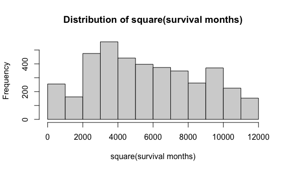

Data Exploration
================
Manye Dong
2023-11-28

## Predict the risk of death based on features 1-14

``` r
library(tidyverse)
```

    ## ── Attaching core tidyverse packages ──────────────────────── tidyverse 2.0.0 ──
    ## ✔ dplyr     1.1.3     ✔ readr     2.1.4
    ## ✔ forcats   1.0.0     ✔ stringr   1.5.0
    ## ✔ ggplot2   3.4.3     ✔ tibble    3.2.1
    ## ✔ lubridate 1.9.2     ✔ tidyr     1.3.0
    ## ✔ purrr     1.0.2     
    ## ── Conflicts ────────────────────────────────────────── tidyverse_conflicts() ──
    ## ✖ dplyr::filter() masks stats::filter()
    ## ✖ dplyr::lag()    masks stats::lag()
    ## ℹ Use the conflicted package (<http://conflicted.r-lib.org/>) to force all conflicts to become errors

``` r
knitr::opts_chunk$set(
  fig.width = 6,
  fig.asp = .6, 
  out.width = "90%"
)

theme_set (theme_minimal() +theme(legend.position = "bottom"))

options(
  ggplot2.continuous.colour = "viridis", 
  ggplots.continuous.fill = "viridis"
)

scale_colour_discrete = scale_colour_viridis_d
scale_fill_disrete = scale_fill_viridis_d

# import data
bc_data = read.csv("./Project_2_data.csv") |>
  janitor::clean_names()
```

``` r
# include a descriptive table with summary statistics for all variables

# continuous data
conti_var = c("age", "tumor_size", "regional_node_examined","reginol_node_positive", "survival_months")
bc_data |>
  select(all_of(conti_var)) |>
  summary() |>
  knitr::kable()
```

|     | age           | tumor_size     | regional_node_examined | reginol_node_positive | survival_months |
|:----|:--------------|:---------------|:-----------------------|:----------------------|:----------------|
|     | Min. :30.00   | Min. : 1.00    | Min. : 1.00            | Min. : 1.000          | Min. : 1.0      |
|     | 1st Qu.:47.00 | 1st Qu.: 16.00 | 1st Qu.: 9.00          | 1st Qu.: 1.000        | 1st Qu.: 56.0   |
|     | Median :54.00 | Median : 25.00 | Median :14.00          | Median : 2.000        | Median : 73.0   |
|     | Mean :53.97   | Mean : 30.47   | Mean :14.36            | Mean : 4.158          | Mean : 71.3     |
|     | 3rd Qu.:61.00 | 3rd Qu.: 38.00 | 3rd Qu.:19.00          | 3rd Qu.: 5.000        | 3rd Qu.: 90.0   |
|     | Max. :69.00   | Max. :140.00   | Max. :61.00            | Max. :46.000          | Max. :107.0     |

``` r
# discrete data count number of distinct variables


discre_var <- c("race", "marital_status", "t_stage", "n_stage", "x6th_stage", "differentiate", "grade", "a_stage", "estrogen_status", "progesterone_status", "status")

# Function to create a summary table for each variable
summary_table = function(variable) {
  counts = table(bc_data[[variable]])
  summary_df = data.frame(
    Variable = rep(variable, length(counts)),
    Value = paste(variable, names(counts), sep = "_"),
    Count = as.vector(counts)
  )
  return(summary_df)
}

summary_tables = lapply(discre_var, summary_table)
combined_summary = do.call(rbind, summary_tables) |>
  knitr::kable()
print(combined_summary)
```

    ## 
    ## 
    ## |Variable            |Value                                   | Count|
    ## |:-------------------|:---------------------------------------|-----:|
    ## |race                |race_Black                              |   291|
    ## |race                |race_Other                              |   320|
    ## |race                |race_White                              |  3413|
    ## |marital_status      |marital_status_Divorced                 |   486|
    ## |marital_status      |marital_status_Married                  |  2643|
    ## |marital_status      |marital_status_Separated                |    45|
    ## |marital_status      |marital_status_Single                   |   615|
    ## |marital_status      |marital_status_Widowed                  |   235|
    ## |t_stage             |t_stage_T1                              |  1603|
    ## |t_stage             |t_stage_T2                              |  1786|
    ## |t_stage             |t_stage_T3                              |   533|
    ## |t_stage             |t_stage_T4                              |   102|
    ## |n_stage             |n_stage_N1                              |  2732|
    ## |n_stage             |n_stage_N2                              |   820|
    ## |n_stage             |n_stage_N3                              |   472|
    ## |x6th_stage          |x6th_stage_IIA                          |  1305|
    ## |x6th_stage          |x6th_stage_IIB                          |  1130|
    ## |x6th_stage          |x6th_stage_IIIA                         |  1050|
    ## |x6th_stage          |x6th_stage_IIIB                         |    67|
    ## |x6th_stage          |x6th_stage_IIIC                         |   472|
    ## |differentiate       |differentiate_Moderately differentiated |  2351|
    ## |differentiate       |differentiate_Poorly differentiated     |  1111|
    ## |differentiate       |differentiate_Undifferentiated          |    19|
    ## |differentiate       |differentiate_Well differentiated       |   543|
    ## |grade               |grade_ anaplastic; Grade IV             |    19|
    ## |grade               |grade_1                                 |   543|
    ## |grade               |grade_2                                 |  2351|
    ## |grade               |grade_3                                 |  1111|
    ## |a_stage             |a_stage_Distant                         |    92|
    ## |a_stage             |a_stage_Regional                        |  3932|
    ## |estrogen_status     |estrogen_status_Negative                |   269|
    ## |estrogen_status     |estrogen_status_Positive                |  3755|
    ## |progesterone_status |progesterone_status_Negative            |   698|
    ## |progesterone_status |progesterone_status_Positive            |  3326|
    ## |status              |status_Alive                            |  3408|
    ## |status              |status_Dead                             |   616|

``` r
# explore the distribution of the outcome and consider potential transformations if necessary
# Since the purpose is to predict the risk of death based on features 1-14, we are going to fit a model with variables 1-14 as predictors (x) and the survival months as the y value. 
# look at the original distribution of survival months
hist(bc_data$survival_months, main = "Distribution of survival months", xlab = "Survival Month")
```


``` r
#try different transformation 
log_survival = log(bc_data$survival_months)
hist(log_survival, main = "Distribution of log_transformed survival months", xlab = "log-transformed survival months")
```


``` r
sqrt_survival = sqrt(bc_data$survival_months)
hist(sqrt_survival, main = "Distribution of sqrt(survival months)", xlab = "sqrt(survival months)")
```


``` r
cubic_survival = sign(bc_data$survival_months)*abs(bc_data$survival_months)^(1/3)
hist(cubic_survival, main = "Distribution of cubic root(survival months)", xlab = "cubic root(survival months)")
```



``` r
# see if there are any unusual observations and consider them as potential outliers/influential points
```
