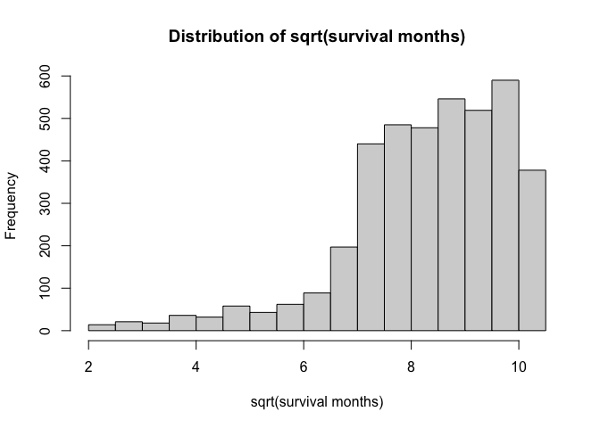

Data Exploration
================
Manye Dong
2023-11-28

## Goal: Predict the risk of death based on features 1-14

``` r
# import data and data cleaning
bc_data = read.csv("./Project_2_data.csv") |>
  janitor::clean_names() |> 
  na.omit()
```

### Data summary

``` r
# include a descriptive table with summary statistics for all variables

# continuous data
conti_var = c("age", "tumor_size", "regional_node_examined","reginol_node_positive", "survival_months")
bc_data |>
  select(all_of(conti_var)) |>
  summary() |>
  knitr::kable()
```

|     | age           | tumor_size     | regional_node_examined | reginol_node_positive | survival_months |
|:----|:--------------|:---------------|:-----------------------|:----------------------|:----------------|
|     | Min. :30.00   | Min. : 1.00    | Min. : 1.00            | Min. : 1.000          | Min. : 1.0      |
|     | 1st Qu.:47.00 | 1st Qu.: 16.00 | 1st Qu.: 9.00          | 1st Qu.: 1.000        | 1st Qu.: 56.0   |
|     | Median :54.00 | Median : 25.00 | Median :14.00          | Median : 2.000        | Median : 73.0   |
|     | Mean :53.97   | Mean : 30.47   | Mean :14.36            | Mean : 4.158          | Mean : 71.3     |
|     | 3rd Qu.:61.00 | 3rd Qu.: 38.00 | 3rd Qu.:19.00          | 3rd Qu.: 5.000        | 3rd Qu.: 90.0   |
|     | Max. :69.00   | Max. :140.00   | Max. :61.00            | Max. :46.000          | Max. :107.0     |

``` r
# discrete data count number of distinct variables


discre_var <- c("race", "marital_status", "t_stage", "n_stage", "x6th_stage", "differentiate", "grade", "a_stage", "estrogen_status", "progesterone_status", "status")

# Function to create a summary table for each variable
summary_table = function(variable) {
  counts = table(bc_data[[variable]])
  summary_df = data.frame(
    Variable = rep(variable, length(counts)),
    Value = paste(variable, names(counts), sep = "_"),
    Count = as.vector(counts)
  )
  return(summary_df)
}

summary_tables = lapply(discre_var, summary_table)
combined_summary = do.call(rbind, summary_tables) |>
  knitr::kable()
print(combined_summary)
```

    ## 
    ## 
    ## |Variable            |Value                                   | Count|
    ## |:-------------------|:---------------------------------------|-----:|
    ## |race                |race_Black                              |   291|
    ## |race                |race_Other                              |   320|
    ## |race                |race_White                              |  3413|
    ## |marital_status      |marital_status_Divorced                 |   486|
    ## |marital_status      |marital_status_Married                  |  2643|
    ## |marital_status      |marital_status_Separated                |    45|
    ## |marital_status      |marital_status_Single                   |   615|
    ## |marital_status      |marital_status_Widowed                  |   235|
    ## |t_stage             |t_stage_T1                              |  1603|
    ## |t_stage             |t_stage_T2                              |  1786|
    ## |t_stage             |t_stage_T3                              |   533|
    ## |t_stage             |t_stage_T4                              |   102|
    ## |n_stage             |n_stage_N1                              |  2732|
    ## |n_stage             |n_stage_N2                              |   820|
    ## |n_stage             |n_stage_N3                              |   472|
    ## |x6th_stage          |x6th_stage_IIA                          |  1305|
    ## |x6th_stage          |x6th_stage_IIB                          |  1130|
    ## |x6th_stage          |x6th_stage_IIIA                         |  1050|
    ## |x6th_stage          |x6th_stage_IIIB                         |    67|
    ## |x6th_stage          |x6th_stage_IIIC                         |   472|
    ## |differentiate       |differentiate_Moderately differentiated |  2351|
    ## |differentiate       |differentiate_Poorly differentiated     |  1111|
    ## |differentiate       |differentiate_Undifferentiated          |    19|
    ## |differentiate       |differentiate_Well differentiated       |   543|
    ## |grade               |grade_ anaplastic; Grade IV             |    19|
    ## |grade               |grade_1                                 |   543|
    ## |grade               |grade_2                                 |  2351|
    ## |grade               |grade_3                                 |  1111|
    ## |a_stage             |a_stage_Distant                         |    92|
    ## |a_stage             |a_stage_Regional                        |  3932|
    ## |estrogen_status     |estrogen_status_Negative                |   269|
    ## |estrogen_status     |estrogen_status_Positive                |  3755|
    ## |progesterone_status |progesterone_status_Negative            |   698|
    ## |progesterone_status |progesterone_status_Positive            |  3326|
    ## |status              |status_Alive                            |  3408|
    ## |status              |status_Dead                             |   616|

### Outliers

``` r
Q1 <- quantile(bc_data$survival_months, 0.25)
Q3 <- quantile(bc_data$survival_months, 0.75)
IQR <- Q3 - Q1

lower_bound <- Q1 - 1.5 * IQR
upper_bound <- Q3 + 1.5 * IQR

outliers <- bc_data |> filter((survival_months < lower_bound) | (survival_months > upper_bound))

bc_data <- anti_join(bc_data, outliers, by = c(colnames(bc_data)))
```

### Survial Months distribution

``` r
# explore the distribution of the outcome and consider potential transformations if necessary
# look at the original distribution of survival months
hist(bc_data$survival_months, main = "Distribution of survival months", xlab = "Survival Month")
```

<!-- -->

``` r
#try different transformation 
log_survival = log(bc_data$survival_months)
hist(log_survival, main = "Distribution of log_transformed survival months", xlab = "log-transformed survival months")
```

<!-- -->

``` r
sqrt_survival = sqrt(bc_data$survival_months)
hist(sqrt_survival, main = "Distribution of sqrt(survival months)", xlab = "sqrt(survival months)")
```

<!-- -->

``` r
sq_survival = (bc_data$survival_months^2)
hist(sq_survival, main = "Distribution of square(survival months)", xlab = "square(survival months)")
```

<!-- -->

``` r
iv_survival = (1/bc_data$survival_months)
hist(iv_survival, main = "Distribution of inverse(survival months)", xlab = "inverse(survival months)", xlim = c(0,0.1),breaks=100)
```

<!-- -->

### Convert categorical data to factor

``` r
bc_data = 
  bc_data |>
  mutate(
    race = factor(race, labels = c("1", "2", "3"), levels = c("Black", "White", "Other")),
    marital_status = factor(marital_status, labels = c("1", "2", "3","4","5"),levels = c("Divorced", "Married", "Separated", "Single ", "Widowed")),
    t_stage = factor(t_stage, labels = c("1", "2", "3","4"),levels = c("T1", "T2", "T3", "T4")),
    n_stage = factor(n_stage, labels = c("1","2","3"),levels = c("N1","N2", "N3")),
    x6th_stage = factor(x6th_stage, labels = c("1", "2", "3","4","5"),levels = c("IIA","IIB","IIIA","IIIB","IIIC")),
    differentiate = factor(differentiate, labels = c("1", "2", "3","4"),levels = c("Moderately differentiated","Poorly differentiated","Undifferentiated","Well differentiated")),
    grade = factor(grade, labels = c("1", "2", "3","4"),levels = c("1","2","3"," anaplastic; Grade IV")),
    a_stage = factor(a_stage, labels = c("1","2"),levels = c("Distant","Regional")),
    estrogen_status = factor(estrogen_status, labels = c("0","1"),levels = c("Negative","Positive")),
    progesterone_status = factor(progesterone_status, labels = c("0","1"),levels = c("Negative","Positive")),
    status = factor(status, labels = c("0","1"),levels = c("Dead","Alive"))
    ) |> 
  rename(regional_node_positive = reginol_node_positive) 
```

## Look at data interaction and collinearity

``` r
# Pairwise interaction and Correlation plot
bc_data |> 
  select(-status, -survival_months) |> 
  pairs()
```

<!-- -->

``` r
cor_matrix <- 
  bc_data |> 
  select(-status, -survival_months) |> 
  mutate(across(where(is.factor), as.numeric)) |> 
  cor()

print(cor_matrix, digits = 3)
```

    ##                             age     race marital_status  t_stage  n_stage
    ## age                     1.00000 -0.02710        0.05004 -0.06793  0.00294
    ## race                   -0.02710  1.00000       -0.10185  0.00607 -0.01821
    ## marital_status          0.05004 -0.10185        1.00000  0.00924  0.01236
    ## t_stage                -0.06793  0.00607        0.00924  1.00000  0.27706
    ## n_stage                 0.00294 -0.01821        0.01236  0.27706  1.00000
    ## x6th_stage             -0.01874 -0.00622        0.00157  0.60716  0.88162
    ## differentiate           0.01612 -0.00258        0.03154 -0.03176 -0.03573
    ## grade                  -0.10058 -0.04452        0.00379  0.13098  0.16258
    ## a_stage                 0.02062  0.00713        0.00490 -0.22149 -0.26162
    ## tumor_size             -0.07725  0.00356        0.00720  0.80903  0.27815
    ## estrogen_status         0.05942  0.02037       -0.01803 -0.06112 -0.10280
    ## progesterone_status    -0.02119  0.01699       -0.01315 -0.05913 -0.09534
    ## regional_node_examined -0.03165  0.00907       -0.00301  0.11439  0.32761
    ## regional_node_positive  0.01275 -0.00709        0.00448  0.24279  0.83789
    ##                        x6th_stage differentiate    grade  a_stage tumor_size
    ## age                      -0.01874       0.01612 -0.10058  0.02062   -0.07725
    ## race                     -0.00622      -0.00258 -0.04452  0.00713    0.00356
    ## marital_status            0.00157       0.03154  0.00379  0.00490    0.00720
    ## t_stage                   0.60716      -0.03176  0.13098 -0.22149    0.80903
    ## n_stage                   0.88162      -0.03573  0.16258 -0.26162    0.27815
    ## x6th_stage                1.00000      -0.04205  0.18696 -0.29293    0.51426
    ## differentiate            -0.04205       1.00000 -0.33112 -0.00863   -0.02885
    ## grade                     0.18696      -0.33112  1.00000 -0.03951    0.11896
    ## a_stage                  -0.29293      -0.00863 -0.03951  1.00000   -0.12405
    ## tumor_size                0.51426      -0.02885  0.11896 -0.12405    1.00000
    ## estrogen_status          -0.10628      -0.02123 -0.21148  0.06540   -0.05968
    ## progesterone_status      -0.10288       0.00870 -0.18091  0.02658   -0.07136
    ## regional_node_examined    0.31689      -0.05733  0.08505 -0.06913    0.10403
    ## regional_node_positive    0.77364      -0.02859  0.13460 -0.23361    0.24179
    ##                        estrogen_status progesterone_status
    ## age                             0.0594             -0.0212
    ## race                            0.0204              0.0170
    ## marital_status                 -0.0180             -0.0131
    ## t_stage                        -0.0611             -0.0591
    ## n_stage                        -0.1028             -0.0953
    ## x6th_stage                     -0.1063             -0.1029
    ## differentiate                  -0.0212              0.0087
    ## grade                          -0.2115             -0.1809
    ## a_stage                         0.0654              0.0266
    ## tumor_size                     -0.0597             -0.0714
    ## estrogen_status                 1.0000              0.5145
    ## progesterone_status             0.5145              1.0000
    ## regional_node_examined         -0.0449             -0.0187
    ## regional_node_positive         -0.0865             -0.0795
    ##                        regional_node_examined regional_node_positive
    ## age                                  -0.03165                0.01275
    ## race                                  0.00907               -0.00709
    ## marital_status                       -0.00301                0.00448
    ## t_stage                               0.11439                0.24279
    ## n_stage                               0.32761                0.83789
    ## x6th_stage                            0.31689                0.77364
    ## differentiate                        -0.05733               -0.02859
    ## grade                                 0.08505                0.13460
    ## a_stage                              -0.06913               -0.23361
    ## tumor_size                            0.10403                0.24179
    ## estrogen_status                      -0.04488               -0.08650
    ## progesterone_status                  -0.01867               -0.07951
    ## regional_node_examined                1.00000                0.41106
    ## regional_node_positive                0.41106                1.00000

``` r
corrplot(cor_matrix, type = "upper", diag = FALSE, tl.cex = 0.5, tl.srt = 45)
```

<!-- -->

``` r
# boxplots for each variable
par(mfrow = c(2,3))

boxplot(bc_data$survival_months, main = "survival_months")
boxplot(bc_data$age, main = "age")
boxplot(bc_data$race, main = "race")
boxplot(bc_data$marital_status, main = "marital_status")
boxplot(bc_data$t_stage, main = "t_stage")
boxplot(bc_data$n_stage, main = "n_stage")
```

<!-- -->

``` r
par(mfrow = c(2,4))
boxplot(bc_data$x6th_stage, main = "x6th_stage")
boxplot(bc_data$differentiate, main = "differentiate")
boxplot(bc_data$a_stage, main = "a_stage")
boxplot(bc_data$tumor_size, main = "tumor_size")
boxplot(bc_data$estrogen_status, main = "estrogen_status")
boxplot(bc_data$progesterone_status, main = "progesterone_status")
boxplot(bc_data$regional_node_examined, main = "regional_node_examined")
boxplot(bc_data$regional_node_positive, main = "regional_node_positive")
```

<!-- -->

## Model and MLR selections

### MLR with all predictors

``` r
mult.fit = 
  lm(survival_months ~ ., data = bc_data)

logit_fit=glm(status ~ .-survival_months,family="binomial",data=bc_data)
summary(logit_fit)
```

    ## 
    ## Call:
    ## glm(formula = status ~ . - survival_months, family = "binomial", 
    ##     data = bc_data)
    ## 
    ## Coefficients: (4 not defined because of singularities)
    ##                          Estimate Std. Error z value Pr(>|z|)    
    ## (Intercept)             1.7384013  0.4902930   3.546 0.000392 ***
    ## age                    -0.0225994  0.0056640  -3.990 6.61e-05 ***
    ## race2                   0.5064409  0.1634261   3.099 0.001942 ** 
    ## race3                   0.8949725  0.2497782   3.583 0.000340 ***
    ## marital_status2         0.1858725  0.1437432   1.293 0.195981    
    ## marital_status3        -0.7277778  0.3906564  -1.863 0.062468 .  
    ## marital_status4         0.0520708  0.1772165   0.294 0.768891    
    ## marital_status5        -0.0442531  0.2243760  -0.197 0.843650    
    ## t_stage2               -0.2556727  0.1970562  -1.297 0.194473    
    ## t_stage3               -0.5007362  0.3160850  -1.584 0.113152    
    ## t_stage4               -0.9237887  0.4510428  -2.048 0.040549 *  
    ## n_stage2               -0.6159097  0.2415728  -2.550 0.010785 *  
    ## n_stage3               -0.7150527  0.3024504  -2.364 0.018069 *  
    ## x6th_stage2            -0.2266921  0.2340636  -0.969 0.332791    
    ## x6th_stage3             0.0969985  0.2977671   0.326 0.744611    
    ## x6th_stage4            -0.1157120  0.5302440  -0.218 0.827254    
    ## x6th_stage5                    NA         NA      NA       NA    
    ## differentiate2         -0.4052842  0.1058755  -3.828 0.000129 ***
    ## differentiate3         -1.3864065  0.5333164  -2.600 0.009333 ** 
    ## differentiate4          0.5052658  0.1845283   2.738 0.006179 ** 
    ## grade2                         NA         NA      NA       NA    
    ## grade3                         NA         NA      NA       NA    
    ## grade4                         NA         NA      NA       NA    
    ## a_stage2                0.0370807  0.2664335   0.139 0.889312    
    ## tumor_size             -0.0007673  0.0039941  -0.192 0.847658    
    ## estrogen_status1        0.7616541  0.1786036   4.264 2.00e-05 ***
    ## progesterone_status1    0.5768740  0.1290909   4.469 7.87e-06 ***
    ## regional_node_examined  0.0360605  0.0072658   4.963 6.94e-07 ***
    ## regional_node_positive -0.0793151  0.0154389  -5.137 2.79e-07 ***
    ## ---
    ## Signif. codes:  0 '***' 0.001 '**' 0.01 '*' 0.05 '.' 0.1 ' ' 1
    ## 
    ## (Dispersion parameter for binomial family taken to be 1)
    ## 
    ##     Null deviance: 3394.0  on 4005  degrees of freedom
    ## Residual deviance: 2904.8  on 3981  degrees of freedom
    ## AIC: 2954.8
    ## 
    ## Number of Fisher Scoring iterations: 5

``` r
summary(mult.fit)
```

    ## 
    ## Call:
    ## lm(formula = survival_months ~ ., data = bc_data)
    ## 
    ## Residuals:
    ##     Min      1Q  Median      3Q     Max 
    ## -69.992 -15.128   0.098  16.032  56.613 
    ## 
    ## Coefficients: (4 not defined because of singularities)
    ##                         Estimate Std. Error t value Pr(>|t|)    
    ## (Intercept)            36.694762   3.772729   9.726  < 2e-16 ***
    ## age                     0.040374   0.036737   1.099  0.27183    
    ## race2                   1.558393   1.244934   1.252  0.21072    
    ## race3                   2.546319   1.643544   1.549  0.12139    
    ## marital_status2        -0.059298   0.989508  -0.060  0.95222    
    ## marital_status3        -2.045810   3.148163  -0.650  0.51583    
    ## marital_status4        -0.408614   1.221966  -0.334  0.73810    
    ## marital_status5        -0.548340   1.604840  -0.342  0.73261    
    ## t_stage2                0.099916   1.499238   0.067  0.94687    
    ## t_stage3                3.199188   2.449076   1.306  0.19153    
    ## t_stage4                3.717544   3.969937   0.936  0.34911    
    ## n_stage2                1.871147   1.761577   1.062  0.28821    
    ## n_stage3               -1.242517   2.369855  -0.524  0.60010    
    ## x6th_stage2            -0.196884   1.617799  -0.122  0.90314    
    ## x6th_stage3            -2.418634   2.092261  -1.156  0.24775    
    ## x6th_stage4             0.788278   4.564133   0.173  0.86289    
    ## x6th_stage5                   NA         NA      NA       NA    
    ## differentiate2          0.285396   0.756143   0.377  0.70587    
    ## differentiate3          3.396099   4.618440   0.735  0.46218    
    ## differentiate4         -1.491896   0.954990  -1.562  0.11832    
    ## grade2                        NA         NA      NA       NA    
    ## grade3                        NA         NA      NA       NA    
    ## grade4                        NA         NA      NA       NA    
    ## a_stage2                4.570519   2.363160   1.934  0.05318 .  
    ## tumor_size             -0.051989   0.030404  -1.710  0.08735 .  
    ## estrogen_status1        4.774359   1.498117   3.187  0.00145 ** 
    ## progesterone_status1   -0.647275   0.979282  -0.661  0.50867    
    ## regional_node_examined -0.001346   0.042900  -0.031  0.97497    
    ## regional_node_positive  0.022143   0.126845   0.175  0.86143    
    ## status1                28.806548   0.945322  30.473  < 2e-16 ***
    ## ---
    ## Signif. codes:  0 '***' 0.001 '**' 0.01 '*' 0.05 '.' 0.1 ' ' 1
    ## 
    ## Residual standard error: 19.86 on 3980 degrees of freedom
    ## Multiple R-squared:  0.2263, Adjusted R-squared:  0.2215 
    ## F-statistic: 46.57 on 25 and 3980 DF,  p-value: < 2.2e-16

``` r
# QQ plot showing datafit 
plot(mult.fit, which = 2)
```

<!-- -->

``` r
# residual vs. leverage plot
plot(mult.fit, which = 4)
```

<!-- -->
Looks like doesn’t need a transformation on the outcome survival months.

### MLR reducing multicollinearity using correlation matrix

First, find the highly correlated pairs:

``` r
new_df = bc_data |> mutate(across(where(is.factor), as.numeric))
```

``` r
cor_matrix = cor(new_df[, c(colnames(new_df))])

# Find the pairs where correlation is greater than or equal to 0.7 but less than 1
high_cor_pairs = which(cor_matrix >= 0.7 & cor_matrix < 1, arr.ind = TRUE)

# Extract the variable names for these pairs
high_cor_var_pairs = data.frame(
  Var1 = rownames(cor_matrix)[high_cor_pairs[, 1]],
  Var2 = colnames(cor_matrix)[high_cor_pairs[, 2]],
  Correlation = cor_matrix[high_cor_pairs]
)

high_cor_var_pairs |> 
  knitr::kable(digits=4)
```

| Var1                   | Var2                   | Correlation |
|:-----------------------|:-----------------------|------------:|
| tumor_size             | t_stage                |      0.8090 |
| x6th_stage             | n_stage                |      0.8816 |
| regional_node_positive | n_stage                |      0.8379 |
| n_stage                | x6th_stage             |      0.8816 |
| regional_node_positive | x6th_stage             |      0.7736 |
| t_stage                | tumor_size             |      0.8090 |
| n_stage                | regional_node_positive |      0.8379 |
| x6th_stage             | regional_node_positive |      0.7736 |

Remove the one with lower correlation with outcome in every pair:

``` r
cor_tumor = cor_matrix["survival_months", "tumor_size"]
cor_tstage = cor_matrix["survival_months", "t_stage"]

c(cor_tumor, cor_tstage)
```

    ## [1] -0.08873521 -0.08673585

Keep tumor_size.

``` r
cor_tumor = cor_matrix["survival_months", "x6th_stage"]
cor_nstage = cor_matrix["survival_months", "n_stage"]
cor_regional = cor_matrix["survival_months", "regional_node_positive"]

c(cor_tumor, cor_nstage, cor_regional)
```

    ## [1] -0.1438298 -0.1372208 -0.1350219

Keep tumor_size, delete the other two.

Fit the reduced model:

``` r
reduced_df = bc_data |> select(-t_stage, -n_stage, -x6th_stage)
```

``` r
reduced_model = lm(survival_months ~ ., data = reduced_df) 

summary(reduced_model) 
```

    ## 
    ## Call:
    ## lm(formula = survival_months ~ ., data = reduced_df)
    ## 
    ## Residuals:
    ##     Min      1Q  Median      3Q     Max 
    ## -70.364 -15.117   0.119  16.073  55.601 
    ## 
    ## Coefficients: (3 not defined because of singularities)
    ##                         Estimate Std. Error t value Pr(>|t|)    
    ## (Intercept)            37.632367   3.630897  10.364  < 2e-16 ***
    ## age                     0.039838   0.036678   1.086  0.27747    
    ## race2                   1.562974   1.243413   1.257  0.20883    
    ## race3                   2.445316   1.640892   1.490  0.13624    
    ## marital_status2        -0.042962   0.988651  -0.043  0.96534    
    ## marital_status3        -2.257402   3.143891  -0.718  0.47278    
    ## marital_status4        -0.349243   1.219953  -0.286  0.77468    
    ## marital_status5        -0.600815   1.603587  -0.375  0.70793    
    ## differentiate2          0.217142   0.753276   0.288  0.77316    
    ## differentiate3          3.558254   4.603453   0.773  0.43960    
    ## differentiate4         -1.438294   0.952960  -1.509  0.13130    
    ## grade2                        NA         NA      NA       NA    
    ## grade3                        NA         NA      NA       NA    
    ## grade4                        NA         NA      NA       NA    
    ## a_stage2                3.186618   2.167131   1.470  0.14152    
    ## tumor_size             -0.023423   0.015504  -1.511  0.13092    
    ## estrogen_status1        4.670712   1.496363   3.121  0.00181 ** 
    ## progesterone_status1   -0.575600   0.978345  -0.588  0.55634    
    ## regional_node_examined -0.001638   0.042780  -0.038  0.96946    
    ## regional_node_positive -0.021290   0.072907  -0.292  0.77029    
    ## status1                28.714016   0.941956  30.483  < 2e-16 ***
    ## ---
    ## Signif. codes:  0 '***' 0.001 '**' 0.01 '*' 0.05 '.' 0.1 ' ' 1
    ## 
    ## Residual standard error: 19.86 on 3988 degrees of freedom
    ## Multiple R-squared:  0.225,  Adjusted R-squared:  0.2217 
    ## F-statistic: 68.09 on 17 and 3988 DF,  p-value: < 2.2e-16

``` r
# |> broom::tidy() |> knitr::kable(digits=3)

plot(reduced_model)
```

<!-- --><!-- --><!-- --><!-- -->

### Stepwise, Backward

``` r
# backward regression 
#step_backward = step(mult.fit, direction='backward')

# Criteria based procedures. both direction: choose the model with the smallest AIC value
step_both = MASS::stepAIC(mult.fit, direction = "both", trace = FALSE) |>
  broom::tidy()

knitr::kable(step_both, digits = 3)
```

| term             | estimate | std.error | statistic | p.value |
|:-----------------|---------:|----------:|----------:|--------:|
| (Intercept)      |   40.689 |     2.481 |    16.402 |   0.000 |
| a_stage2         |    3.466 |     2.119 |     1.636 |   0.102 |
| tumor_size       |   -0.023 |     0.015 |    -1.515 |   0.130 |
| estrogen_status1 |    4.160 |     1.278 |     3.255 |   0.001 |
| status1          |   28.657 |     0.903 |    31.744 |   0.000 |

### LASSO

``` r
# fit a LASSO with lambda = 1
# smaller lambda, tends to give large model (more predictors)

mat = makeX(bc_data[1:14])
```

``` r
fit_LASSO = cv.glmnet(mat, bc_data$survival_months, alpha = 1)
plot(fit_LASSO)
```

<!-- -->

``` r
best_lambda = fit_LASSO$lambda.min
best_model = glmnet(mat, bc_data$survival_months, alpha=1, lambda=best_lambda)
coef(best_model)
```

    ## 39 x 1 sparse Matrix of class "dgCMatrix"
    ##                                   s0
    ## (Intercept)             7.320420e+01
    ## age                    -4.529766e-03
    ## race1                  -2.845638e+00
    ## race2                   .           
    ## race3                   1.289409e+00
    ## marital_status1         .           
    ## marital_status2         5.435657e-01
    ## marital_status3        -3.222507e+00
    ## marital_status4         .           
    ## marital_status5         .           
    ## t_stage1                8.046251e-01
    ## t_stage2               -4.056180e-02
    ## t_stage3                .           
    ## t_stage4                .           
    ## n_stage1                7.650783e-01
    ## n_stage2                .           
    ## n_stage3               -2.369217e+00
    ## x6th_stage1             2.196481e-01
    ## x6th_stage2             .           
    ## x6th_stage3             .           
    ## x6th_stage4             .           
    ## x6th_stage5             .           
    ## differentiate1          2.715506e-01
    ## differentiate2         -5.763277e-01
    ## differentiate3          .           
    ## differentiate4          .           
    ## grade1                  .           
    ## grade2                  5.130475e-04
    ## grade3                  .           
    ## grade4                  .           
    ## a_stage1               -3.317514e+00
    ## a_stage2                7.270694e-13
    ## tumor_size             -3.019736e-02
    ## estrogen_status0       -8.447549e+00
    ## estrogen_status1        .           
    ## progesterone_status0   -1.287088e+00
    ## progesterone_status1    1.115183e-12
    ## regional_node_examined  5.258240e-02
    ## regional_node_positive -2.792675e-01

``` r
best_lambda
```

    ## [1] 0.246539

``` r
fit_LASSO_logit = cv.glmnet(mat, bc_data$status, family="binomial")
plot(fit_LASSO_logit)
```

<!-- -->

``` r
coef(fit_LASSO_logit)
```

    ## 39 x 1 sparse Matrix of class "dgCMatrix"
    ##                                   s1
    ## (Intercept)             2.117418e+00
    ## age                    -1.113388e-03
    ## race1                  -1.030604e-01
    ## race2                   .           
    ## race3                   .           
    ## marital_status1         .           
    ## marital_status2         .           
    ## marital_status3         .           
    ## marital_status4         .           
    ## marital_status5         .           
    ## t_stage1                9.967541e-02
    ## t_stage2                .           
    ## t_stage3                .           
    ## t_stage4               -2.849163e-01
    ## n_stage1                3.005845e-01
    ## n_stage2                .           
    ## n_stage3               -2.312864e-01
    ## x6th_stage1             6.184819e-04
    ## x6th_stage2             .           
    ## x6th_stage3             .           
    ## x6th_stage4             .           
    ## x6th_stage5             .           
    ## differentiate1          .           
    ## differentiate2         -2.173147e-01
    ## differentiate3         -4.963612e-03
    ## differentiate4          .           
    ## grade1                  .           
    ## grade2                  .           
    ## grade3                 -5.447183e-05
    ## grade4                 -1.797397e-05
    ## a_stage1                .           
    ## a_stage2                .           
    ## tumor_size             -1.378630e-03
    ## estrogen_status0       -5.617933e-01
    ## estrogen_status1        1.054623e-12
    ## progesterone_status0   -4.276115e-01
    ## progesterone_status1    2.982028e-13
    ## regional_node_examined  .           
    ## regional_node_positive -4.790896e-02

## Model Validation & Performance Evaluation

First, we will conduct a train-test split on bc_data:

``` r
# train test split used for training and testing
# Set seed for reproducibility
set.seed(123)

# Split data into training and testing sets (80% train, 20% test)
train_indices <- sample(seq_len(nrow(bc_data)), 0.8 * nrow(bc_data))  # 80% train indices
train_data <- bc_data[train_indices, ]  # Training data
test_data <- bc_data[-train_indices, ]  # Testing data

# Separate predictor variables (train_x, test_x) and target variable (train_y, test_y)
train_x <- train_data[, -which(names(train_data) == "survival_months")]
train_y <- train_data$survival_months

test_x <- test_data[, -which(names(test_data) == "survival_months")]
test_y <- test_data$survival_months
```

### Test MLR w/ all predictors

``` r
# Fit the MLR model on the training data
mult.fit <- lm(survival_months ~ ., data = train_data)

# Predict on the test data
predicted_test <- predict(mult.fit, newdata = test_data)

# Calculate evaluation metrics (e.g., Mean Squared Error, R-squared)
rmse <- sqrt(mean((predicted_test - test_data$survival_months)^2))
rsquared <- summary(mult.fit)$r.squared

rsquared
```

    ## [1] 0.2330054

``` r
mlr_summary <- summary(mult.fit)
adjusted_r_squared_mlr <- mlr_summary$adj.r.squared
adjusted_r_squared_mlr
```

    ## [1] 0.2269717

We will also cross-validate MLR to double-check:

``` r
# Define the number of folds for cross-validation
num_folds <- 5  # You can adjust the number of folds as needed

# Define the control parameters for cross-validation
ctrl <- trainControl(method = "cv", number = num_folds)

# Train the MLR model with k-fold cross-validation
mult.fit_cv <- train(survival_months ~ ., data = bc_data, method = "lm", trControl = ctrl)

# Get cross-validated performance metrics
cv_results <- mult.fit_cv$results
print(cv_results)
```

    ##   intercept     RMSE  Rsquared     MAE    RMSESD RsquaredSD     MAESD
    ## 1      TRUE 19.94613 0.2154283 16.5184 0.3696032 0.01164553 0.1953258

The RMSE and R-squared appear similar.

``` r
mlr_cv_summary <- summary(mult.fit)
adjusted_r_squared_mlr <- mlr_summary$adj.r.squared
adjusted_r_squared_mlr
```

    ## [1] 0.2269717

The crude, all-in-one MLR performs better than linear regression with
LASSO regularization in terms of adjusted R-squared.

### Test MLR with reduced multicollinearity

### Test Stepwise Regression Model

``` r
# Create a named vector of coefficients
coefficients <- c(
  `(Intercept)` = 39.290750,
  a_stage = 3.426435, 
  estrogen_status = 3.744369, 
  status = 29.713666
)

# Extract the predictor names from the coefficients
selected_predictors <- names(coefficients)[-1]  # Exclude '(Intercept)'

# Construct the formula for the model
selected_formula <- reformulate(selected_predictors, response = "survival_months")

# Fit the MLR model using the selected predictors and coefficients
selected_model <- lm(selected_formula, data = train_data)  # Replace 'your_data' with your dataset

# View the summary of the model
summary(selected_model)
```

    ## 
    ## Call:
    ## lm(formula = selected_formula, data = train_data)
    ## 
    ## Residuals:
    ##     Min      1Q  Median      3Q     Max 
    ## -71.515 -15.515   0.485  16.485  56.413 
    ## 
    ## Coefficients:
    ##                  Estimate Std. Error t value Pr(>|t|)    
    ## (Intercept)        38.727      2.623  14.767  < 2e-16 ***
    ## a_stage2            3.861      2.373   1.627 0.103927    
    ## estrogen_status1    4.790      1.416   3.383 0.000726 ***
    ## status1            29.137      1.004  29.025  < 2e-16 ***
    ## ---
    ## Signif. codes:  0 '***' 0.001 '**' 0.01 '*' 0.05 '.' 0.1 ' ' 1
    ## 
    ## Residual standard error: 20.05 on 3200 degrees of freedom
    ## Multiple R-squared:  0.2294, Adjusted R-squared:  0.2286 
    ## F-statistic: 317.5 on 3 and 3200 DF,  p-value: < 2.2e-16

``` r
# Predict on the test data
predicted_test <- predict(selected_model, newdata = test_data)

# Calculate evaluation metrics: RMSE, R-squared, and adjusted R-squared
actual_values <- test_data$survival_months  # Actual values from test data

# RMSE
rmse <- sqrt(mean((predicted_test - test_y)^2))

# R-squared
rsquared <- summary(selected_model)$r.squared

# Adjusted R-squared
num_predictors <- length(coef(selected_model)) - 1  # Number of predictors (excluding intercept)
n <- length(test_y)  # Total number of samples
adjusted_r_squared <- 1 - ((1 - rsquared) * (n - 1) / (n - num_predictors - 1))

cat("RMSE:", rmse, "\n")
```

    ## RMSE: 19.06999

``` r
cat("R-squared:", rsquared, "\n")
```

    ## R-squared: 0.2293712

``` r
cat("Adjusted R-squared:", adjusted_r_squared, "\n")
```

    ## Adjusted R-squared: 0.2264741

### Test LASSO

``` r
# Train LASSO model using the best lambda obtained from cross-validation
lasso_model <- glmnet(train_x, train_y, alpha = 1, lambda = best_lambda)
```

``` r
# Predict using the validation data
predicted_val <- predict(lasso_model, newx = as.matrix(test_x))

# Calculate evaluation metrics (e.g., Mean Squared Error and R-squared)
rmse <- sqrt(mean((predicted_val - test_y)^2))
rsquared <- 1 - (sum((test_y - predicted_val)^2) / sum((test_y - mean(test_y))^2))
```

``` r
# Calculate the residual sum of squares (RSS)
rss <- sum((predicted_val - test_y)^2)

# Get the number of predictors used in the LASSO model
num_predictors <- sum(coef(lasso_model) != 0) - 1  # Exclude intercept (-1)

# Get the total number of samples
n <- length(test_y)

# Calculate adjusted R-squared for LASSO model
r_squared <- 1 - (rss / ((n - num_predictors - 1) * var(test_y)))
adjusted_r_squared_lasso <- 1 - ((1 - r_squared) * (n - 1) / (n - num_predictors - 1))
```

``` r
adjusted_r_squared_lasso
```

    ## [1] -2.119206

## The model we selected…

xxxx The reasons behind:

## Compare performance for White vs Black groups

And can you improve the prediction performance gap btw these two groups
for your model?
