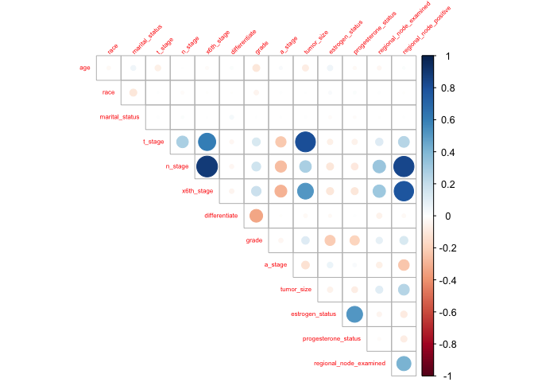
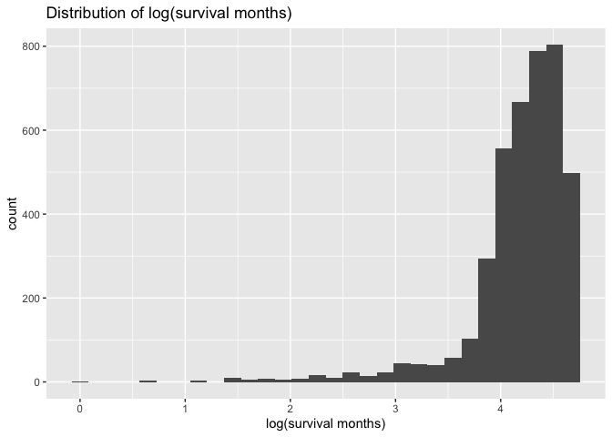

Data Exploration
================
Manye Dong
2023-11-28

## Predict the risk of death based on features 1-14

``` r
# import data and data cleaning
bc_data = read.csv("./Project_2_data.csv") |>
  janitor::clean_names() |> 
  na.omit() |> 
  mutate(
    race = factor(race, labels = c("1", "2", "3"), levels = c("Black","White","Other")),
    marital_status = factor(marital_status, labels = c("1", "2", "3","4","5"),levels = c("Divorced", "Married", "Separated", "Single ", "Widowed")),
    t_stage = factor(t_stage, labels = c("1", "2", "3","4"),levels = c("T1", "T2", "T3", "T4")),
    n_stage = factor(n_stage, labels = c("1","2","3"),levels = c("N1","N2", "N3")),
    x6th_stage = factor(x6th_stage, labels = c("1", "2", "3","4","5"),levels = c("IIA","IIB","IIIA","IIIB","IIIC")),
    differentiate = factor(differentiate, labels = c("1", "2", "3","4"),levels = c("Moderately differentiated","Poorly differentiated","Undifferentiated","Well differentiated")),
    grade = factor(grade, labels = c("1", "2", "3","4"),levels = c("1","2","3"," anaplastic; Grade IV")),
    a_stage = factor(a_stage, labels = c("1","2"),levels = c("Distant","Regional")),
    estrogen_status = factor(estrogen_status, labels = c("0","1"),levels = c("Negative","Positive")),
    progesterone_status = factor(progesterone_status, labels = c("0","1"),levels = c("Negative","Positive"))
    ) |> 
  rename(regional_node_positive = reginol_node_positive) |> 
  select(-status)
```

``` r
# Pairwise interaction and Correlation plot
bc_data |> 
  pairs()
```

<!-- -->

``` r
cor_matrix <- bc_data |> 
  mutate(across(where(is.factor), as.numeric)) |> 
  cor()

corrplot(cor_matrix, type = "upper", diag = FALSE, tl.cex = 0.5, tl.srt = 45)
```

<!-- -->

``` r
# boxplots for each variable
par(mfrow = c(2,3))

boxplot(bc_data$survival_months, main = "survival_months")
boxplot(bc_data$age, main = "age")
boxplot(bc_data$race, main = "race")
boxplot(bc_data$marital_status, main = "marital_status")
boxplot(bc_data$t_stage, main = "t_stage")
boxplot(bc_data$n_stage, main = "n_stage")
```

<!-- -->

``` r
par(mfrow = c(2,4))
boxplot(bc_data$x6th_stage, main = "x6th_stage")
boxplot(bc_data$differentiate, main = "differentiate")
boxplot(bc_data$a_stage, main = "a_stage")
boxplot(bc_data$tumor_size, main = "tumor_size")
boxplot(bc_data$estrogen_status, main = "estrogen_status")
boxplot(bc_data$progesterone_status, main = "progesterone_status")
boxplot(bc_data$regional_node_examined, main = "regional_node_examined")
boxplot(bc_data$regional_node_positive, main = "regional_node_positive")
```

<!-- -->

``` r
# backward regression
mult.fit = 
  lm(survival_months ~ ., data = bc_data)

summary(mult.fit)
```

    ## 
    ## Call:
    ## lm(formula = survival_months ~ ., data = bc_data)
    ## 
    ## Residuals:
    ##     Min      1Q  Median      3Q     Max 
    ## -74.685 -15.591   1.087  18.126  56.245 
    ## 
    ## Coefficients: (4 not defined because of singularities)
    ##                        Estimate Std. Error t value Pr(>|t|)    
    ## (Intercept)            58.98164    4.18486  14.094  < 2e-16 ***
    ## age                    -0.04220    0.04138  -1.020  0.30787    
    ## race2                   3.67154    1.40193   2.619  0.00885 ** 
    ## race3                   5.58194    1.84998   3.017  0.00257 ** 
    ## marital_status2         0.71309    1.11566   0.639  0.52276    
    ## marital_status3        -6.24605    3.52093  -1.774  0.07614 .  
    ## marital_status4        -0.03560    1.37859  -0.026  0.97940    
    ## marital_status5        -0.78933    1.80857  -0.436  0.66254    
    ## t_stage2               -1.61447    1.69125  -0.955  0.33984    
    ## t_stage3                0.73762    2.76338   0.267  0.78954    
    ## t_stage4               -2.25092    4.48353  -0.502  0.61567    
    ## n_stage2               -0.58607    1.98650  -0.295  0.76799    
    ## n_stage3               -3.37649    2.67197  -1.264  0.20642    
    ## x6th_stage2             0.53765    1.82506   0.295  0.76832    
    ## x6th_stage3            -0.65701    2.36107  -0.278  0.78082    
    ## x6th_stage4             3.32794    5.15941   0.645  0.51895    
    ## x6th_stage5                  NA         NA      NA       NA    
    ## differentiate2         -0.98945    0.85155  -1.162  0.24533    
    ## differentiate3         -2.95238    5.21782  -0.566  0.57154    
    ## differentiate4         -0.02110    1.07890  -0.020  0.98440    
    ## grade2                       NA         NA      NA       NA    
    ## grade3                       NA         NA      NA       NA    
    ## grade4                       NA         NA      NA       NA    
    ## a_stage2                4.36505    2.67211   1.634  0.10243    
    ## tumor_size             -0.05649    0.03434  -1.645  0.10002    
    ## estrogen_status1        8.61299    1.68605   5.108  3.4e-07 ***
    ## progesterone_status1    1.60271    1.10116   1.455  0.14562    
    ## regional_node_examined  0.10692    0.04828   2.214  0.02686 *  
    ## regional_node_positive -0.31396    0.14259  -2.202  0.02774 *  
    ## ---
    ## Signif. codes:  0 '***' 0.001 '**' 0.01 '*' 0.05 '.' 0.1 ' ' 1
    ## 
    ## Residual standard error: 22.47 on 3999 degrees of freedom
    ## Multiple R-squared:  0.04476,    Adjusted R-squared:  0.03903 
    ## F-statistic: 7.808 on 24 and 3999 DF,  p-value: < 2.2e-16

``` r
step_backward = step(mult.fit, direction='backward')
```

    ## Start:  AIC=25071.64
    ## survival_months ~ age + race + marital_status + t_stage + n_stage + 
    ##     x6th_stage + differentiate + grade + a_stage + tumor_size + 
    ##     estrogen_status + progesterone_status + regional_node_examined + 
    ##     regional_node_positive
    ## 
    ## 
    ## Step:  AIC=25071.64
    ## survival_months ~ age + race + marital_status + t_stage + n_stage + 
    ##     x6th_stage + differentiate + a_stage + tumor_size + estrogen_status + 
    ##     progesterone_status + regional_node_examined + regional_node_positive
    ## 
    ##                          Df Sum of Sq     RSS   AIC
    ## - x6th_stage              3     437.4 2019476 25066
    ## - differentiate           3     831.8 2019871 25067
    ## - t_stage                 3    1210.1 2020249 25068
    ## - marital_status          4    2694.9 2021734 25069
    ## - n_stage                 1      43.9 2019083 25070
    ## - age                     1     525.1 2019564 25071
    ## <none>                                2019039 25072
    ## - progesterone_status     1    1069.5 2020108 25072
    ## - a_stage                 1    1347.3 2020386 25072
    ## - tumor_size              1    1366.5 2020405 25072
    ## - regional_node_positive  1    2447.6 2021487 25074
    ## - regional_node_examined  1    2475.6 2021515 25075
    ## - race                    2    4847.7 2023887 25077
    ## - estrogen_status         1   13175.2 2032214 25096
    ## 
    ## Step:  AIC=25066.51
    ## survival_months ~ age + race + marital_status + t_stage + n_stage + 
    ##     differentiate + a_stage + tumor_size + estrogen_status + 
    ##     progesterone_status + regional_node_examined + regional_node_positive
    ## 
    ##                          Df Sum of Sq     RSS   AIC
    ## - differentiate           3     887.3 2020364 25062
    ## - marital_status          4    2781.9 2022258 25064
    ## - t_stage                 3    1862.0 2021338 25064
    ## - n_stage                 2    1538.8 2021015 25066
    ## - age                     1     551.9 2020028 25066
    ## <none>                                2019476 25066
    ## - progesterone_status     1    1078.0 2020554 25067
    ## - a_stage                 1    1294.7 2020771 25067
    ## - tumor_size              1    1354.8 2020831 25067
    ## - regional_node_positive  1    2424.9 2021901 25069
    ## - regional_node_examined  1    2496.6 2021973 25070
    ## - race                    2    4776.4 2024253 25072
    ## - estrogen_status         1   13046.4 2032523 25090
    ## 
    ## Step:  AIC=25062.28
    ## survival_months ~ age + race + marital_status + t_stage + n_stage + 
    ##     a_stage + tumor_size + estrogen_status + progesterone_status + 
    ##     regional_node_examined + regional_node_positive
    ## 
    ##                          Df Sum of Sq     RSS   AIC
    ## - marital_status          4    2801.5 2023165 25060
    ## - t_stage                 3    1979.3 2022343 25060
    ## - age                     1     452.5 2020816 25061
    ## - n_stage                 2    1693.4 2022057 25062
    ## <none>                                2020364 25062
    ## - progesterone_status     1    1215.3 2021579 25063
    ## - a_stage                 1    1243.6 2021607 25063
    ## - tumor_size              1    1399.2 2021763 25063
    ## - regional_node_positive  1    2395.4 2022759 25065
    ## - regional_node_examined  1    2499.4 2022863 25065
    ## - race                    2    5009.1 2025373 25068
    ## - estrogen_status         1   14389.1 2034753 25089
    ## 
    ## Step:  AIC=25059.85
    ## survival_months ~ age + race + t_stage + n_stage + a_stage + 
    ##     tumor_size + estrogen_status + progesterone_status + regional_node_examined + 
    ##     regional_node_positive
    ## 
    ##                          Df Sum of Sq     RSS   AIC
    ## - t_stage                 3    2134.5 2025300 25058
    ## - age                     1     590.2 2023755 25059
    ## - n_stage                 2    1651.4 2024817 25059
    ## <none>                                2023165 25060
    ## - a_stage                 1    1302.2 2024467 25060
    ## - progesterone_status     1    1347.7 2024513 25060
    ## - tumor_size              1    1446.9 2024612 25061
    ## - regional_node_examined  1    2562.5 2025728 25063
    ## - regional_node_positive  1    2586.6 2025752 25063
    ## - race                    2    6003.0 2029168 25068
    ## - estrogen_status         1   14442.0 2037607 25086
    ## 
    ## Step:  AIC=25058.09
    ## survival_months ~ age + race + n_stage + a_stage + tumor_size + 
    ##     estrogen_status + progesterone_status + regional_node_examined + 
    ##     regional_node_positive
    ## 
    ##                          Df Sum of Sq     RSS   AIC
    ## - age                     1     569.3 2025869 25057
    ## - n_stage                 2    1774.1 2027074 25058
    ## <none>                                2025300 25058
    ## - progesterone_status     1    1375.0 2026675 25059
    ## - a_stage                 1    1380.8 2026680 25059
    ## - regional_node_examined  1    2455.2 2027755 25061
    ## - regional_node_positive  1    2632.3 2027932 25061
    ## - tumor_size              1    4418.4 2029718 25065
    ## - race                    2    5949.2 2031249 25066
    ## - estrogen_status         1   14469.1 2039769 25085
    ## 
    ## Step:  AIC=25057.23
    ## survival_months ~ race + n_stage + a_stage + tumor_size + estrogen_status + 
    ##     progesterone_status + regional_node_examined + regional_node_positive
    ## 
    ##                          Df Sum of Sq     RSS   AIC
    ## - n_stage                 2    1777.9 2027647 25057
    ## <none>                                2025869 25057
    ## - a_stage                 1    1352.0 2027221 25058
    ## - progesterone_status     1    1492.9 2027362 25058
    ## - regional_node_examined  1    2554.4 2028423 25060
    ## - regional_node_positive  1    2700.2 2028569 25061
    ## - tumor_size              1    4193.1 2030062 25064
    ## - race                    2    5941.5 2031810 25065
    ## - estrogen_status         1   14113.8 2039983 25083
    ## 
    ## Step:  AIC=25056.76
    ## survival_months ~ race + a_stage + tumor_size + estrogen_status + 
    ##     progesterone_status + regional_node_examined + regional_node_positive
    ## 
    ##                          Df Sum of Sq     RSS   AIC
    ## <none>                                2027647 25057
    ## - progesterone_status     1    1588.1 2029235 25058
    ## - a_stage                 1    1891.4 2029538 25058
    ## - regional_node_examined  1    2738.5 2030385 25060
    ## - tumor_size              1    4952.4 2032599 25065
    ## - race                    2    6160.2 2033807 25065
    ## - estrogen_status         1   14365.3 2042012 25083
    ## - regional_node_positive  1   23221.7 2050868 25101

``` r
# Criteria based procedures. both direction: choose the model with the smallest AIC value
step_both = MASS::stepAIC(mult.fit, direction = "both", trace = FALSE) |>
  broom::tidy()

knitr::kable(step_both, digits = 3)
```

| term                   | estimate | std.error | statistic | p.value |
|:-----------------------|---------:|----------:|----------:|--------:|
| (Intercept)            |   55.101 |     3.147 |    17.510 |   0.000 |
| race2                  |    4.156 |     1.375 |     3.024 |   0.003 |
| race3                  |    6.116 |     1.821 |     3.358 |   0.001 |
| a_stage2               |    4.737 |     2.448 |     1.935 |   0.053 |
| tumor_size             |   -0.054 |     0.017 |    -3.132 |   0.002 |
| estrogen_status1       |    8.851 |     1.659 |     5.333 |   0.000 |
| progesterone_status1   |    1.937 |     1.092 |     1.773 |   0.076 |
| regional_node_examined |    0.112 |     0.048 |     2.329 |   0.020 |
| regional_node_positive |   -0.542 |     0.080 |    -6.781 |   0.000 |

``` r
# make plots for all variables
# plot(step_both, which = 2)
```

``` r
# include a descriptive table with summary statistics for all variables

# continuous data
conti_var = c("age", "tumor_size", "regional_node_examined","reginol_node_positive", "survival_months")
bc_data |>
  select(all_of(conti_var)) |>
  summary() |>
  knitr::kable()

# discrete data count number of distinct variables


discre_var <- c("race", "marital_status", "t_stage", "n_stage", "x6th_stage", "differentiate", "grade", "a_stage", "estrogen_status", "progesterone_status", "status")

# Function to create a summary table for each variable
summary_table = function(variable) {
  counts = table(bc_data[[variable]])
  summary_df = data.frame(
    Variable = rep(variable, length(counts)),
    Value = paste(variable, names(counts), sep = "_"),
    Count = as.vector(counts)
  )
  return(summary_df)
}

summary_tables = lapply(discre_var, summary_table)
combined_summary = do.call(rbind, summary_tables) |>
  knitr::kable()
print(combined_summary)
```

``` r
# explore the distribution of the outcome and consider potential transformations if necessary
# Since the purpose is to predict the risk of death based on features 1-14, we are going to fit a model with variables 1-14 as predictors (x) and the survival months as the y value. 
# look at the original distribution of survival months
hist(bc_data$survival_months, main = "Distribution of survival months", xlab = "Survival Month")
```

<!-- -->

``` r
#try different transformation 
log_survival = log(bc_data$survival_months)
hist(log_survival, main = "Distribution of log_transformed survival months", xlab = "log-transformed survival months")
```

<!-- -->

``` r
sqrt_survival = sqrt(bc_data$survival_months)
hist(sqrt_survival, main = "Distribution of sqrt(survival months)", xlab = "sqrt(survival months)")
```

<!-- -->

``` r
sq_survival = (bc_data$survival_months^2)
hist(sq_survival, main = "Distribution of square(survival months)", xlab = "square(survival months)")
```

<!-- -->

``` r
bc_data = bc_data |>
  mutate(log_survival = log(survival_months))

bc_data |>
  ggplot(aes(x = log_survival)) +
  geom_histogram() +
  labs(title = "Distribution of log(survival months)", x = "log(survival months)")
```

    ## `stat_bin()` using `bins = 30`. Pick better value with `binwidth`.

<!-- -->

``` r
# examine the marginal distributions and pariwise relationships between variables (e.g., to check to see whether any nonlinearities are immediately obvious)
# explore several candidate models, and explain why you select your model
model_all = lm(survival_months ~ age+reginol_node_positive+ regional_node_examined+factor(estrogen_status)+factor(progesterone_status)+tumor_size+factor(a_stage) +factor(grade)+factor(differentiate)+factor(x6th_stage)+factor(n_stage)+factor(t_stage)+factor(marital_status)+factor(race), data = bc_data)

summary(model_all)
```

``` r
# see if there are any unusual observations and consider them as potential outliers/influential points

# detect non normality of outliers, using qq plot
plot(model_all, which = 2)
```

``` r
# suggest possible models
```
